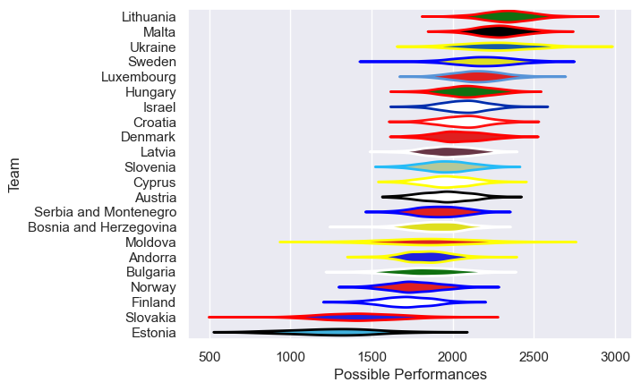

---  
title: "Rugby Europe Trophy 2018 Status"  
date: 2025-07-28 6:00:00 -0500  
categories: model review projection  
layout: article  
aside:  
    toc: true  
---
# Current Team Rankings

# Standings

## Current Standings

| Club                   |   Played |   Wins |   Point Differential |   Losing Bonus Points | Try Bonus Points   |   Competition Points |
|:-----------------------|---------:|-------:|---------------------:|----------------------:|:-------------------|---------------------:|
| Croatia                |        5 |      4 |                   75 |                     0 |                    |                   18 |
| Malta                  |        5 |      4 |                   63 |                     0 |                    |                   16 |
| Ukraine                |        4 |      3 |                   53 |                     0 |                    |                   14 |
| Denmark                |        4 |      3 |                  197 |                     1 |                    |                   13 |
| Serbia and Montenegro  |        4 |      3 |                   65 |                     1 |                    |                   13 |
| Lithuania              |        3 |      3 |                   96 |                     0 |                    |                   12 |
| Sweden                 |        4 |      3 |                   77 |                     0 |                    |                   12 |
| Austria                |        4 |      2 |                   51 |                     2 |                    |                   10 |
| Luxembourg             |        4 |      2 |                   47 |                     1 |                    |                    9 |
| Slovenia               |        4 |      2 |                   30 |                     1 |                    |                    9 |
| Norway                 |        4 |      2 |                  -17 |                     0 |                    |                    8 |
| Latvia                 |        4 |      2 |                  -18 |                     0 |                    |                    8 |
| Finland                |        5 |      2 |                  -33 |                     0 |                    |                    8 |
| Israel                 |        4 |      1 |                   -5 |                     3 |                    |                    7 |
| Hungary                |        4 |      1 |                  -13 |                     1 |                    |                    7 |
| Andorra                |        5 |      1 |                 -110 |                     1 |                    |                    7 |
| Bulgaria               |        2 |      1 |                   -6 |                     0 |                    |                    4 |
| Cyprus                 |        4 |      1 |                  -40 |                     0 |                    |                    4 |
| Bosnia and Herzegovina |        4 |      1 |                  -81 |                     0 |                    |                    4 |
| Moldova                |        2 |      0 |                  -89 |                     0 |                    |                    0 |
| Slovakia               |        4 |      0 |                 -122 |                     0 |                    |                    0 |
| Estonia                |        3 |      0 |                 -220 |                     0 |                    |                    0 |

# Completed Match Review

| Model | Percent Correct Predictions | Spread Error |
| ------ | ------ | ------ |
| Club Level | 72.1% | 19.1 |
| Player Level: Lineup | nan% | nan |
| Player Level: Minutes | nan% | nan |

