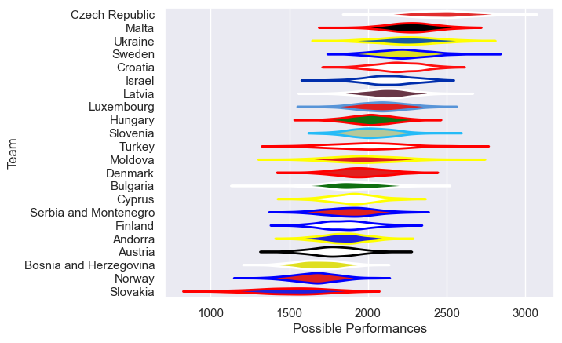

---  
title: "Rugby Europe Trophy 2019 Status"  
date: 2025-07-28 6:00:00 -0500  
categories: model review projection  
layout: article  
aside:  
    toc: true  
---
# Current Team Rankings

# Standings

## Current Standings

| Club                   |   Played |   Wins |   Point Differential |   Losing Bonus Points | Try Bonus Points   |   Competition Points |
|:-----------------------|---------:|-------:|---------------------:|----------------------:|:-------------------|---------------------:|
| Bulgaria               |        4 |      4 |                  145 |                     0 |                    |                   16 |
| Denmark                |        4 |      3 |                   58 |                     0 |                    |                   12 |
| Luxembourg             |        4 |      3 |                    0 |                     0 |                    |                   12 |
| Finland                |        4 |      3 |                   -2 |                     0 |                    |                   12 |
| Malta                  |        4 |      2 |                   53 |                     1 |                    |                   11 |
| Croatia                |        3 |      2 |                   34 |                     0 |                    |                   10 |
| Latvia                 |        4 |      2 |                   23 |                     1 |                    |                    9 |
| Moldova                |        4 |      2 |                   23 |                     1 |                    |                    9 |
| Cyprus                 |        4 |      2 |                  -29 |                     1 |                    |                    9 |
| Czech Republic         |        2 |      2 |                   93 |                     0 |                    |                    8 |
| Andorra                |        4 |      2 |                   23 |                     0 |                    |                    8 |
| Sweden                 |        4 |      2 |                   -9 |                     0 |                    |                    8 |
| Serbia and Montenegro  |        4 |      2 |                  -74 |                     0 |                    |                    8 |
| Slovenia               |        4 |      1 |                   50 |                     0 |                    |                    6 |
| Israel                 |        3 |      1 |                   11 |                     0 |                    |                    6 |
| Ukraine                |        2 |      1 |                    5 |                     1 |                    |                    5 |
| Austria                |        4 |      1 |                  -41 |                     1 |                    |                    5 |
| Hungary                |        4 |      1 |                  -51 |                     1 |                    |                    5 |
| Turkey                 |        2 |      1 |                    9 |                     0 |                    |                    4 |
| Bosnia and Herzegovina |        4 |      0 |                 -124 |                     1 |                    |                    1 |
| Slovakia               |        2 |      0 |                  -98 |                     0 |                    |                    0 |
| Norway                 |        4 |      0 |                  -99 |                     0 |                    |                    0 |

# Completed Match Review

| Model | Percent Correct Predictions | Spread Error |
| ------ | ------ | ------ |
| Club Level | 66.7% | 18.3 |
| Player Level: Lineup | nan% | nan |
| Player Level: Minutes | nan% | nan |

