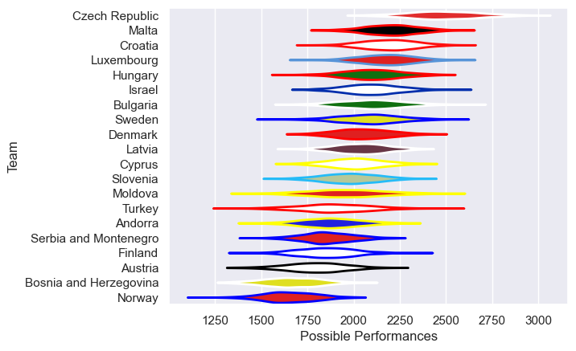

---  
title: "Rugby Europe Trophy 2020"  
date: 2025-07-29 6:00:00 -0500  
categories: model review projection  
layout: article  
aside:  
    toc: true  
---
# Current Team Rankings

# Standings

## Projected Remaining Table

| Club                   |   To Play |   Projected Wins |   Projected Differential |   Projected Losing Bonus Points | Projected Try Bonus Points   |   Projected Competition Points |
|:-----------------------|----------:|-----------------:|-------------------------:|--------------------------------:|:-----------------------------|-------------------------------:|
| Czech Republic         |         2 |            1.389 |                   21.997 |                           0.263 |                              |                          5.969 |
| Croatia                |         2 |            1.335 |                   14.615 |                           0.296 |                              |                          5.768 |
| Bulgaria               |         2 |            1.245 |                   11.959 |                           0.338 |                              |                          5.448 |
| Denmark                |         2 |            1.21  |                    9.224 |                           0.336 |                              |                          5.34  |
| Finland                |         2 |            1.183 |                    8.816 |                           0.395 |                              |                          5.251 |
| Serbia and Montenegro  |         2 |            1.099 |                    5.66  |                           0.392 |                              |                          4.97  |
| Luxembourg             |         2 |            1.09  |                    4.896 |                           0.367 |                              |                          4.925 |
| Moldova                |         2 |            1.087 |                   10.3   |                           0.32  |                              |                          4.816 |
| Malta                  |         2 |            1.025 |                    2.856 |                           0.37  |                              |                          4.622 |
| Turkey                 |         2 |            0.989 |                    2.328 |                           0.326 |                              |                          4.398 |
| Hungary                |         2 |            0.949 |                   -0.391 |                           0.382 |                              |                          4.366 |
| Israel                 |         2 |            0.934 |                   -0.036 |                           0.4   |                              |                          4.302 |
| Cyprus                 |         2 |            0.909 |                   -2.663 |                           0.38  |                              |                          4.166 |
| Andorra                |         2 |            0.834 |                   -5.07  |                           0.409 |                              |                          3.927 |
| Austria                |         2 |            0.713 |                   -9.454 |                           0.423 |                              |                          3.425 |
| Latvia                 |         2 |            0.693 |                  -14.388 |                           0.379 |                              |                          3.307 |
| Sweden                 |         2 |            0.666 |                  -12.114 |                           0.396 |                              |                          3.22  |
| Bosnia and Herzegovina |         2 |            0.643 |                  -14.877 |                           0.373 |                              |                          3.095 |
| Norway                 |         2 |            0.632 |                  -18.886 |                           0.372 |                              |                          3.014 |
| Slovenia               |         2 |            0.616 |                  -14.772 |                           0.393 |                              |                          2.981 |

## Projected Total Table

| Club                   |   Played |   Wins |   Point Differential |   Losing Bonus Points | Try Bonus Points   |   Competition Points |
|:-----------------------|---------:|-------:|---------------------:|----------------------:|:-------------------|---------------------:|
| Czech Republic         |        2 |  1.389 |               21.997 |                 0.263 |                    |                5.969 |
| Croatia                |        2 |  1.335 |               14.615 |                 0.296 |                    |                5.768 |
| Bulgaria               |        2 |  1.245 |               11.959 |                 0.338 |                    |                5.448 |
| Denmark                |        2 |  1.21  |                9.224 |                 0.336 |                    |                5.34  |
| Finland                |        2 |  1.183 |                8.816 |                 0.395 |                    |                5.251 |
| Serbia and Montenegro  |        2 |  1.099 |                5.66  |                 0.392 |                    |                4.97  |
| Luxembourg             |        2 |  1.09  |                4.896 |                 0.367 |                    |                4.925 |
| Moldova                |        2 |  1.087 |               10.3   |                 0.32  |                    |                4.816 |
| Malta                  |        2 |  1.025 |                2.856 |                 0.37  |                    |                4.622 |
| Turkey                 |        2 |  0.989 |                2.328 |                 0.326 |                    |                4.398 |
| Hungary                |        2 |  0.949 |               -0.391 |                 0.382 |                    |                4.366 |
| Israel                 |        2 |  0.934 |               -0.036 |                 0.4   |                    |                4.302 |
| Cyprus                 |        2 |  0.909 |               -2.663 |                 0.38  |                    |                4.166 |
| Andorra                |        2 |  0.834 |               -5.07  |                 0.409 |                    |                3.927 |
| Austria                |        2 |  0.713 |               -9.454 |                 0.423 |                    |                3.425 |
| Latvia                 |        2 |  0.693 |              -14.388 |                 0.379 |                    |                3.307 |
| Sweden                 |        2 |  0.666 |              -12.114 |                 0.396 |                    |                3.22  |
| Bosnia and Herzegovina |        2 |  0.643 |              -14.877 |                 0.373 |                    |                3.095 |
| Norway                 |        2 |  0.632 |              -18.886 |                 0.372 |                    |                3.014 |
| Slovenia               |        2 |  0.616 |              -14.772 |                 0.393 |                    |                2.981 |

# Future Predictions

## Week 1

### Malta V Israel on 2020/03/21

Average Margin: Malta by 6.4

## Week 2

### Croatia V Slovenia on 2020/03/28

Average Margin: Croatia by 11.1

### Israel V Cyprus on 2020/03/28

Average Margin: Israel by 6.4

## Week 3

### Croatia V Malta on 2020/04/04

Average Margin: Croatia by 3.6

## Week 4

### Moldova V Norway on 2020/04/11

Average Margin: Moldova by 15.6

### Bosnia and Herzegovina V Serbia and Montenegro on 2020/04/11

Average Margin: Serbia and Montenegro by 3.4

## Week 5

### Czech Republic V Latvia on 2020/04/18

Average Margin: Czech Republic by 13.5

### Turkey V Bosnia and Herzegovina on 2020/04/18

Average Margin: Turkey by 11.5

## Week 6

### Cyprus V Slovenia on 2020/04/25

Average Margin: Cyprus by 3.7

## Week 7

### Bulgaria V Turkey on 2020/05/02

Average Margin: Bulgaria by 9.2

### Latvia V Luxembourg on 2020/05/02

Average Margin: Luxembourg by 0.8

## Week 8

### Luxembourg V Hungary on 2020/05/09

Average Margin: Luxembourg by 4.0

### Denmark V Moldova on 2020/05/09

Average Margin: Denmark by 5.3

### Serbia and Montenegro V Andorra on 2020/05/09

Average Margin: Serbia and Montenegro by 2.3

### Sweden V Czech Republic on 2020/05/09

Average Margin: Czech Republic by 8.5

## Week 9

### Andorra V Bulgaria on 2020/05/16

Average Margin: Bulgaria by 2.8

### Hungary V Sweden on 2020/05/16

Average Margin: Hungary by 3.7

### Norway V Finland on 2020/05/16

Average Margin: Finland by 3.3

## Week 10

### Austria V Denmark on 2020/05/23

Average Margin: Denmark by 4.0

## Week 11

### Finland V Austria on 2020/05/30

Average Margin: Finland by 5.5

