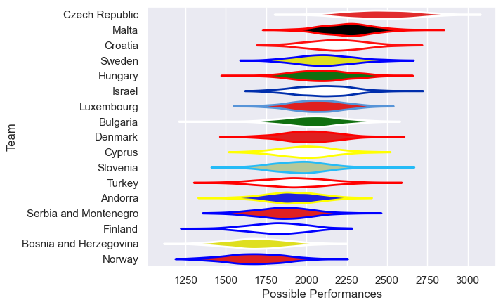

---  
title: "Rugby Europe Trophy 2021"  
date: 2025-07-29 6:00:00 -0500  
categories: model review projection  
layout: article  
aside:  
    toc: true  
---
# Current Team Rankings

# Standings

## Current Standings

| Club                   |   Played |   Wins |   Point Differential |   Losing Bonus Points | Try Bonus Points   |   Competition Points |
|:-----------------------|---------:|-------:|---------------------:|----------------------:|:-------------------|---------------------:|
| Croatia                |        2 |      2 |                   66 |                     0 |                    |                    8 |
| Denmark                |        2 |      2 |                   57 |                     0 |                    |                    8 |
| Czech Republic         |        2 |      2 |                   45 |                     0 |                    |                    8 |
| Bulgaria               |        2 |      2 |                   28 |                     0 |                    |                    8 |
| Malta                  |        2 |      2 |                   16 |                     0 |                    |                    8 |
| Serbia and Montenegro  |        2 |      1 |                   20 |                     1 |                    |                    5 |
| Andorra                |        2 |      1 |                    9 |                     1 |                    |                    5 |
| Sweden                 |        1 |      1 |                   46 |                     0 |                    |                    4 |
| Bosnia and Herzegovina |        2 |      1 |                  -24 |                     0 |                    |                    4 |
| Israel                 |        1 |      0 |                   -2 |                     1 |                    |                    1 |
| Finland                |        1 |      0 |                  -10 |                     0 |                    |                    0 |
| Hungary                |        1 |      0 |                  -18 |                     0 |                    |                    0 |
| Cyprus                 |        1 |      0 |                  -21 |                     0 |                    |                    0 |
| Turkey                 |        2 |      0 |                  -33 |                     0 |                    |                    0 |
| Norway                 |        1 |      0 |                  -47 |                     0 |                    |                    0 |
| Slovenia               |        2 |      0 |                  -59 |                     0 |                    |                    0 |
| Luxembourg             |        2 |      0 |                  -73 |                     0 |                    |                    0 |

# Completed Match Review

| Model | Percent Correct Predictions | Spread Error |
| ------ | ------ | ------ |
| Club Level | 85.7% | 17.2 |
| Player Level: Lineup | nan% | nan |
| Player Level: Minutes | nan% | nan |

