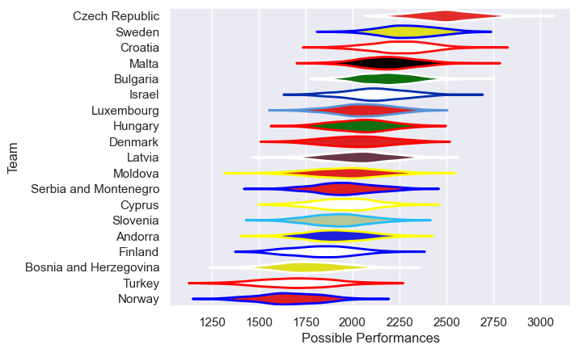

---  
title: "Rugby Europe Trophy 2022 Status"  
date: 2025-07-28 6:00:00 -0500  
categories: model review projection  
layout: article  
aside:  
    toc: true  
---
# Current Team Rankings

# Standings

## Current Standings

| Club           |   Played |   Wins |   Point Differential |   Losing Bonus Points | Try Bonus Points   |   Competition Points |
|:---------------|---------:|-------:|---------------------:|----------------------:|:-------------------|---------------------:|
| Czech Republic |        2 |      2 |                   46 |                     0 |                    |                    8 |
| Bulgaria       |        2 |      2 |                   28 |                     0 |                    |                    8 |
| Malta          |        2 |      1 |                   27 |                     0 |                    |                    4 |
| Israel         |        2 |      1 |                  -18 |                     0 |                    |                    4 |
| Cyprus         |        1 |      0 |                   -1 |                     1 |                    |                    1 |
| Hungary        |        1 |      0 |                  -20 |                     0 |                    |                    0 |
| Moldova        |        1 |      0 |                  -26 |                     0 |                    |                    0 |
| Slovenia       |        1 |      0 |                  -36 |                     0 |                    |                    0 |

## Projected Remaining Table

| Club                   |   To Play |   Projected Wins |   Projected Differential |   Projected Losing Bonus Points | Projected Try Bonus Points   |   Projected Competition Points |
|:-----------------------|----------:|-----------------:|-------------------------:|--------------------------------:|:-----------------------------|-------------------------------:|
| Israel                 |         3 |             1.65 |                     9.19 |                            0.64 |                              |                           7.42 |
| Moldova                |         3 |             1.64 |                     8.54 |                            0.44 |                              |                           7.26 |
| Slovenia               |         3 |             1.46 |                     0.41 |                            0.73 |                              |                           6.85 |
| Sweden                 |         3 |             1.46 |                    -0.81 |                            0.58 |                              |                           6.64 |
| Luxembourg             |         3 |             1.46 |                    -1.44 |                            0.58 |                              |                           6.62 |
| Cyprus                 |         4 |             1.34 |                   -23.2  |                            0.85 |                              |                           6.57 |
| Hungary                |         3 |             1.35 |                    -0.5  |                            0.68 |                              |                           6.24 |
| Serbia and Montenegro  |         2 |             1.37 |                    15.86 |                            0.33 |                              |                           5.91 |
| Czech Republic         |         2 |             1.31 |                    18.53 |                            0.3  |                              |                           5.7  |
| Latvia                 |         3 |             1.16 |                   -15.78 |                            0.55 |                              |                           5.49 |
| Croatia                |         2 |             1.13 |                     8.27 |                            0.38 |                              |                           5.14 |
| Bulgaria               |         2 |             1.18 |                     8.6  |                            0.19 |                              |                           5.05 |
| Malta                  |         2 |             1.1  |                     5.33 |                            0.23 |                              |                           4.85 |
| Finland                |         2 |             1.03 |                     1.69 |                            0.31 |                              |                           4.59 |
| Bosnia and Herzegovina |         2 |             0.81 |                    -6.77 |                            0.43 |                              |                           3.81 |
| Turkey                 |         2 |             0.75 |                    -8.28 |                            0.38 |                              |                           3.56 |
| Andorra                |         2 |             0.74 |                    -9.41 |                            0.39 |                              |                           3.39 |
| Norway                 |         2 |             0.64 |                   -14.92 |                            0.37 |                              |                           3.11 |
| Denmark                |         1 |             0.53 |                     4.69 |                            0.23 |                              |                           2.39 |

## Projected Total Table

| Club                   |   Played |   Wins |   Point Differential |   Losing Bonus Points | Try Bonus Points   |   Competition Points |
|:-----------------------|---------:|-------:|---------------------:|----------------------:|:-------------------|---------------------:|
| Czech Republic         |        4 |   3.31 |                64.53 |                  0.3  |                    |                13.7  |
| Bulgaria               |        4 |   3.18 |                36.6  |                  0.19 |                    |                13.05 |
| Israel                 |        5 |   2.65 |                -8.81 |                  0.64 |                    |                11.42 |
| Malta                  |        4 |   2.1  |                32.33 |                  0.23 |                    |                 8.85 |
| Cyprus                 |        5 |   1.34 |               -24.2  |                  1.85 |                    |                 7.57 |
| Moldova                |        4 |   1.64 |               -17.46 |                  0.44 |                    |                 7.26 |
| Slovenia               |        4 |   1.46 |               -35.59 |                  0.73 |                    |                 6.85 |
| Sweden                 |        3 |   1.46 |                -0.81 |                  0.58 |                    |                 6.64 |
| Luxembourg             |        3 |   1.46 |                -1.44 |                  0.58 |                    |                 6.62 |
| Hungary                |        4 |   1.35 |               -20.5  |                  0.68 |                    |                 6.24 |
| Serbia and Montenegro  |        2 |   1.37 |                15.86 |                  0.33 |                    |                 5.91 |
| Latvia                 |        3 |   1.16 |               -15.78 |                  0.55 |                    |                 5.49 |
| Croatia                |        2 |   1.13 |                 8.27 |                  0.38 |                    |                 5.14 |
| Finland                |        2 |   1.03 |                 1.69 |                  0.31 |                    |                 4.59 |
| Bosnia and Herzegovina |        2 |   0.81 |                -6.77 |                  0.43 |                    |                 3.81 |
| Turkey                 |        2 |   0.75 |                -8.28 |                  0.38 |                    |                 3.56 |
| Andorra                |        2 |   0.74 |                -9.41 |                  0.39 |                    |                 3.39 |
| Norway                 |        2 |   0.64 |               -14.92 |                  0.37 |                    |                 3.11 |
| Denmark                |        1 |   0.53 |                 4.69 |                  0.23 |                    |                 2.39 |

# Completed Match Review

| Model | Percent Correct Predictions | Spread Error |
| ------ | ------ | ------ |
| Club Level | 89.7% | 5.9 |
| Player Level: Lineup | nan% | nan |
| Player Level: Minutes | nan% | nan |

# Future Predictions

## Week 3

### Luxembourg V Hungary on 2022/03/11

Average Margin: Luxembourg by 0.9

## Week 4

### Cyprus V Slovenia on 2022/03/25

Average Margin: Cyprus by 2.5

## Week 5

### Andorra V Bulgaria on 2022/04/01

Average Margin: Bulgaria by 0.0

### Slovenia V Israel on 2022/04/01

Average Margin: Israel by 2.8

### Latvia V Luxembourg on 2022/04/01

Average Margin: Latvia by 3.9

### Croatia V Malta on 2022/04/01

Average Margin: Croatia by 4.7

## Week 6

### Israel V Croatia on 2022/04/08

Average Margin: Israel by 0.5

## Week 7

### Malta V Cyprus on 2022/04/15

Average Margin: Malta by 10.1

### Moldova V Norway on 2022/04/15

Average Margin: Moldova by 14.1

### Serbia and Montenegro V Andorra on 2022/04/15

Average Margin: Serbia and Montenegro by 5.4

## Week 8

### Israel V Cyprus on 2022/04/29

Average Margin: Israel by 9.2

## Week 9

### Hungary V Sweden on 2022/05/06

Average Margin: Sweden by 1.5

### Norway V Finland on 2022/05/06

Average Margin: Finland by 3.4

### Bulgaria V Turkey on 2022/05/06

Average Margin: Bulgaria by 11.2

### Czech Republic V Latvia on 2022/05/06

Average Margin: Czech Republic by 13.6

### Denmark V Moldova on 2022/05/06

Average Margin: Denmark by 5.4

### Bosnia and Herzegovina V Serbia and Montenegro on 2022/05/06

Average Margin: Serbia and Montenegro by 2.6

## Week 10

### Sweden V Czech Republic on 2022/05/13

Average Margin: Czech Republic by 2.8

## Week 11

### Turkey V Bosnia and Herzegovina on 2022/05/20

Average Margin: Turkey by 1.0

### Finland V Moldova on 2022/05/20

Average Margin: Finland by 1.8

## Week 12

### Latvia V Sweden on 2022/05/30

Average Margin: Sweden by 2.4

## Week 13

### Slovenia V Cyprus on 2022/09/30

Average Margin: Slovenia by 2.9

## Week 14

### Luxembourg V Hungary on 2022/11/25

Average Margin: Luxembourg by 2.5

