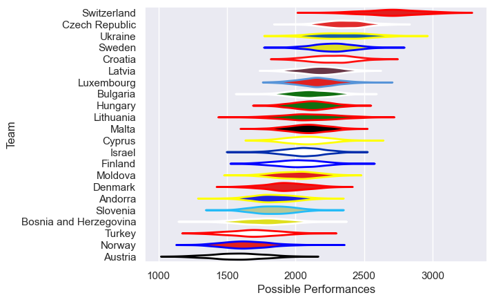

---  
title: "Rugby Europe Trophy 2023"  
date: 2025-07-29 6:00:00 -0500  
categories: model review projection  
layout: article  
aside:  
    toc: true  
---
# Current Team Rankings

# Standings

## Current Standings

| Club                   |   Played |   Wins |   Point Differential |   Losing Bonus Points |   Try Bonus Points |   Competition Points |
|:-----------------------|---------:|-------:|---------------------:|----------------------:|-------------------:|---------------------:|
| Czech Republic         |        4 |      3 |                   41 |                     0 |                  1 |                   13 |
| Sweden                 |        3 |      2 |                    2 |                     0 |                  1 |                    9 |
| Luxembourg             |        2 |      2 |                   62 |                     0 |                    |                    8 |
| Latvia                 |        2 |      2 |                   46 |                     0 |                    |                    8 |
| Switzerland            |        2 |      2 |                   25 |                     0 |                    |                    8 |
| Cyprus                 |        2 |      1 |                   13 |                     1 |                    |                    5 |
| Hungary                |        3 |      1 |                   11 |                     1 |                    |                    5 |
| Croatia                |        3 |      1 |                    8 |                     1 |                    |                    5 |
| Slovenia               |        1 |      1 |                   12 |                     0 |                    |                    4 |
| Malta                  |        1 |      1 |                    5 |                     0 |                    |                    4 |
| Finland                |        1 |      1 |                    4 |                     0 |                    |                    4 |
| Moldova                |        1 |      1 |                    4 |                     0 |                    |                    4 |
| Lithuania              |        3 |      1 |                   -6 |                     0 |                    |                    4 |
| Denmark                |        2 |      0 |                   -4 |                     1 |                    |                    3 |
| Andorra                |        1 |      0 |                    0 |                     0 |                    |                    2 |
| Turkey                 |        1 |      0 |                   -4 |                     1 |                    |                    1 |
| Israel                 |        1 |      0 |                  -16 |                     0 |                    |                    0 |
| Bulgaria               |        1 |      0 |                  -18 |                     0 |                    |                    0 |
| Austria                |        2 |      0 |                  -37 |                     0 |                    |                    0 |
| Norway                 |        1 |      0 |                  -45 |                     0 |                    |                    0 |
| Bosnia and Herzegovina |        1 |      0 |                  -49 |                     0 |                    |                    0 |
| Ukraine                |        2 |      0 |                  -54 |                     0 |                    |                    0 |

## Projected Remaining Table

| Club                   |   To Play |   Projected Wins |   Projected Differential |   Projected Losing Bonus Points | Projected Try Bonus Points   |   Projected Competition Points |
|:-----------------------|----------:|-----------------:|-------------------------:|--------------------------------:|:-----------------------------|-------------------------------:|
| Bulgaria               |         3 |            2.075 |                   33.017 |                           0.399 |                              |                          8.881 |
| Israel                 |         3 |            1.834 |                   15.411 |                           0.496 |                              |                          8.072 |
| Malta                  |         3 |            1.391 |                   -0.435 |                           0.626 |                              |                          6.446 |
| Latvia                 |         3 |            1.35  |                   -5.617 |                           0.577 |                              |                          6.199 |
| Czech Republic         |         2 |            1.387 |                   20.601 |                           0.271 |                              |                          5.919 |
| Luxembourg             |         3 |            1.185 |                  -12.664 |                           0.575 |                              |                          5.547 |
| Slovenia               |         3 |            1.087 |                  -20.501 |                           0.488 |                              |                          5.056 |
| Moldova                |         2 |            0.93  |                   -0.631 |                           0.362 |                              |                          4.246 |
| Cyprus                 |         2 |            0.719 |                   -8.855 |                           0.435 |                              |                          3.465 |
| Finland                |         1 |            0.526 |                    1.522 |                           0.196 |                              |                          2.366 |
| Hungary                |         1 |            0.408 |                   -3.211 |                           0.185 |                              |                          1.889 |
| Bosnia and Herzegovina |         1 |            0.366 |                   -4.189 |                           0.211 |                              |                          1.775 |
| Turkey                 |         1 |            0.229 |                  -14.448 |                           0.165 |                              |                          1.125 |

## Projected Total Table

| Club                   |   Played |   Wins |   Point Differential |   Losing Bonus Points |   Try Bonus Points |   Competition Points |
|:-----------------------|---------:|-------:|---------------------:|----------------------:|-------------------:|---------------------:|
| Czech Republic         |        6 |  4.387 |               61.601 |                 0.271 |                  1 |               18.919 |
| Latvia                 |        5 |  3.35  |               40.383 |                 0.577 |                    |               14.199 |
| Luxembourg             |        5 |  3.185 |               49.336 |                 0.575 |                    |               13.547 |
| Malta                  |        4 |  2.391 |                4.565 |                 0.626 |                    |               10.446 |
| Slovenia               |        4 |  2.087 |               -8.501 |                 0.488 |                    |                9.056 |
| Sweden                 |        3 |  2     |                2     |                 0     |                  1 |                9     |
| Bulgaria               |        4 |  2.075 |               15.017 |                 0.399 |                    |                8.881 |
| Cyprus                 |        4 |  1.719 |                4.145 |                 1.435 |                    |                8.465 |
| Moldova                |        3 |  1.93  |                3.369 |                 0.362 |                    |                8.246 |
| Israel                 |        4 |  1.834 |               -0.589 |                 0.496 |                    |                8.072 |
| Switzerland            |        2 |  2     |               25     |                 0     |                    |                8     |
| Hungary                |        4 |  1.408 |                7.789 |                 1.185 |                    |                6.889 |
| Finland                |        2 |  1.526 |                5.522 |                 0.196 |                    |                6.366 |
| Croatia                |        3 |  1     |                8     |                 1     |                    |                5     |
| Lithuania              |        3 |  1     |               -6     |                 0     |                    |                4     |
| Denmark                |        2 |  0     |               -4     |                 1     |                    |                3     |
| Turkey                 |        2 |  0.229 |              -18.448 |                 1.165 |                    |                2.125 |
| Andorra                |        1 |  0     |                0     |                 0     |                    |                2     |
| Bosnia and Herzegovina |        2 |  0.366 |              -53.189 |                 0.211 |                    |                1.775 |
| Austria                |        2 |  0     |              -37     |                 0     |                    |                0     |
| Norway                 |        1 |  0     |              -45     |                 0     |                    |                0     |
| Ukraine                |        2 |  0     |              -54     |                 0     |                    |                0     |

# Completed Match Review

| Model | Percent Correct Predictions | Spread Error |
| ------ | ------ | ------ |
| Club Level | 76.5% | 12.1 |
| Player Level: Lineup | nan% | nan |
| Player Level: Minutes | nan% | nan |

# Future Predictions

## Week 5

### Malta V Cyprus on 2023/03/24

Average Margin: Malta by 5.2

## Week 6

### Luxembourg V Moldova on 2023/04/14

Average Margin: Luxembourg by 3.8

## Week 7

### Czech Republic V Luxembourg on 2023/04/21

Average Margin: Czech Republic by 13.2

## Week 8

### Israel V Slovenia on 2023/04/28

Average Margin: Israel by 9.8

### Latvia V Czech Republic on 2023/04/28

Average Margin: Czech Republic by 7.4

### Moldova V Hungary on 2023/04/28

Average Margin: Moldova by 3.2

### Bulgaria V Slovenia on 2023/04/28

Average Margin: Bulgaria by 14.9

### Cyprus V Bulgaria on 2023/04/28

Average Margin: Bulgaria by 3.6

### Israel V Malta on 2023/04/28

Average Margin: Israel by 3.2

## Week 9

### Latvia V Luxembourg on 2023/05/05

Average Margin: Latvia by 3.3

## Week 10

### Finland V Latvia on 2023/10/20

Average Margin: Finland by 1.5

### Slovenia V Bosnia and Herzegovina on 2023/10/20

Average Margin: Slovenia by 4.2

## Week 11

### Bulgaria V Turkey on 2023/10/27

Average Margin: Bulgaria by 14.4

### Israel V Malta on 2023/10/27

Average Margin: Israel by 2.5

