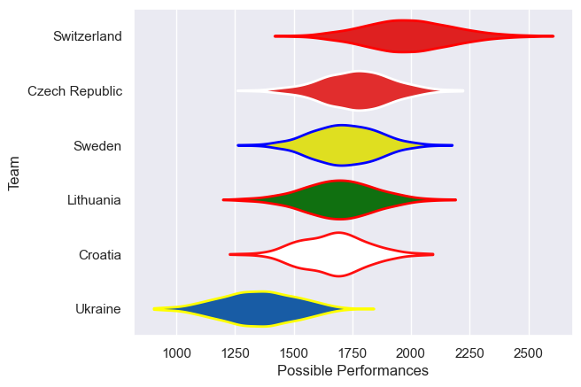
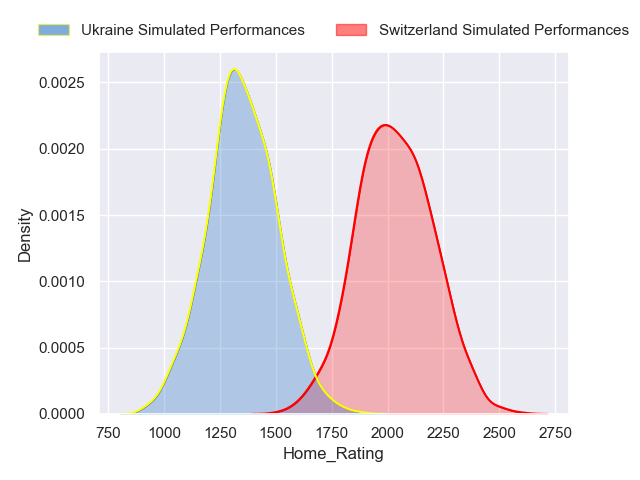
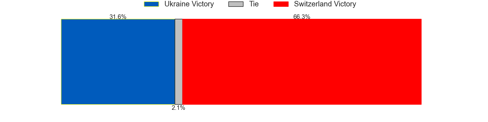
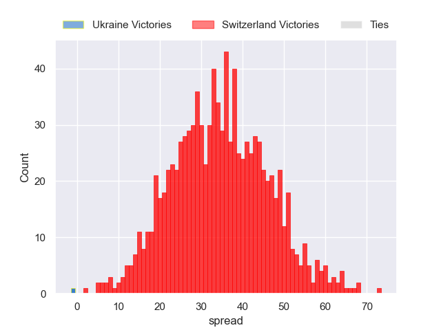

---  
title: "Rugby Europe Trophy 2023 Status"  
date: 2024-04-09 6:00:00 -0500  
categories: model review projection  
layout: article  
aside:  
    toc: true  
---
# Current Team Rankings

# Standings

## Current Standings

| Club           |   Played |   Wins |   Point Differential |   Losing Bonus Points |   Try Bonus Points |   Competition Points |
|:---------------|---------:|-------:|---------------------:|----------------------:|-------------------:|---------------------:|
| Sweden         |        3 |      2 |                    2 |                     0 |                nan |                    9 |
| Switzerland    |        2 |      2 |                   25 |                     0 |                nan |                    8 |
| Czech Republic |        2 |      1 |                   15 |                     0 |                nan |                    5 |
| Croatia        |        3 |      1 |                    8 |                     1 |                nan |                    5 |
| Lithuania      |        2 |      1 |                    4 |                     0 |                nan |                    4 |
| Ukraine        |        2 |      0 |                  -54 |                     0 |                nan |                    0 |

## Projected Remaining Table

| Club        |   Matches Remaining |   Wins |   Point Differential |   Losing Bonus Points |   Try Bonus Points |   Competition Points |
|:------------|--------------------:|-------:|---------------------:|----------------------:|-------------------:|---------------------:|
| Switzerland |                   1 |      1 |              35.6954 |                     0 |                0.8 |                  4.8 |
| Ukraine     |                   1 |      0 |             -35.6954 |                     0 |                0.1 |                  0.2 |

## Projected Total Table

| Club           |   Total Matches |   Wins |   Point Differential |   Losing Bonus Points |   Try Bonus Points |   Competition Points |
|:---------------|----------------:|-------:|---------------------:|----------------------:|-------------------:|---------------------:|
| Switzerland    |               3 |      3 |              60.6954 |                     0 |                0.8 |                 12.8 |
| Sweden         |               3 |      2 |               2      |                     0 |                0   |                  9   |
| Czech Republic |               2 |      1 |              15      |                     0 |                0   |                  5   |
| Croatia        |               3 |      1 |               8      |                     1 |                0   |                  5   |
| Lithuania      |               2 |      1 |               4      |                     0 |                0   |                  4   |
| Ukraine        |               3 |      0 |             -89.6954 |                     0 |                0.1 |                  0.2 |

# Completed Match Review

| Model | Percent Correct Predictions | Spread Error |
| ------ | ------ | ------ |
| Club Level | 42.9% | 19.5 |
| Player Level: Lineup | 100.0% | 8.8 |
| Player Level: Minutes | 100.0% | 8.8 |

# Future Predictions

## Week 4

### Switzerland V Ukraine on 2024/04/13

Average Margin: Switzerland by 35.7

Average Scoreline: 46-10

