---  
title: "Rugby Europe Trophy 2023 Status"  
date: 2023-11-15 6:00:00 -0500  
categories: model review projection  
layout: article  
aside:  
    toc: true  
---
# Current Team Rankings

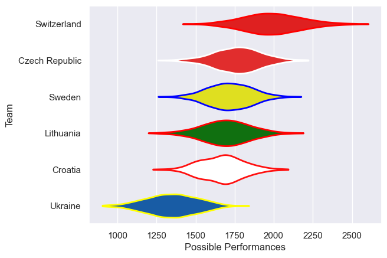
# Standings

## Current Standings

| Club           |   Played |   Wins |   Point Differential |   Losing Bonus Points |   Try Bonus Points |   Competition Points |
|:---------------|---------:|-------:|---------------------:|----------------------:|-------------------:|---------------------:|
| Switzerland    |        2 |      2 |                   25 |                     0 |                nan |                    8 |
| Czech Republic |        2 |      1 |                   15 |                     0 |                nan |                    5 |
| Sweden         |        2 |      1 |                    0 |                     0 |                nan |                    5 |
| Croatia        |        2 |      1 |                   10 |                     0 |                nan |                    4 |
| Lithuania      |        2 |      1 |                    4 |                     0 |                nan |                    4 |
| Ukraine        |        2 |      0 |                  -54 |                     0 |                nan |                    0 |

## Projected Remaining Table

| Club           |   Matches Remaining |   Wins |   Point Differential |   Losing Bonus Points |   Try Bonus Points |   Competition Points |
|:---------------|--------------------:|-------:|---------------------:|----------------------:|-------------------:|---------------------:|
| Switzerland    |                   2 |    1.9 |                 51.3 |                   0   |                1.9 |                  9.7 |
| Czech Republic |                   1 |    0.8 |                  8.8 |                   0.1 |                0.8 |                  4.1 |
| Croatia        |                   2 |    0.7 |                -14.1 |                   0.3 |                0.7 |                  3.8 |
| Sweden         |                   1 |    0.4 |                 -3.2 |                   0.3 |                0.4 |                  2.1 |
| Lithuania      |                   1 |    0.2 |                 -8.8 |                   0.2 |                0.2 |                  1.2 |
| Ukraine        |                   1 |    0   |                -33.6 |                   0   |                0   |                  0   |

## Projected Total Table

| Club           |   Total Matches |   Wins |   Point Differential |   Losing Bonus Points |   Try Bonus Points |   Competition Points |
|:---------------|----------------:|-------:|---------------------:|----------------------:|-------------------:|---------------------:|
| Switzerland    |               4 |    3.9 |                 76.3 |                   0   |                1.9 |                 17.7 |
| Czech Republic |               3 |    1.8 |                 23.8 |                   0.1 |                0.8 |                  9.1 |
| Croatia        |               4 |    1.7 |                 -4.1 |                   0.3 |                0.7 |                  7.8 |
| Sweden         |               3 |    1.4 |                 -3.2 |                   0.3 |                0.4 |                  7.1 |
| Lithuania      |               3 |    1.2 |                 -4.8 |                   0.2 |                0.2 |                  5.2 |
| Ukraine        |               3 |    0   |                -87.6 |                   0   |                0   |                  0   |

# Completed Match Review

| Model | Percent Correct Predictions | Spread Error |
| ------ | ------ | ------ |
| Club Level | 50.0% | 22.3 |
| Player Level: Lineup | 100.0% | 8.0 |
| Player Level: Minutes | 100.0% | 8.0 |

# Future Predictions

## Week 3

### Croatia V Sweden on 2023/11/18

Average Margin: Croatia by 3.4

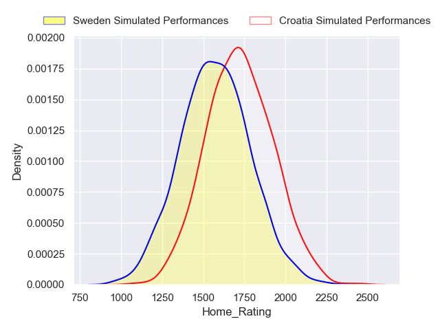
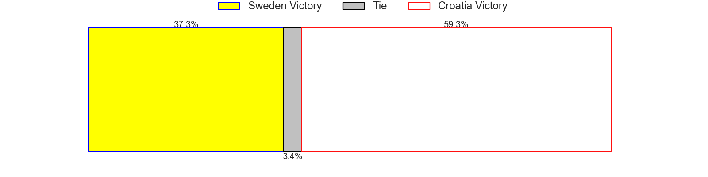
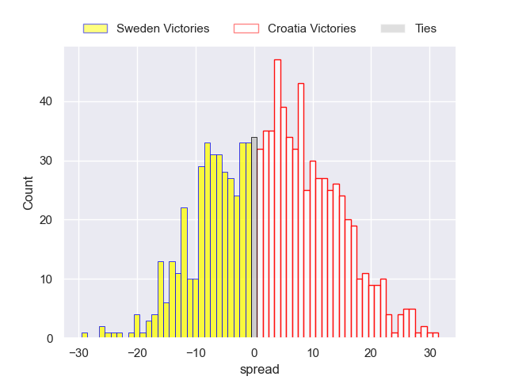

## Week 4

### Czech Republic V Lithuania on 2023/11/25

Average Margin: Czech Republic by 9.1

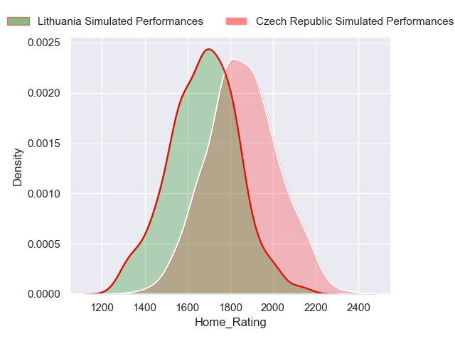
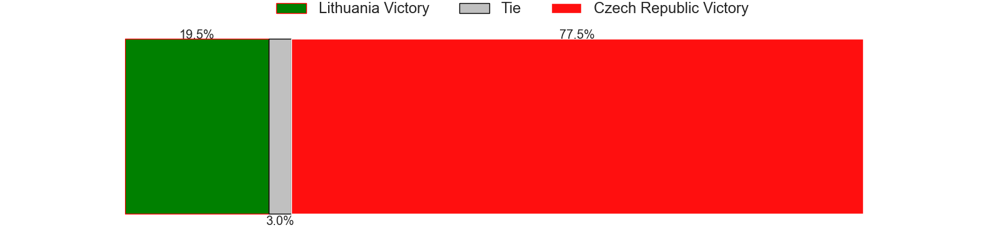
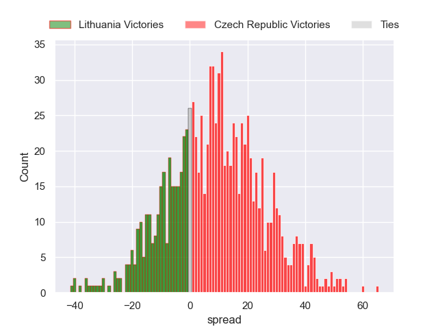

## Week 5

### Switzerland V Croatia on 2024/03/24

Average Margin: Switzerland by 17.7

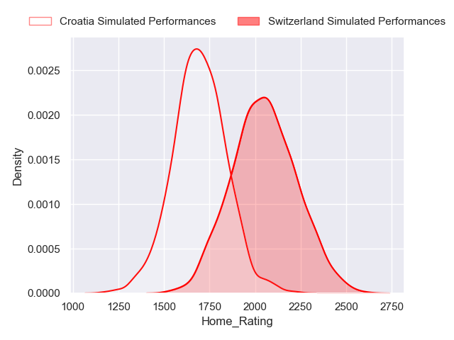
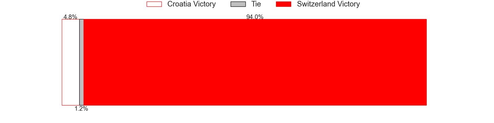
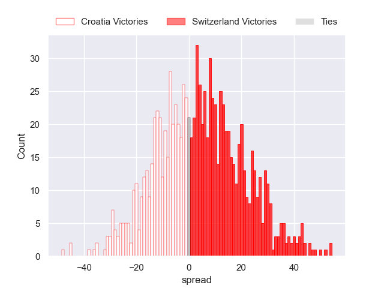

## Week 6

### Switzerland V Ukraine on 2024/04/13

Average Margin: Switzerland by 34.1

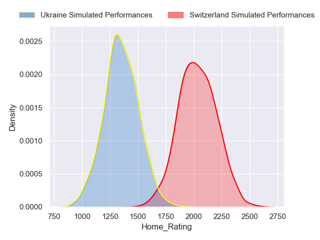

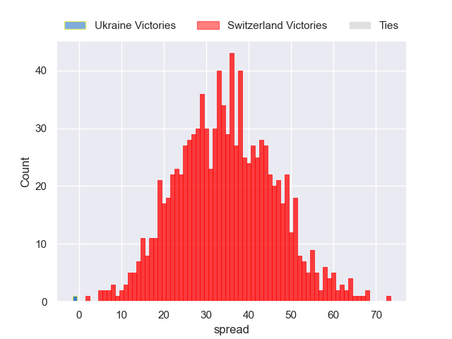

