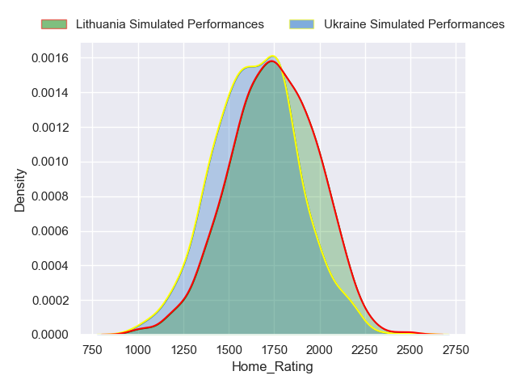
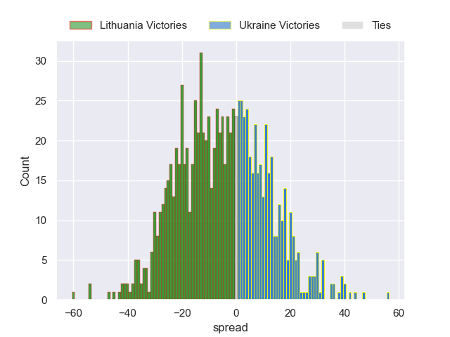
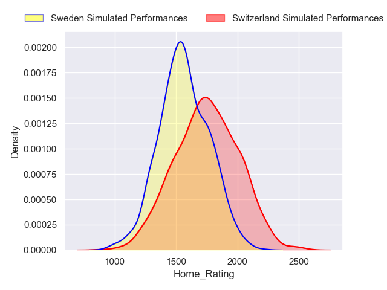
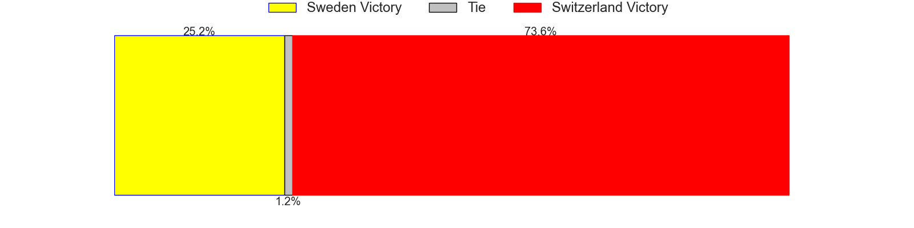
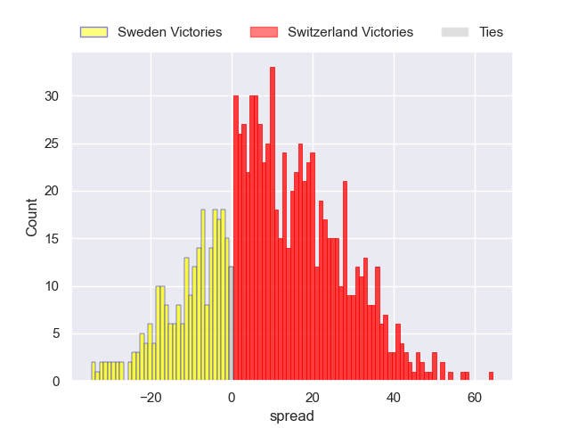
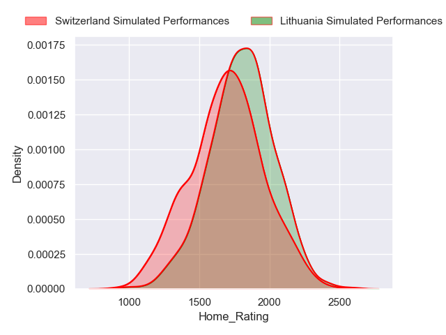
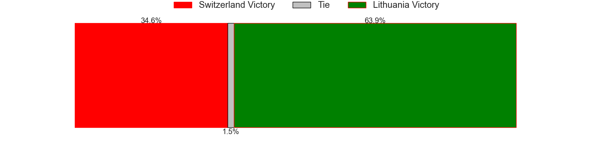
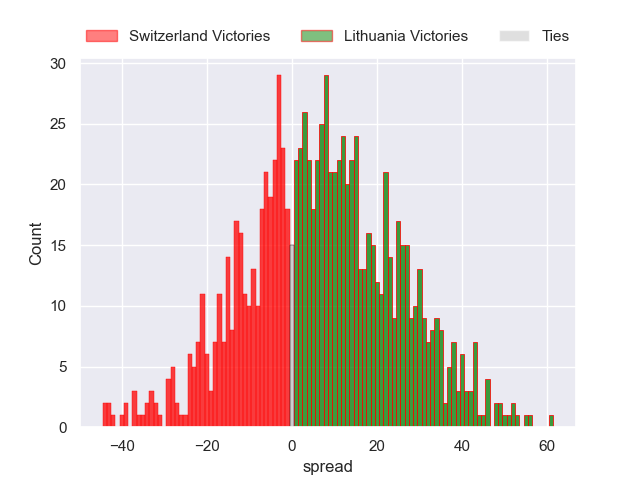

---  
title: "Rugby Europe Trophy 2023 Status"  
date: 2023-11-01 6:00:00 -0500  
categories: model review projection  
layout: article  
aside:  
    toc: true  
---
# Current Team Rankings

# Standings

## Projected Total Table

| Club           |   Total Matches |   Wins |   Point Differential |   Losing Bonus Points |   Try Bonus Points |   Competition Points |
|:---------------|----------------:|-------:|---------------------:|----------------------:|-------------------:|---------------------:|
| Switzerland    |               4 |    2.3 |                 12.6 |                   0.6 |                2.2 |                 11.8 |
| Lithuania      |               3 |    2.3 |                 97.8 |                   0.3 |                2.2 |                 11.6 |
| Croatia        |               3 |    2.1 |                 85.8 |                   0.3 |                2.1 |                 10.9 |
| Ukraine        |               2 |    0.8 |                -11.1 |                   0.3 |                0.7 |                  4.1 |
| Sweden         |               2 |    0.5 |                -18.3 |                   0.3 |                0.5 |                  3   |
| Czech republic |               2 |    0   |               -167   |                   0   |                0   |                  0   |

# Future Predictions

## Week 3

### Ukraine V Lithuania on 2023/11/04

Average Margin: Lithuania by 4.9

### Switzerland V Sweden on 2023/11/04

Average Margin: Switzerland by 10.0

## Week 4

### Lithuania V Switzerland on 2023/11/11

Average Margin: Lithuania by 7.8

## Week 5

### Croatia V Sweden on 2023/11/18

Average Margin: Croatia by 8.6

## Week 6

## Week 1

### Switzerland V Croatia on 2024/03/24

Average Margin: Switzerland by 4.3

## Week 2

### Switzerland V Ukraine on 2024/04/13

Average Margin: Switzerland by 6.3

