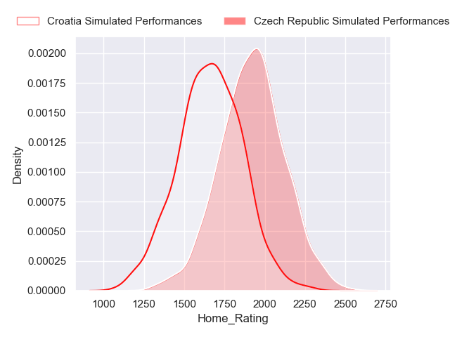
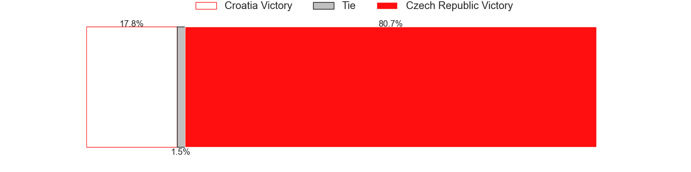
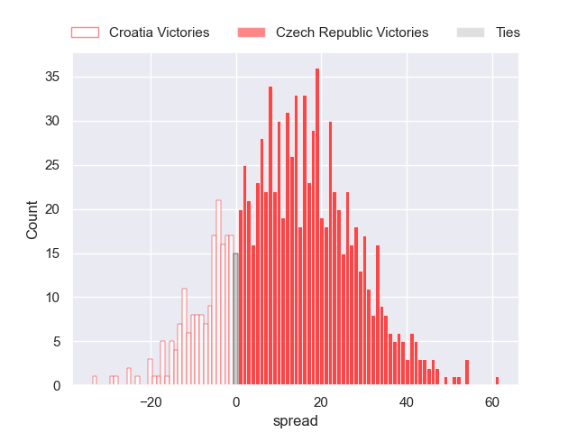

---  
title: "Rugby Europe Trophy 2023 Status"  
date: 2023-11-03 6:00:00 -0500  
categories: model review projection  
layout: article  
aside:  
    toc: true  
---
# Current Team Rankings

# Standings

## Projected Total Table

| Club           |   Total Matches |   Wins |   Point Differential |   Losing Bonus Points |   Try Bonus Points |   Competition Points |
|:---------------|----------------:|-------:|---------------------:|----------------------:|-------------------:|---------------------:|
| Switzerland    |               4 |    2.4 |                 15.9 |                   0.6 |                2.2 |                 12.2 |
| Lithuania      |               3 |    1.5 |                  1.6 |                   0.5 |                1.4 |                  8   |
| Czech Republic |               2 |    1.5 |                 21.4 |                   0.2 |                1.4 |                  7.8 |
| Croatia        |               3 |    1.3 |                 -9.5 |                   0.5 |                1.2 |                  6.8 |
| Ukraine        |               2 |    0.7 |                -12.8 |                   0.3 |                0.6 |                  3.8 |
| Sweden         |               2 |    0.6 |                -16.6 |                   0.3 |                0.6 |                  3.3 |

# Future Predictions

## Week 3

### Czech Republic V Croatia on 2023/11/04

Average Margin: Czech Republic by 13.0

### Ukraine V Lithuania on 2023/11/04

Average Margin: Lithuania by 4.8

### Switzerland V Sweden on 2023/11/04

Average Margin: Switzerland by 9.2

## Week 4

### Lithuania V Switzerland on 2023/11/11

Average Margin: Lithuania by 5.5

## Week 5

### Croatia V Sweden on 2023/11/18

Average Margin: Croatia by 7.6

## Week 6

### Czech Republic V Lithuania on 2023/11/25

Average Margin: Czech Republic by 8.7

## Week 1

### Switzerland V Croatia on 2024/03/24

Average Margin: Switzerland by 4.3

## Week 2

### Switzerland V Ukraine on 2024/04/13

Average Margin: Switzerland by 8.1

