---  
title: "Rugby Europe Trophy 2024 Status"  
date: 2025-01-27 6:00:00 -0500  
categories: model review projection  
layout: article  
aside:  
    toc: true  
---
# Current Team Rankings

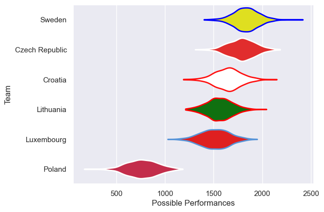
# Standings

## Current Standings

| Club           |   Played |   Wins |   Point Differential |   Losing Bonus Points |   Try Bonus Points |   Competition Points |
|:---------------|---------:|-------:|---------------------:|----------------------:|-------------------:|---------------------:|
| Sweden         |        3 |      3 |                   44 |                     0 |                  2 |                   14 |
| Poland         |        2 |      2 |                   34 |                     0 |                  1 |                    9 |
| Croatia        |        4 |      1 |                  -25 |                     0 |                nan |                    9 |
| Czech Republic |        3 |      1 |                   10 |                     2 |                  1 |                    7 |
| Lithuania      |        4 |      1 |                  -36 |                     0 |                  1 |                    5 |
| Luxembourg     |        2 |      0 |                  -27 |                     0 |                nan |                    2 |

## Projected Remaining Table

| Club           |   Matches Remaining |   Wins |   Point Differential |   Losing Bonus Points |   Try Bonus Points |   Competition Points |
|:---------------|--------------------:|-------:|---------------------:|----------------------:|-------------------:|---------------------:|
| Sweden         |                   2 |    1.8 |             48.7978  |                   0.1 |                1.4 |                  8.7 |
| Czech Republic |                   2 |    1.6 |             20.4426  |                   0.2 |                1   |                  7.6 |
| Luxembourg     |                   3 |    1.3 |             -1.7555  |                   0.4 |                1   |                  6.4 |
| Croatia        |                   1 |    0.9 |             19.1301  |                   0   |                0.6 |                  4.3 |
| Poland         |                   3 |    0.2 |            -76.8283  |                   0.2 |                0.6 |                  1.7 |
| Lithuania      |                   1 |    0.2 |             -9.78666 |                   0.3 |                0.2 |                  1.3 |

## Projected Total Table

| Club           |   Total Matches |   Wins |   Point Differential |   Losing Bonus Points |   Try Bonus Points |   Competition Points |
|:---------------|----------------:|-------:|---------------------:|----------------------:|-------------------:|---------------------:|
| Sweden         |               5 |    4.8 |             92.7978  |                   0.1 |                3.4 |                 22.7 |
| Czech Republic |               5 |    2.6 |             30.4426  |                   2.2 |                2   |                 14.6 |
| Croatia        |               5 |    1.9 |             -5.86994 |                   0   |                0.6 |                 13.3 |
| Poland         |               5 |    2.2 |            -42.8283  |                   0.2 |                1.6 |                 10.7 |
| Luxembourg     |               5 |    1.3 |            -28.7555  |                   0.4 |                1   |                  8.4 |
| Lithuania      |               5 |    1.2 |            -45.7867  |                   0.3 |                1.2 |                  6.3 |

# Completed Match Review

| Model | Percent Correct Predictions | Spread Error |
| ------ | ------ | ------ |
| Club Level | 55.6% | 23.4 |
| Player Level: Lineup | 37.5% | 17.6 |
| Player Level: Minutes | 37.5% | 16.5 |

# Future Predictions

## Week 5

### Poland V Croatia on 2025/02/22

Average Margin: Croatia by 19.1

Average Scoreline: 49-30

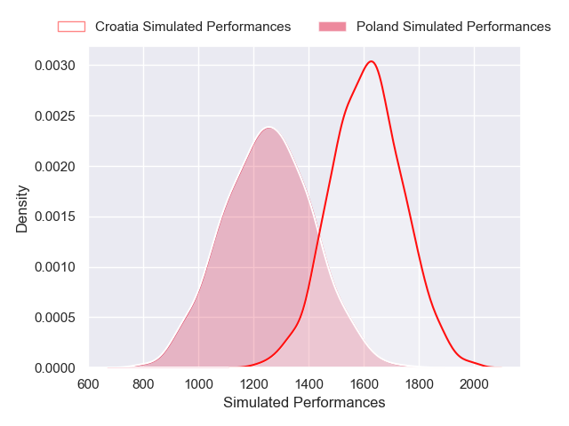
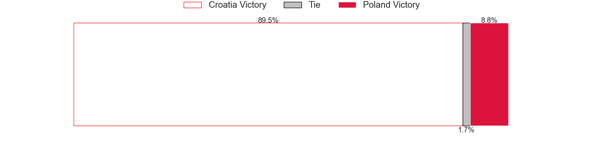
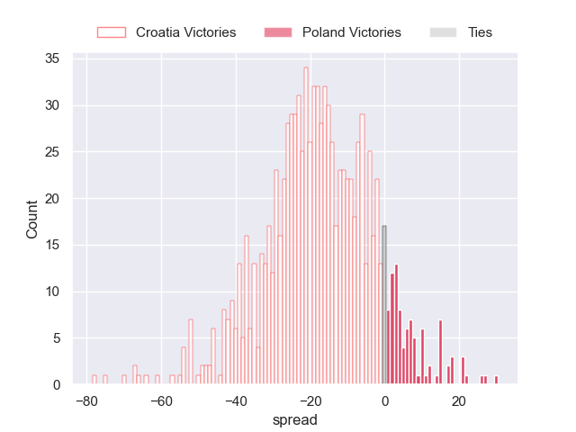

## Week 6

### Czech Republic V Luxembourg on 2025/03/08

Average Margin: Czech Republic by 10.7

Average Scoreline: 33-22

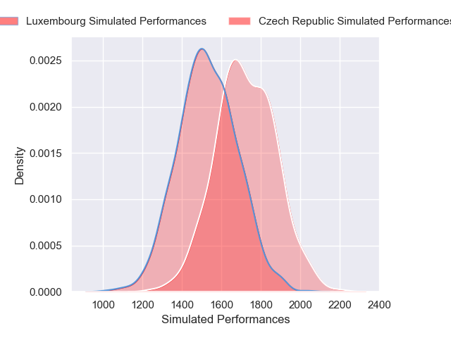
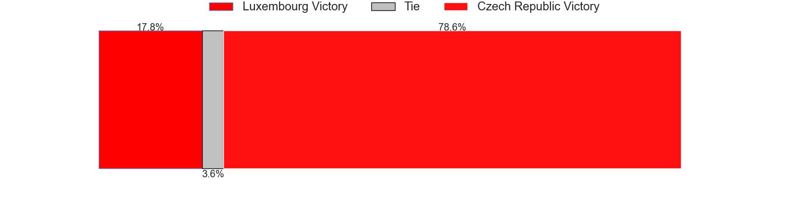
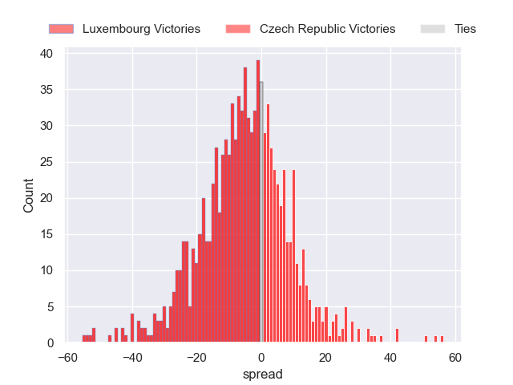

## Week 7

### Luxembourg V Sweden on 2025/03/29

Average Margin: Sweden by 13.4

Average Scoreline: 39-26

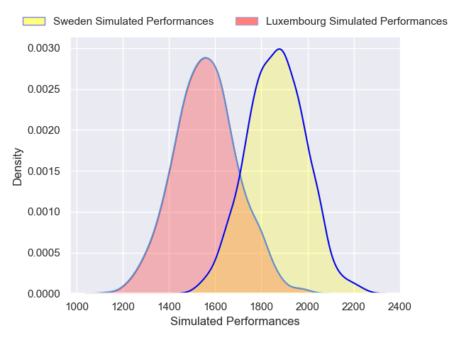
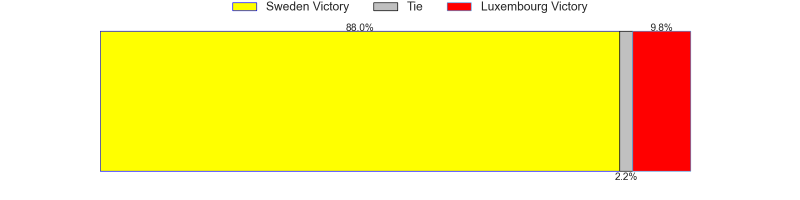
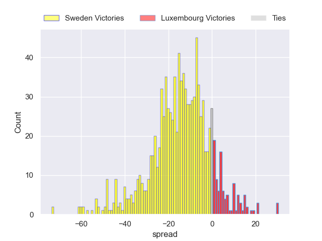

### Lithuania V Czech Republic on 2025/03/29

Average Margin: Czech Republic by 9.8

Average Scoreline: 37-27

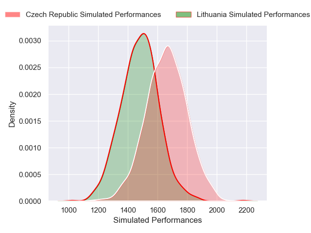

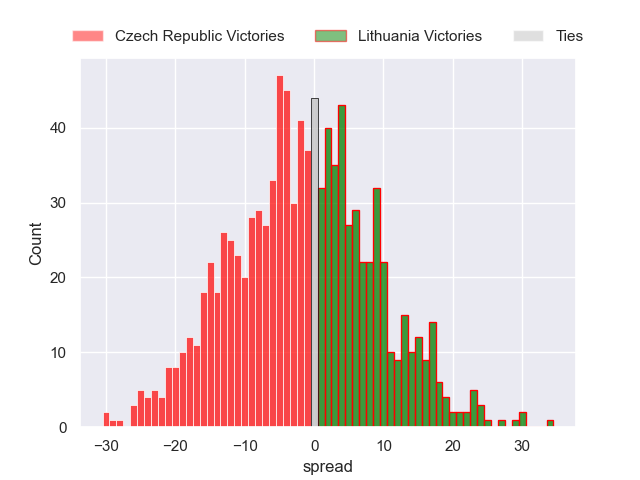

## Week 8

### Luxembourg V Poland on 2025/04/05

Average Margin: Luxembourg by 22.3

Average Scoreline: 36-14

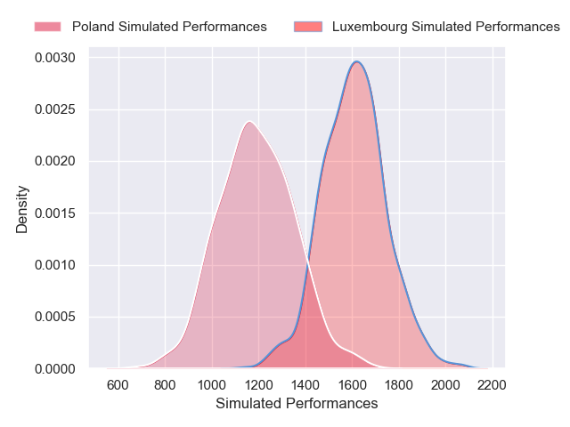
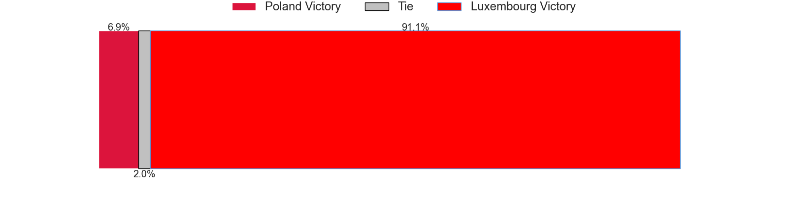
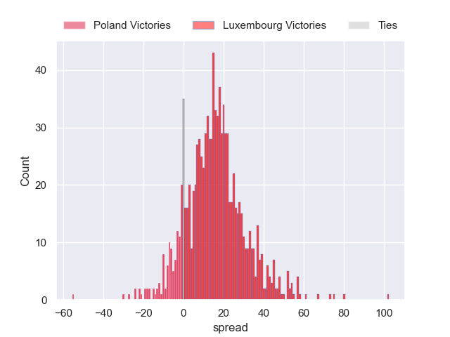

## Week 9

### Sweden V Poland on 2025/04/11

Average Margin: Sweden by 35.4

Average Scoreline: 45-10

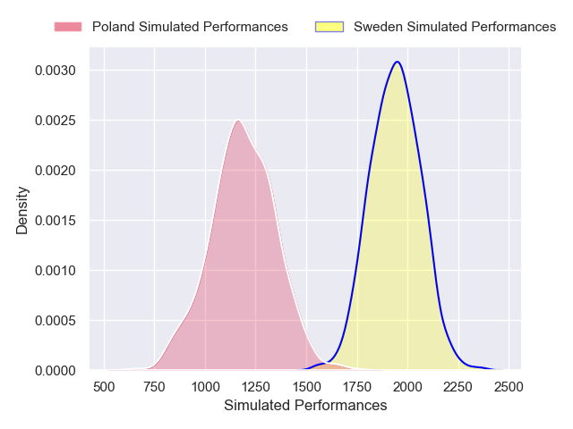
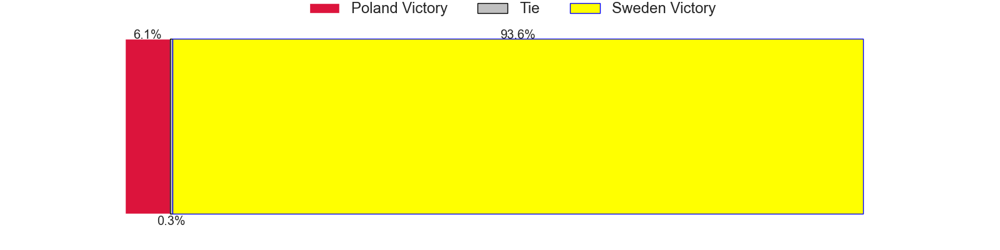

