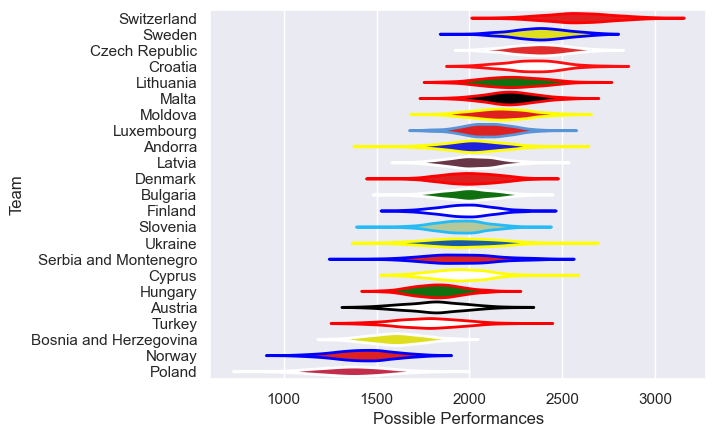

---  
title: "Rugby Europe Trophy 2024 Status"  
date: 2025-07-28 6:00:00 -0500  
categories: model review projection  
layout: article  
aside:  
    toc: true  
---
# Current Team Rankings

# Standings

## Current Standings

| Club           |   Played |   Wins |   Point Differential |   Losing Bonus Points |   Try Bonus Points |   Competition Points |
|:---------------|---------:|-------:|---------------------:|----------------------:|-------------------:|---------------------:|
| Sweden         |        3 |      3 |                   44 |                     0 |                  2 |                   14 |
| Poland         |        2 |      2 |                   34 |                     0 |                  1 |                    9 |
| Croatia        |        4 |      1 |                  -25 |                     0 |                  3 |                    9 |
| Czech Republic |        3 |      1 |                   10 |                     2 |                  1 |                    7 |
| Luxembourg     |        3 |      1 |                   -8 |                     0 |                    |                    6 |
| Lithuania      |        4 |      1 |                  -36 |                     0 |                  1 |                    5 |
| Finland        |        1 |      1 |                   50 |                     0 |                    |                    4 |
| Andorra        |        1 |      1 |                   24 |                     0 |                    |                    4 |
| Moldova        |        2 |      1 |                   23 |                     0 |                    |                    4 |
| Malta          |        1 |      1 |                   10 |                     0 |                    |                    4 |
| Cyprus         |        1 |      0 |                  -10 |                     0 |                    |                    0 |
| Bulgaria       |        1 |      0 |                  -42 |                     0 |                    |                    0 |
| Norway         |        2 |      0 |                  -74 |                     0 |                    |                    0 |

## Projected Remaining Table

| Club                   |   To Play |   Projected Wins |   Projected Differential |   Projected Losing Bonus Points | Projected Try Bonus Points   |   Projected Competition Points |
|:-----------------------|----------:|-----------------:|-------------------------:|--------------------------------:|:-----------------------------|-------------------------------:|
| Switzerland            |         2 |             1.41 |                    31.12 |                            0.25 |                              |                           6.07 |
| Luxembourg             |         2 |             1.17 |                     6.26 |                            0.31 |                              |                           5.15 |
| Serbia and Montenegro  |         2 |             1.06 |                     6.03 |                            0.38 |                              |                           4.78 |
| Slovenia               |         2 |             1.02 |                     6.94 |                            0.37 |                              |                           4.59 |
| Hungary                |         2 |             0.98 |                     1.51 |                            0.3  |                              |                           4.54 |
| Denmark                |         2 |             0.96 |                     5.76 |                            0.41 |                              |                           4.35 |
| Austria                |         2 |             0.82 |                    -9.29 |                            0.34 |                              |                           3.8  |
| Bosnia and Herzegovina |         2 |             0.75 |                    -5.42 |                            0.38 |                              |                           3.62 |
| Andorra                |         1 |             0.7  |                     6.16 |                            0.14 |                              |                           2.98 |
| Latvia                 |         1 |             0.67 |                     5.76 |                            0.14 |                              |                           2.9  |
| Bulgaria               |         1 |             0.52 |                     2.61 |                            0.2  |                              |                           2.38 |
| Turkey                 |         1 |             0.34 |                    -8.64 |                            0.13 |                              |                           1.55 |
| Finland                |         1 |             0.28 |                    -6.16 |                            0.27 |                              |                           1.43 |
| Norway                 |         1 |             0.32 |                   -11.52 |                            0.13 |                              |                           1.43 |
| Croatia                |         1 |             0.29 |                   -11.63 |                            0.08 |                              |                           1.36 |
| Ukraine                |         1 |             0.21 |                   -19.49 |                            0.17 |                              |                           1.07 |

## Projected Total Table

| Club                   |   Played |   Wins |   Point Differential |   Losing Bonus Points |   Try Bonus Points |   Competition Points |
|:-----------------------|---------:|-------:|---------------------:|----------------------:|-------------------:|---------------------:|
| Sweden                 |        3 |   3    |                44    |                  0    |                  2 |                14    |
| Luxembourg             |        5 |   2.17 |                -1.74 |                  0.31 |                    |                11.15 |
| Croatia                |        5 |   1.29 |               -36.63 |                  0.08 |                  3 |                10.36 |
| Poland                 |        2 |   2    |                34    |                  0    |                  1 |                 9    |
| Czech Republic         |        3 |   1    |                10    |                  2    |                  1 |                 7    |
| Andorra                |        2 |   1.7  |                30.16 |                  0.14 |                    |                 6.98 |
| Switzerland            |        2 |   1.41 |                31.12 |                  0.25 |                    |                 6.07 |
| Finland                |        2 |   1.28 |                43.84 |                  0.27 |                    |                 5.43 |
| Lithuania              |        4 |   1    |               -36    |                  0    |                  1 |                 5    |
| Serbia and Montenegro  |        2 |   1.06 |                 6.03 |                  0.38 |                    |                 4.78 |
| Slovenia               |        2 |   1.02 |                 6.94 |                  0.37 |                    |                 4.59 |
| Hungary                |        2 |   0.98 |                 1.51 |                  0.3  |                    |                 4.54 |
| Denmark                |        2 |   0.96 |                 5.76 |                  0.41 |                    |                 4.35 |
| Moldova                |        2 |   1    |                23    |                  0    |                    |                 4    |
| Malta                  |        1 |   1    |                10    |                  0    |                    |                 4    |
| Austria                |        2 |   0.82 |                -9.29 |                  0.34 |                    |                 3.8  |
| Bosnia and Herzegovina |        2 |   0.75 |                -5.42 |                  0.38 |                    |                 3.62 |
| Latvia                 |        1 |   0.67 |                 5.76 |                  0.14 |                    |                 2.9  |
| Bulgaria               |        2 |   0.52 |               -39.39 |                  0.2  |                    |                 2.38 |
| Turkey                 |        1 |   0.34 |                -8.64 |                  0.13 |                    |                 1.55 |
| Norway                 |        3 |   0.32 |               -85.52 |                  0.13 |                    |                 1.43 |
| Ukraine                |        1 |   0.21 |               -19.49 |                  0.17 |                    |                 1.07 |
| Cyprus                 |        1 |   0    |               -10    |                  0    |                    |                 0    |

# Completed Match Review

| Model | Percent Correct Predictions | Spread Error |
| ------ | ------ | ------ |
| Club Level | 80.8% | 16.3 |
| Player Level: Lineup | nan% | nan |
| Player Level: Minutes | nan% | nan |

# Future Predictions

## Week 5

### Switzerland V Croatia on 2024/03/24

Average Margin: Switzerland by 11.8

## Week 6

### Hungary V Luxembourg on 2024/04/05

Average Margin: Luxembourg by 3.2

### Austria V Bosnia and Herzegovina on 2024/04/05

Average Margin: Austria by 3.0

## Week 7

### Denmark V Norway on 2024/04/12

Average Margin: Denmark by 12.5

### Slovenia V Austria on 2024/04/12

Average Margin: Slovenia by 10.8

### Serbia and Montenegro V Turkey on 2024/04/12

Average Margin: Serbia and Montenegro by 7.3

### Andorra V Finland on 2024/04/12

Average Margin: Andorra by 7.6

### Switzerland V Ukraine on 2024/04/13

Average Margin: Switzerland by 23.8

## Week 8

### Latvia V Denmark on 2024/04/19

Average Margin: Latvia by 5.3

### Bulgaria V Serbia and Montenegro on 2024/04/19

Average Margin: Bulgaria by 6.6

### Bosnia and Herzegovina V Hungary on 2024/04/19

Average Margin: Hungary by 2.8

### Luxembourg V Slovenia on 2024/04/19

Average Margin: Luxembourg by 4.1

