---  
title: "Rugby Europe Trophy 2024 Status"  
date: 2024-11-11 6:00:00 -0500  
categories: model review projection  
layout: article  
aside:  
    toc: true  
---
# Current Team Rankings

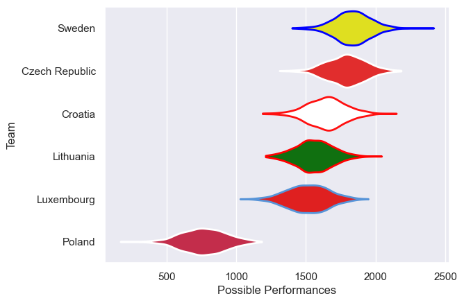
# Standings

## Current Standings

| Club           |   Played |   Wins |   Point Differential |   Losing Bonus Points |   Try Bonus Points |   Competition Points |
|:---------------|---------:|-------:|---------------------:|----------------------:|-------------------:|---------------------:|
| Sweden         |        2 |      2 |                   33 |                     0 |                  1 |                    9 |
| Czech Republic |        2 |      1 |                   17 |                     1 |                nan |                    5 |
| Lithuania      |        2 |      1 |                    0 |                     0 |                  1 |                    5 |
| Croatia        |        1 |      0 |                  -23 |                     0 |                nan |                    0 |
| Luxembourg     |        1 |      0 |                  -27 |                     0 |                  0 |                    0 |

## Projected Remaining Table

| Club           |   Matches Remaining |   Wins |   Point Differential |   Losing Bonus Points |   Try Bonus Points |   Competition Points |
|:---------------|--------------------:|-------:|---------------------:|----------------------:|-------------------:|---------------------:|
| Croatia        |                   4 |    2.3 |             11.5907  |                   0.6 |                1.7 |                 11.6 |
| Czech Republic |                   3 |    2.4 |             60.6561  |                   0.3 |                1.9 |                 11.5 |
| Sweden         |                   3 |    2   |             35.5972  |                   0.4 |                1.9 |                 10.3 |
| Luxembourg     |                   4 |    2   |             13.8047  |                   0.6 |                1.4 |                  9.9 |
| Lithuania      |                   3 |    1.2 |             -4.70297 |                   0.4 |                1.4 |                  6.8 |
| Poland         |                   5 |    1.1 |           -116.946   |                   0.2 |                0.8 |                  5.3 |

## Projected Total Table

| Club           |   Total Matches |   Wins |   Point Differential |   Losing Bonus Points |   Try Bonus Points |   Competition Points |
|:---------------|----------------:|-------:|---------------------:|----------------------:|-------------------:|---------------------:|
| Sweden         |               5 |    4   |             68.5972  |                   0.4 |                2.9 |                 19.3 |
| Czech Republic |               5 |    3.4 |             77.6561  |                   1.3 |                1.9 |                 16.5 |
| Lithuania      |               5 |    2.2 |             -4.70297 |                   0.4 |                2.4 |                 11.8 |
| Croatia        |               5 |    2.3 |            -11.4093  |                   0.6 |                1.7 |                 11.6 |
| Luxembourg     |               5 |    2   |            -13.1953  |                   0.6 |                1.4 |                  9.9 |
| Poland         |               5 |    1.1 |           -116.946   |                   0.2 |                0.8 |                  5.3 |

# Completed Match Review

| Model | Percent Correct Predictions | Spread Error |
| ------ | ------ | ------ |
| Club Level | 100.0% | 16.7 |
| Player Level: Lineup | 66.7% | 18.8 |
| Player Level: Minutes | 66.7% | 18.5 |

# Future Predictions

## Week 3

### Poland V Lithuania on 2024/11/16

Average Margin: Lithuania by 4.7

Average Scoreline: 29-24

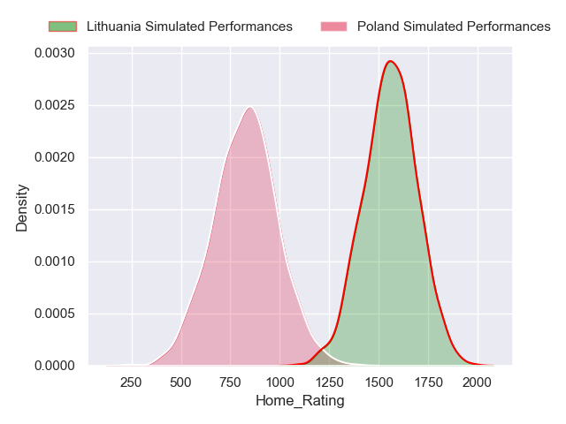

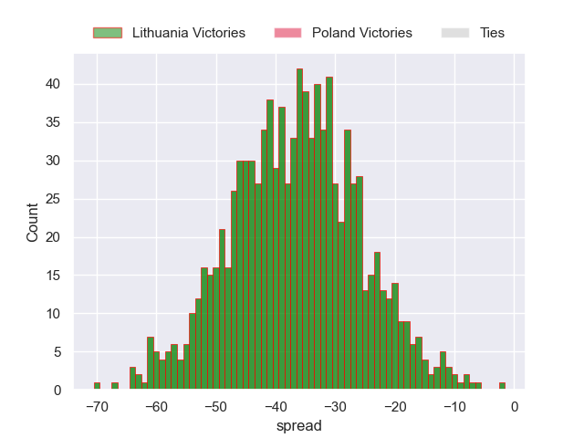

### Croatia V Sweden on 2024/11/16

Average Margin: Croatia by 0.4

Average Scoreline: 25-25

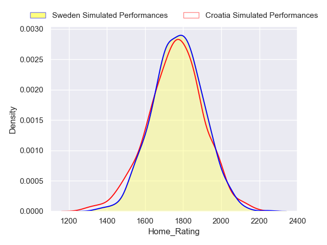
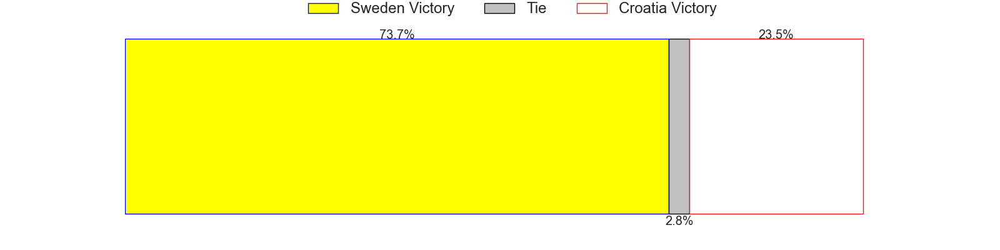
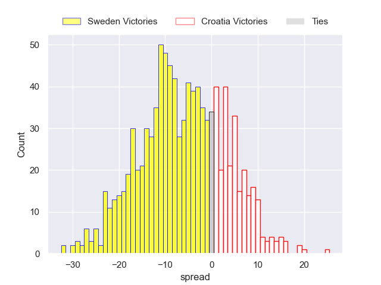

## Week 4

### Czech Republic V Poland on 2024/11/23

Average Margin: Czech Republic by 44.1

Average Scoreline: 89-45

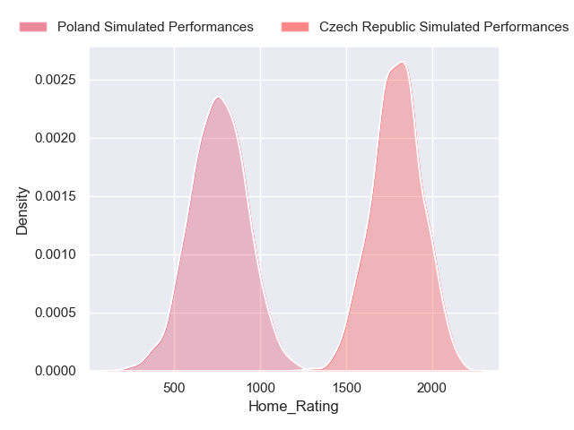

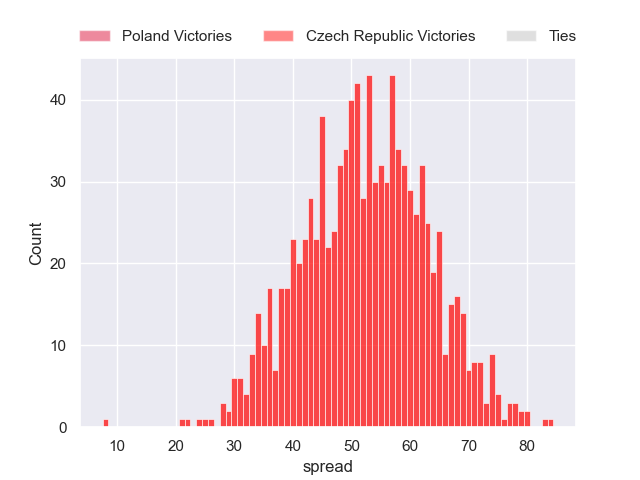

### Croatia V Lithuania on 2024/11/23

Average Margin: Croatia by 9.5

Average Scoreline: 30-20

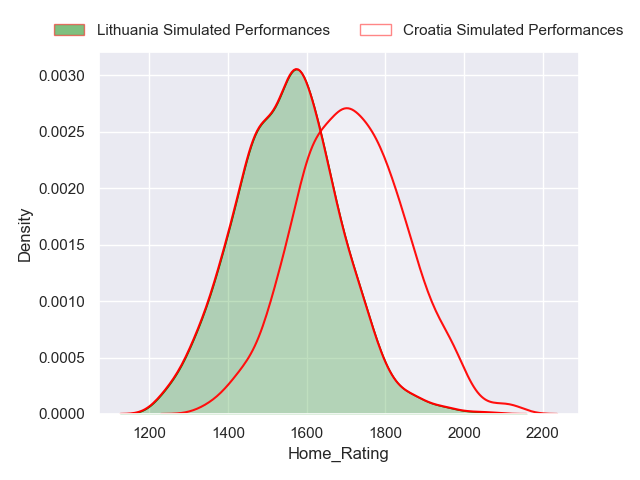
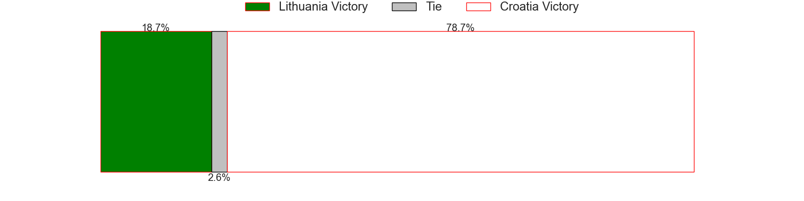
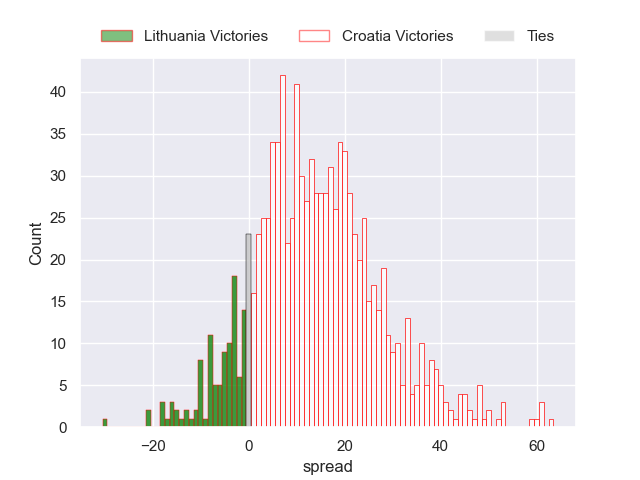

## Week 5

### Luxembourg V Croatia on 2024/11/30

Average Margin: Luxembourg by 0.4

Average Scoreline: 26-26

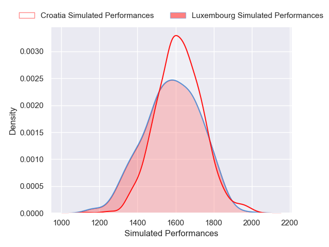

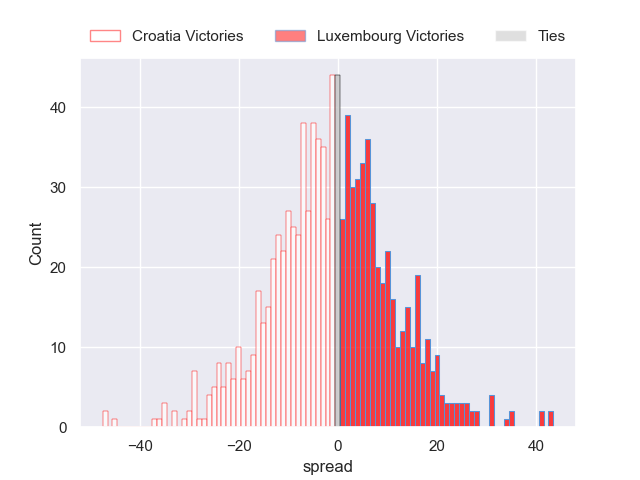

## Week 6

### Poland V Croatia on 2025/02/22

Average Margin: Croatia by 2.1

Average Scoreline: 28-25

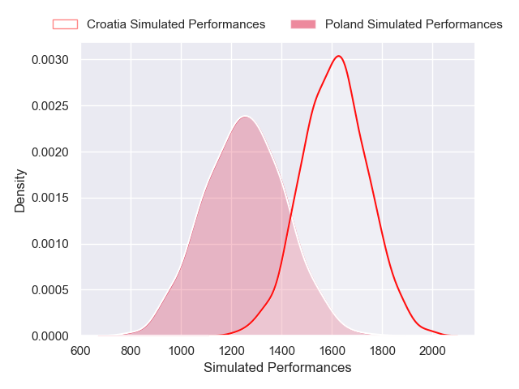
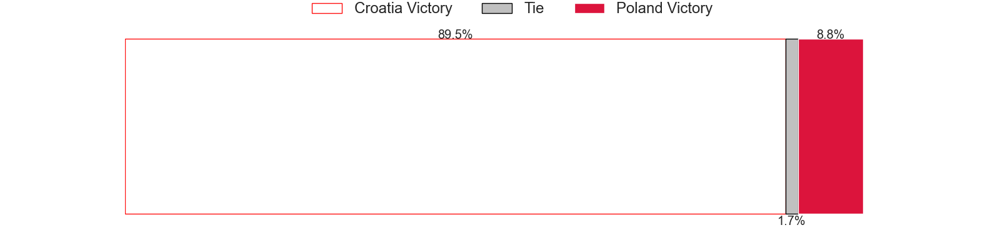
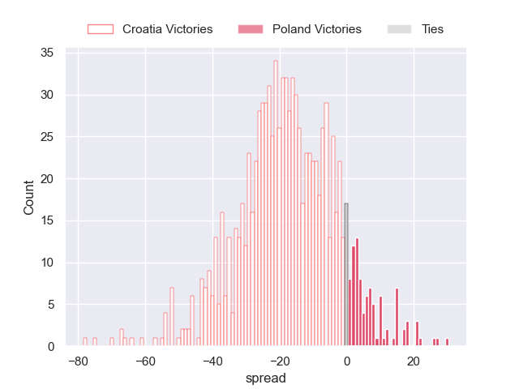

## Week 7

### Czech Republic V Luxembourg on 2025/03/08

Average Margin: Czech Republic by 16.7

Average Scoreline: 36-20

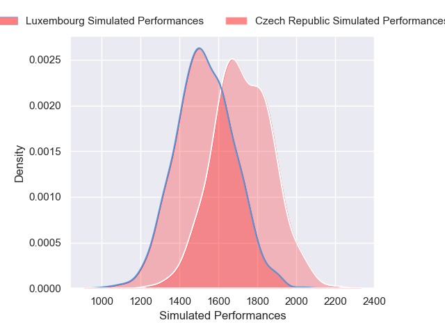
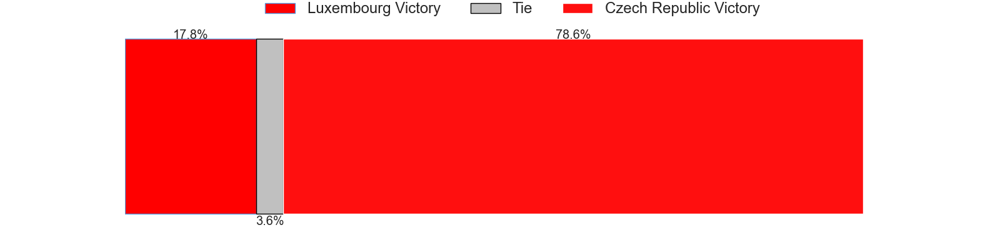
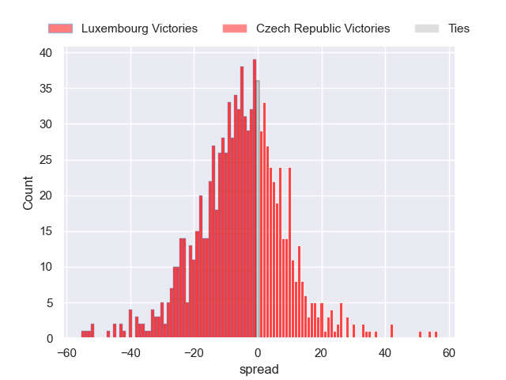

## Week 8

### Lithuania V Czech Republic on 2025/03/29

Average Margin: Lithuania by 0.1

Average Scoreline: 30-30

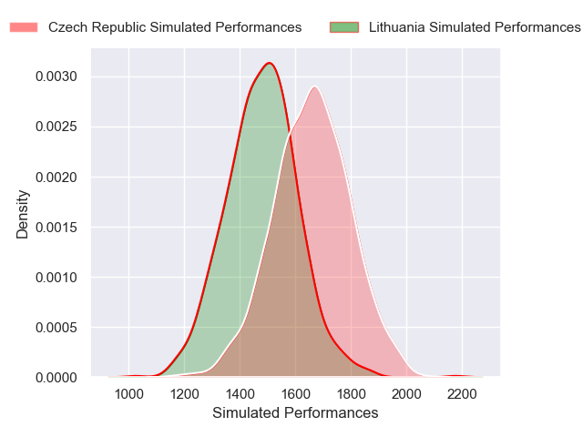

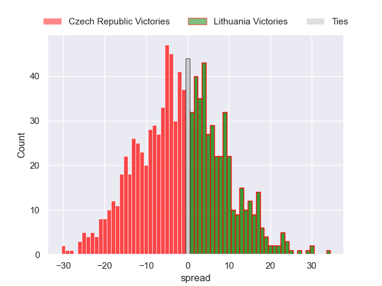

### Luxembourg V Sweden on 2025/03/29

Average Margin: Luxembourg by 0.2

Average Scoreline: 28-28

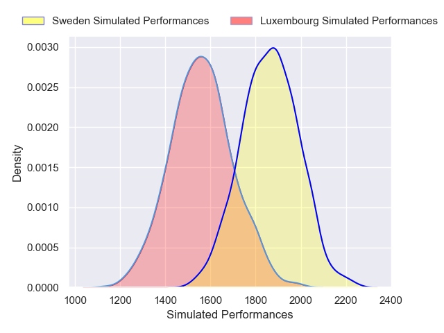
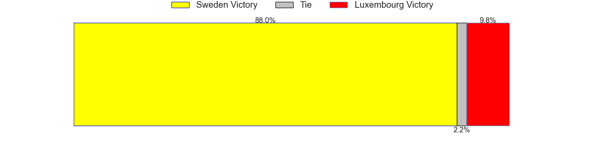
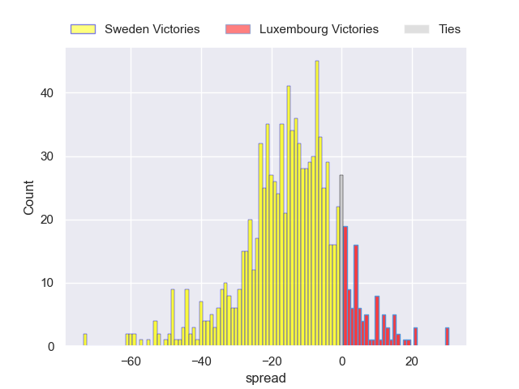

## Week 9

### Luxembourg V Poland on 2025/04/05

Average Margin: Luxembourg by 29.9

Average Scoreline: 56-26

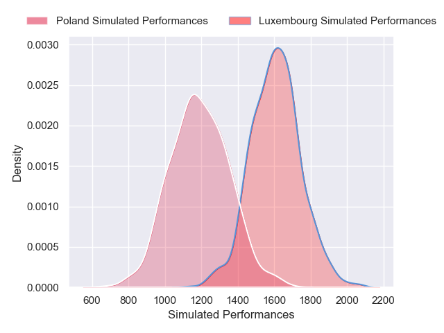

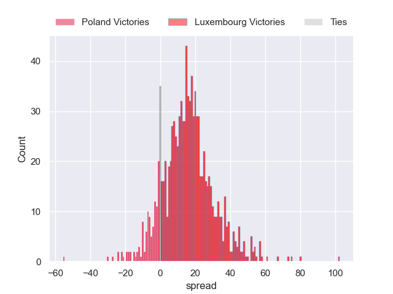

## Week 10

### Sweden V Poland on 2025/04/11

Average Margin: Sweden by 36.2

Average Scoreline: 65-29

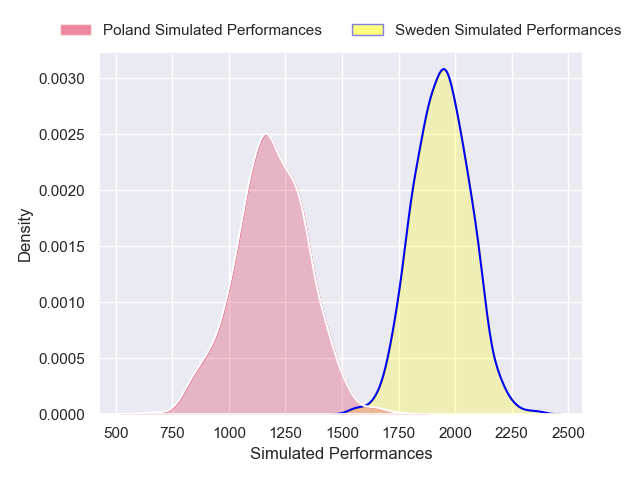
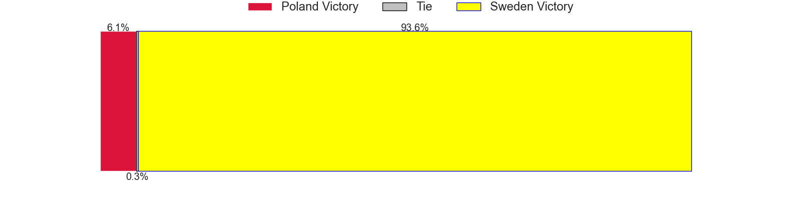
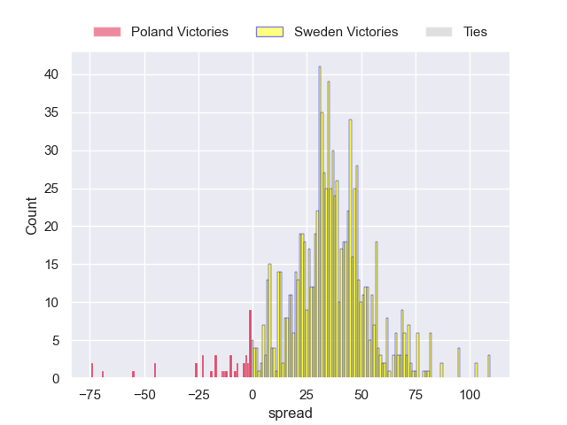

