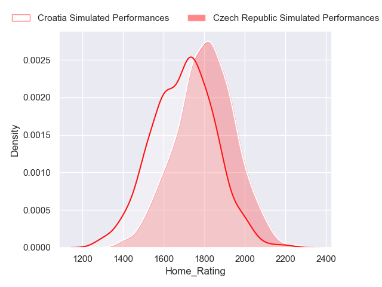
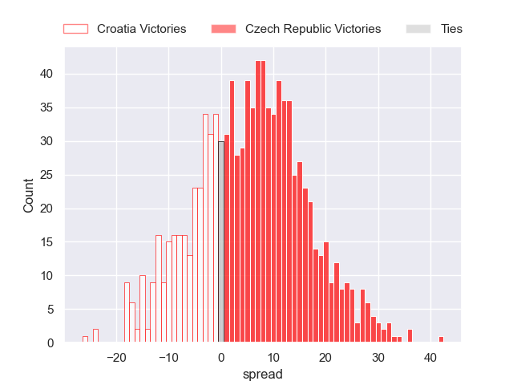

---  
title: "Rugby Europe Trophy 2024 Status"  
date: 2024-11-04 6:00:00 -0500  
categories: model review projection  
layout: article  
aside:  
    toc: true  
---
# Current Team Rankings

# Standings

## Current Standings

| Club           |   Played |   Wins |   Point Differential |   Losing Bonus Points |   Try Bonus Points |   Competition Points |
|:---------------|---------:|-------:|---------------------:|----------------------:|-------------------:|---------------------:|
| Sweden         |        2 |      2 |                   33 |                     0 |                nan |                    8 |
| Lithuania      |        2 |      1 |                    0 |                     0 |                nan |                    5 |
| Czech Republic |        1 |      0 |                   -6 |                     1 |                  0 |                    1 |
| Luxembourg     |        1 |      0 |                  -27 |                     0 |                  0 |                    0 |

## Projected Remaining Table

| Club           |   Matches Remaining |   Wins |   Point Differential |   Losing Bonus Points |   Try Bonus Points |   Competition Points |
|:---------------|--------------------:|-------:|---------------------:|----------------------:|-------------------:|---------------------:|
| Croatia        |                   5 |    3.2 |             50.3088  |                   0.8 |                2.1 |                 15.8 |
| Czech Republic |                   4 |    3.3 |             76.9285  |                   0.4 |                2   |                 15.7 |
| Sweden         |                   3 |    2.5 |             72.7845  |                   0.3 |                1.9 |                 12.3 |
| Luxembourg     |                   4 |    1.5 |              9.38218 |                   0.6 |                1.3 |                  7.8 |
| Lithuania      |                   3 |    1.5 |             21.3034  |                   0.5 |                1.3 |                  7.6 |
| Poland         |                   5 |    0   |           -230.707   |                   0   |                0.8 |                  0.8 |

## Projected Total Table

| Club           |   Total Matches |   Wins |   Point Differential |   Losing Bonus Points |   Try Bonus Points |   Competition Points |
|:---------------|----------------:|-------:|---------------------:|----------------------:|-------------------:|---------------------:|
| Sweden         |               5 |    4.5 |             105.784  |                   0.3 |                1.9 |                 20.3 |
| Czech Republic |               5 |    3.3 |              70.9285 |                   1.4 |                2   |                 16.7 |
| Croatia        |               5 |    3.2 |              50.3088 |                   0.8 |                2.1 |                 15.8 |
| Lithuania      |               5 |    2.5 |              21.3034 |                   0.5 |                1.3 |                 12.6 |
| Luxembourg     |               5 |    1.5 |             -17.6178 |                   0.6 |                1.3 |                  7.8 |
| Poland         |               5 |    0   |            -230.707  |                   0   |                0.8 |                  0.8 |

# Completed Match Review

| Model | Percent Correct Predictions | Spread Error |
| ------ | ------ | ------ |
| Club Level | 100.0% | 16.7 |
| Player Level: Lineup | 100.0% | 13.5 |
| Player Level: Minutes | 100.0% | 12.5 |

# Future Predictions

## Week 3

### Czech Republic V Croatia on 2024/11/09

Average Margin: Czech Republic by 5.3

Average Scoreline: 31-26

## Week 4

### Poland V Lithuania on 2024/11/16

Average Margin: Lithuania by 36.5

Average Scoreline: 48-12

### Croatia V Sweden on 2024/11/16

Average Margin: Sweden by 3.6

Average Scoreline: 31-27

## Week 5

### Czech Republic V Poland on 2024/11/23

Average Margin: Czech Republic by 52.8

Average Scoreline: 60-7

### Croatia V Lithuania on 2024/11/23

Average Margin: Croatia by 10.3

Average Scoreline: 31-21

## Week 6

### Luxembourg V Croatia on 2024/11/30

Average Margin: Croatia by 6.0

Average Scoreline: 26-20

## Week 7

### Poland V Croatia on 2025/02/22

Average Margin: Croatia by 43.0

Average Scoreline: 51-8

## Week 8

### Czech Republic V Luxembourg on 2025/03/08

Average Margin: Czech Republic by 13.9

Average Scoreline: 32-19

## Week 9

### Luxembourg V Sweden on 2025/03/29

Average Margin: Sweden by 12.4

Average Scoreline: 31-18

### Lithuania V Czech Republic on 2025/03/29

Average Margin: Czech Republic by 4.9

Average Scoreline: 26-21

## Week 10

### Luxembourg V Poland on 2025/04/05

Average Margin: Luxembourg by 41.6

Average Scoreline: 56-14

## Week 11

### Sweden V Poland on 2025/04/11

Average Margin: Sweden by 56.8

Average Scoreline: 63-6

