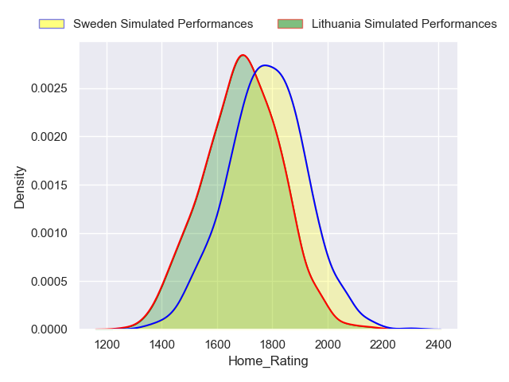
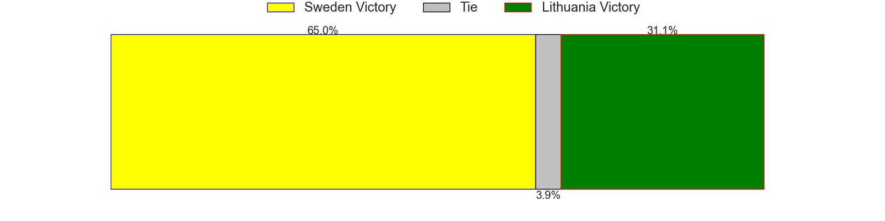
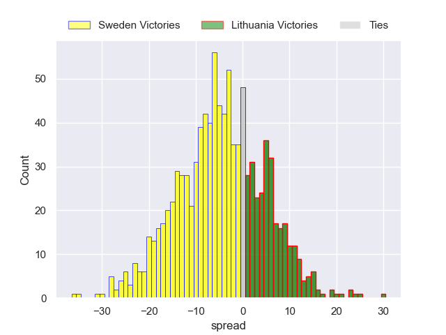

---  
title: "Rugby Europe Trophy 2024 Status"  
date: 2024-11-01 6:00:00 -0500  
categories: model review projection  
layout: article  
aside:  
    toc: true  
---
# Current Team Rankings

# Standings

## Current Standings

| Club           |   Played |   Wins |   Point Differential |   Losing Bonus Points |   Try Bonus Points |   Competition Points |
|:---------------|---------:|-------:|---------------------:|----------------------:|-------------------:|---------------------:|
| Lithuania      |        1 |      1 |                   27 |                     0 |                nan |                    4 |
| Sweden         |        1 |      1 |                    6 |                     0 |                nan |                    4 |
| Czech Republic |        1 |      0 |                   -6 |                     1 |                nan |                    1 |
| Luxembourg     |        1 |      0 |                  -27 |                     0 |                nan |                    0 |

## Projected Remaining Table

| Club           |   Matches Remaining |   Wins |   Point Differential |   Losing Bonus Points |   Try Bonus Points |   Competition Points |
|:---------------|--------------------:|-------:|---------------------:|----------------------:|-------------------:|---------------------:|
| Croatia        |                   5 |    3.2 |              50.3798 |                   0.9 |                2.1 |                 15.9 |
| Czech Republic |                   4 |    3.2 |              74.1427 |                   0.5 |                2.1 |                 15.4 |
| Sweden         |                   4 |    3   |              68.2289 |                   0.6 |                2.1 |                 14.7 |
| Lithuania      |                   4 |    2   |              26.569  |                   0.8 |                1.4 |                 10.2 |
| Luxembourg     |                   4 |    1.6 |              13.0145 |                   0.7 |                1.3 |                  8.2 |
| Poland         |                   5 |    0   |            -232.335  |                   0   |                1   |                  1   |

## Projected Total Table

| Club           |   Total Matches |   Wins |   Point Differential |   Losing Bonus Points |   Try Bonus Points |   Competition Points |
|:---------------|----------------:|-------:|---------------------:|----------------------:|-------------------:|---------------------:|
| Sweden         |               5 |    4   |              74.2289 |                   0.6 |                2.1 |                 18.7 |
| Czech Republic |               5 |    3.2 |              68.1427 |                   1.5 |                2.1 |                 16.4 |
| Croatia        |               5 |    3.2 |              50.3798 |                   0.9 |                2.1 |                 15.9 |
| Lithuania      |               5 |    3   |              53.569  |                   0.8 |                1.4 |                 14.2 |
| Luxembourg     |               5 |    1.6 |             -13.9855 |                   0.7 |                1.3 |                  8.2 |
| Poland         |               5 |    0   |            -232.335  |                   0   |                1   |                  1   |

# Completed Match Review

| Model | Percent Correct Predictions | Spread Error |
| ------ | ------ | ------ |
| Club Level | 100.0% | 13.0 |
| Player Level: Lineup | nan% | nan |
| Player Level: Minutes | nan% | nan |

# Future Predictions

## Week 2

### Lithuania V Sweden on 2024/11/02

Average Margin: Sweden by 4.4

Average Scoreline: 39-34

## Week 3

### Czech Republic V Croatia on 2024/11/09

Average Margin: Czech Republic by 5.7

Average Scoreline: 31-25

## Week 4

### Croatia V Sweden on 2024/11/16

Average Margin: Sweden by 0.3

Average Scoreline: 27-27

### Poland V Lithuania on 2024/11/16

Average Margin: Lithuania by 40.2

Average Scoreline: 48-8

## Week 5

### Croatia V Lithuania on 2024/11/23

Average Margin: Croatia by 6.9

Average Scoreline: 30-23

### Czech Republic V Poland on 2024/11/23

Average Margin: Czech Republic by 52.4

Average Scoreline: 72-20

## Week 6

### Luxembourg V Croatia on 2024/11/30

Average Margin: Croatia by 5.8

Average Scoreline: 37-31

## Week 7

### Poland V Croatia on 2025/02/22

Average Margin: Croatia by 43.7

Average Scoreline: 49-6

## Week 8

### Czech Republic V Luxembourg on 2025/03/08

Average Margin: Czech Republic by 13.7

Average Scoreline: 32-18

## Week 9

### Lithuania V Czech Republic on 2025/03/29

Average Margin: Czech Republic by 2.3

Average Scoreline: 34-31

### Luxembourg V Sweden on 2025/03/29

Average Margin: Sweden by 9.3

Average Scoreline: 34-24

## Week 10

### Luxembourg V Poland on 2025/04/05

Average Margin: Luxembourg by 41.8

Average Scoreline: 59-17

## Week 11

### Sweden V Poland on 2025/04/11

Average Margin: Sweden by 54.2

Average Scoreline: 74-20

