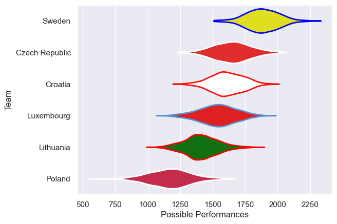

---  
title: "Rugby Europe Trophy 2025 Status"  
date: 2025-01-31 6:00:00 -0500  
categories: model review projection  
layout: article  
aside:  
    toc: true  
---
# Current Team Rankings

# Standings

## Projected Total Table

| Club           |   Total Matches |   Wins |   Point Differential |   Losing Bonus Points |   Try Bonus Points |   Competition Points |
|:---------------|----------------:|-------:|---------------------:|----------------------:|-------------------:|---------------------:|
| Sweden         |               2 |    1.8 |             47.9426  |                   0.1 |                1.4 |                  8.7 |
| Czech Republic |               2 |    1.6 |             19.8914  |                   0.3 |                0.9 |                  7.5 |
| Luxembourg     |               3 |    1.3 |             -2.36876 |                   0.4 |                0.9 |                  6.4 |
| Croatia        |               1 |    0.9 |             18.2162  |                   0.1 |                0.6 |                  4.3 |
| Poland         |               3 |    0.2 |            -73.9002  |                   0.2 |                0.6 |                  1.8 |
| Lithuania      |               1 |    0.2 |             -9.78123 |                   0.2 |                0.2 |                  1.3 |

# Future Predictions

## Week 1

### Poland V Croatia on 2025/02/22

Average Margin: Croatia by 18.2

Average Scoreline: 37-19

## Week 2

### Czech Republic V Luxembourg on 2025/03/08

Average Margin: Czech Republic by 10.1

Average Scoreline: 37-27

## Week 3

### Luxembourg V Sweden on 2025/03/29

Average Margin: Sweden by 13.7

Average Scoreline: 21-8

### Lithuania V Czech Republic on 2025/03/29

Average Margin: Czech Republic by 9.8

Average Scoreline: 35-25

## Week 4

### Luxembourg V Poland on 2025/04/05

Average Margin: Luxembourg by 21.4

Average Scoreline: 30-9

## Week 5

### Sweden V Poland on 2025/04/11

Average Margin: Sweden by 34.2

Average Scoreline: 45-10

