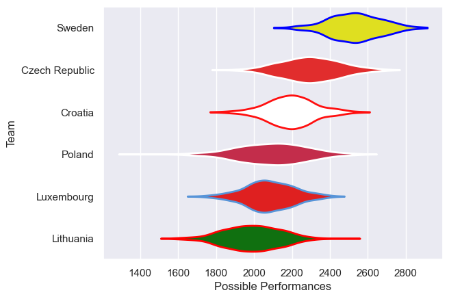

---  
title: "Rugby Europe Trophy 2025 Status"  
date: 2025-04-11 6:00:00 -0500  
categories: model review projection  
layout: article  
aside:  
    toc: true  
---
# Current Team Rankings

# Standings

## Current Standings

| Club           |   Played |   Wins |   Point Differential |   Losing Bonus Points |   Try Bonus Points |   Competition Points |
|:---------------|---------:|-------:|---------------------:|----------------------:|-------------------:|---------------------:|
| Czech Republic |        2 |      2 |                   65 |                     0 |                nan |                    8 |
| Poland         |        2 |      2 |                   54 |                     0 |                nan |                    8 |
| Sweden         |        1 |      1 |                   39 |                     0 |                nan |                    4 |
| Croatia        |        1 |      0 |                  -31 |                     0 |                nan |                    0 |
| Lithuania      |        1 |      0 |                  -41 |                     0 |                nan |                    0 |
| Luxembourg     |        3 |      0 |                  -86 |                     0 |                nan |                    0 |

## Projected Remaining Table

| Club   |   Matches Remaining |   Wins |   Point Differential |   Losing Bonus Points |   Try Bonus Points |   Competition Points |
|:-------|--------------------:|-------:|---------------------:|----------------------:|-------------------:|---------------------:|
| Sweden |                   1 |    0.9 |              22.5503 |                   0   |                0.6 |                  4.4 |
| Poland |                   1 |    0.1 |             -22.5503 |                   0.1 |                0.1 |                  0.4 |

## Projected Total Table

| Club           |   Total Matches |   Wins |   Point Differential |   Losing Bonus Points |   Try Bonus Points |   Competition Points |
|:---------------|----------------:|-------:|---------------------:|----------------------:|-------------------:|---------------------:|
| Sweden         |               2 |    1.9 |              61.5503 |                   0   |                0.6 |                  8.4 |
| Poland         |               3 |    2.1 |              31.4497 |                   0.1 |                0.1 |                  8.4 |
| Czech Republic |               2 |    2   |              65      |                   0   |                0   |                  8   |
| Croatia        |               1 |    0   |             -31      |                   0   |                0   |                  0   |
| Lithuania      |               1 |    0   |             -41      |                   0   |                0   |                  0   |
| Luxembourg     |               3 |    0   |             -86      |                   0   |                0   |                  0   |

# Completed Match Review

| Model | Percent Correct Predictions | Spread Error |
| ------ | ------ | ------ |
| Club Level | 60.0% | 30.4 |
| Player Level: Lineup | nan% | nan |
| Player Level: Minutes | nan% | nan |

# Future Predictions

## Week 4

### Sweden V Poland on 2025/04/12

Average Margin: Sweden by 22.6

Average Scoreline: 39-16

