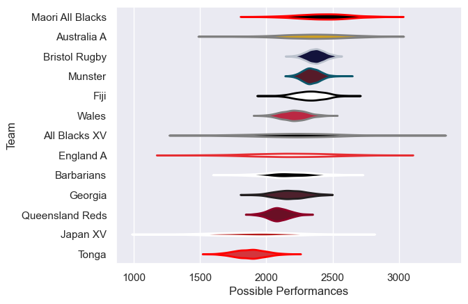

---  
title: "Rugby Union Hybrid Friendlies 2024 Status"  
date: 2025-07-28 6:00:00 -0500  
categories: model review projection  
layout: article  
aside:  
    toc: true  
---
# Current Team Rankings

# Standings

## Current Standings

| Club             |   Played |   Wins |   Point Differential |   Losing Bonus Points |   Try Bonus Points |   Competition Points |
|:-----------------|---------:|-------:|---------------------:|----------------------:|-------------------:|---------------------:|
| All Blacks XV    |        2 |      2 |                   32 |                     0 |                  2 |                   10 |
| Queensland Reds  |        2 |      1 |                   26 |                     1 |                  2 |                    7 |
| England A        |        1 |      1 |                   21 |                     0 |                  1 |                    5 |
| Maori All Blacks |        2 |      1 |                   14 |                     0 |                  1 |                    5 |
| Barbarians       |        1 |      1 |                   13 |                     0 |                  1 |                    5 |
| Wales            |        1 |      1 |                    1 |                     0 |                  1 |                    5 |
| Japan XV         |        2 |      1 |                  -14 |                     0 |                    |                    4 |
| Bristol Rugby    |        1 |      0 |                    0 |                     0 |                    |                    2 |
| Australia A      |        2 |      0 |                  -21 |                     0 |                    |                    2 |
| Fiji             |        1 |      0 |                  -13 |                     0 |                  1 |                    1 |
| Munster          |        1 |      0 |                  -14 |                     0 |                  1 |                    1 |
| Georgia          |        1 |      0 |                  -18 |                     0 |                    |                    0 |
| Tonga            |        1 |      0 |                  -27 |                     0 |                    |                    0 |

# Completed Match Review

| Model | Percent Correct Predictions | Spread Error |
| ------ | ------ | ------ |
| Club Level | 11.1% | 20.8 |
| Player Level: Lineup | nan% | nan |
| Player Level: Minutes | nan% | nan |

