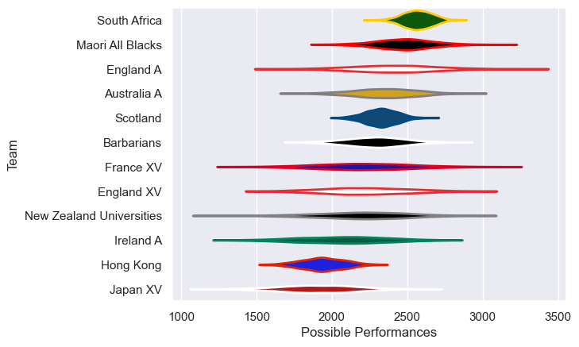

---  
title: "Rugby Union Hybrid Friendlies 2025"  
date: 2025-10-13 6:00:00 -0500  
categories: model review projection  
layout: article  
aside:  
    toc: true  
---
# Team Rankings

# Standings

## Current Standings

| Club                     |   Played |   Wins |   Point Differential |   Losing Bonus Points |   Try Bonus Points |   Competition Points |
|:-------------------------|---------:|-------:|---------------------:|----------------------:|-------------------:|---------------------:|
| Japan XV                 |        3 |      2 |                   28 |                     0 |                  1 |                    9 |
| Maori All Blacks         |        2 |      1 |                   30 |                     1 |                  2 |                    7 |
| South Africa             |        1 |      1 |                   47 |                     0 |                  1 |                    5 |
| England A                |        1 |      1 |                   16 |                     0 |                  1 |                    5 |
| Scotland                 |        1 |      1 |                    3 |                     0 |                  1 |                    5 |
| France XV                |        1 |      1 |                    2 |                     0 |                  1 |                    5 |
| England XV               |        1 |      0 |                   -2 |                     1 |                  1 |                    2 |
| New Zealand Universities |        1 |      0 |                   -9 |                     0 |                    |                    0 |
| Ireland A                |        1 |      0 |                  -16 |                     0 |                    |                    0 |
| Barbarians               |        1 |      0 |                  -47 |                     0 |                    |                    0 |
| Hong Kong                |        1 |      0 |                  -52 |                     0 |                    |                    0 |

## Projected Remaining Table

| Club        |   To Play |   Projected Wins |   Projected Differential |   Projected Losing Bonus Points | Projected Try Bonus Points   |   Projected Competition Points |
|:------------|----------:|-----------------:|-------------------------:|--------------------------------:|:-----------------------------|-------------------------------:|
| Australia A |         1 |            0.645 |                    9.328 |                           0.142 |                              |                          2.786 |
| Japan XV    |         1 |            0.323 |                   -9.328 |                           0.165 |                              |                          1.521 |

## Projected Total Table

| Club                     |   Played |   Wins |   Point Differential |   Losing Bonus Points |   Try Bonus Points |   Competition Points |
|:-------------------------|---------:|-------:|---------------------:|----------------------:|-------------------:|---------------------:|
| Japan XV                 |        4 |  2.323 |               18.672 |                 0.165 |                  1 |               10.521 |
| Maori All Blacks         |        2 |  1     |               30     |                 1     |                  2 |                7     |
| South Africa             |        1 |  1     |               47     |                 0     |                  1 |                5     |
| England A                |        1 |  1     |               16     |                 0     |                  1 |                5     |
| Scotland                 |        1 |  1     |                3     |                 0     |                  1 |                5     |
| France XV                |        1 |  1     |                2     |                 0     |                  1 |                5     |
| Australia A              |        1 |  0.645 |                9.328 |                 0.142 |                    |                2.786 |
| England XV               |        1 |  0     |               -2     |                 1     |                  1 |                2     |
| New Zealand Universities |        1 |  0     |               -9     |                 0     |                    |                0     |
| Ireland A                |        1 |  0     |              -16     |                 0     |                    |                0     |
| Barbarians               |        1 |  0     |              -47     |                 0     |                    |                0     |
| Hong Kong                |        1 |  0     |              -52     |                 0     |                    |                0     |

# Completed Match Review

| Model | Percent Correct Predictions | Spread Error |
| ------ | ------ | ------ |
| Club Level | 50.0% | 20.7 |
| Player Level: Lineup | nan% | nan |
| Player Level: Minutes | nan% | nan |

# Future Predictions

## Week 4

### Japan XV V Australia A on 2025/10/17

Average Margin: Australia A by 9.3

