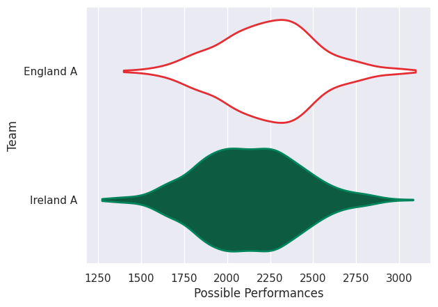
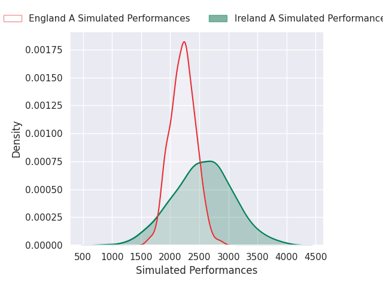
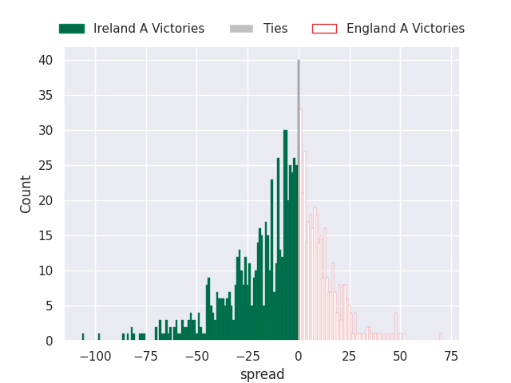

# Team Rankings

# Standings

## Projected Remaining Table

| Club      |   To Play |   Projected Wins |   Projected Differential |   Projected Losing Bonus Points | Projected Try Bonus Points   |   Projected Competition Points |
|:----------|----------:|-----------------:|-------------------------:|--------------------------------:|:-----------------------------|-------------------------------:|
| Ireland A |         1 |            0.641 |                    9.571 |                           0.136 |                              |                          2.772 |
| England A |         1 |            0.323 |                   -9.571 |                           0.182 |                              |                          1.546 |

## Projected Total Table

| Club      |   Played |   Wins |   Point Differential |   Losing Bonus Points | Try Bonus Points   |   Competition Points |
|:----------|---------:|-------:|---------------------:|----------------------:|:-------------------|---------------------:|
| Ireland A |        1 |  0.641 |                9.571 |                 0.136 |                    |                2.772 |
| England A |        1 |  0.323 |               -9.571 |                 0.182 |                    |                1.546 |

# Future Predictions

## Week 1

### Ireland A V England A on 2026/02/06

Average Margin: Ireland A by 9.6

