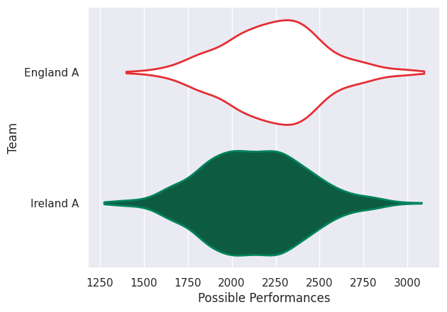
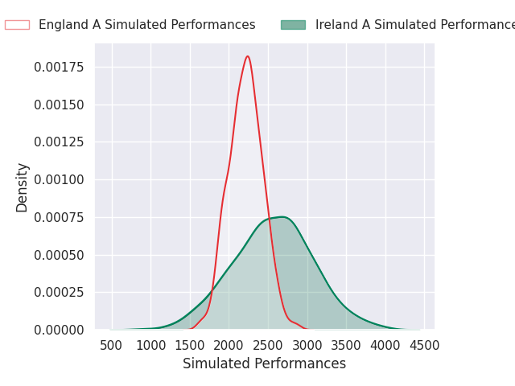
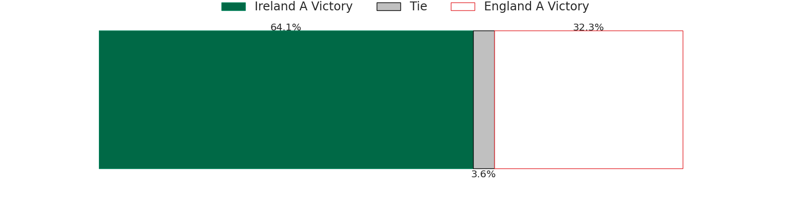
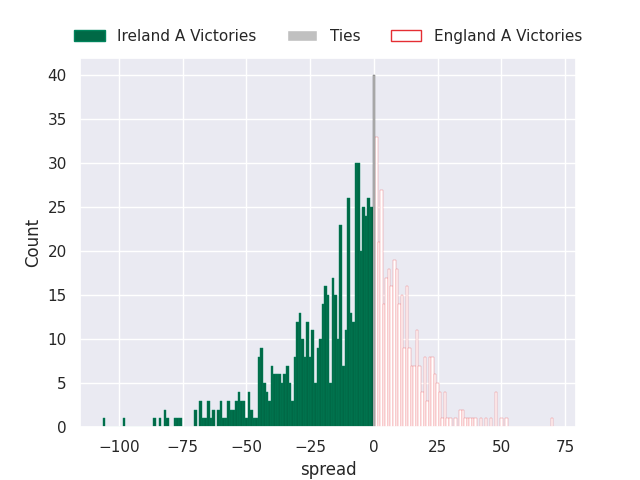

# Team Rankings

# Standings

## Projected Remaining Table

| Club      |   To Play |   Projected Wins |   Projected Differential |   Projected Losing Bonus Points | Projected Try Bonus Points   |   Projected Competition Points |
|:----------|----------:|-----------------:|-------------------------:|--------------------------------:|:-----------------------------|-------------------------------:|
| Ireland A |         1 |            0.601 |                    8.334 |                           0.154 |                              |                          2.62  |
| England A |         1 |            0.368 |                   -8.334 |                           0.168 |                              |                          1.702 |

## Projected Total Table

| Club      |   Played |   Wins |   Point Differential |   Losing Bonus Points | Try Bonus Points   |   Competition Points |
|:----------|---------:|-------:|---------------------:|----------------------:|:-------------------|---------------------:|
| Ireland A |        1 |  0.601 |                8.334 |                 0.154 |                    |                2.62  |
| England A |        1 |  0.368 |               -8.334 |                 0.168 |                    |                1.702 |

# Future Predictions

## Week 1

### Ireland A V England A on 2026/02/06

Average Margin: Ireland A by 8.3

