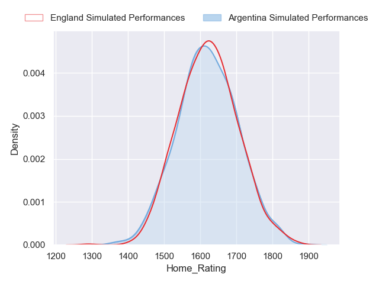
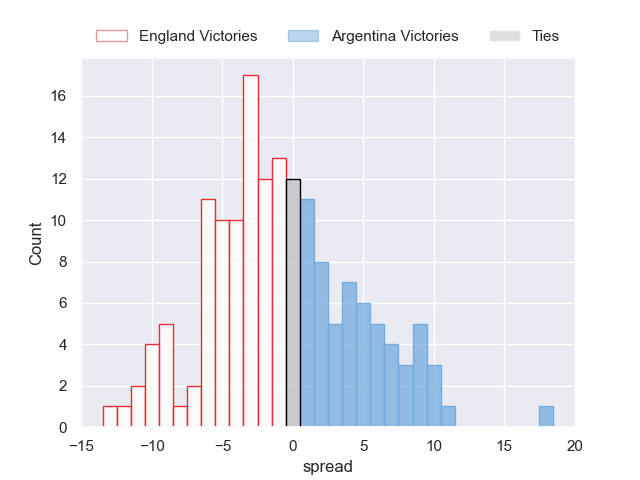
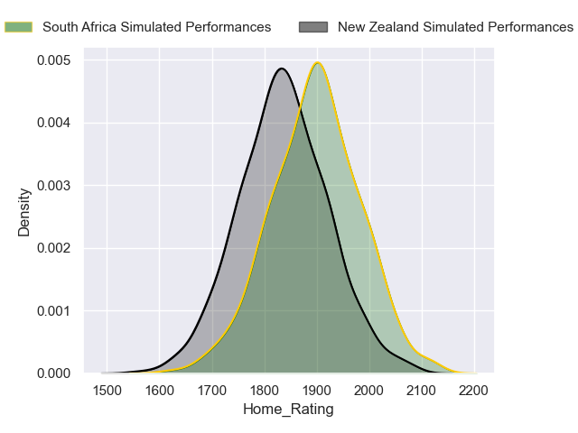
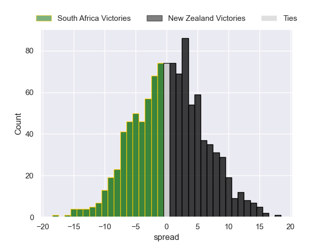

---  
title: "World Cup 2023 Predictions"  
date: 2023-10-26 6:00:00 -0500  
categories: model projection  
layout: article  
aside:  
    toc: true  
---
# Current Team Rankings

# Pool Results

## Current Standings

| Club        |   Played |   Wins |   Point Differential |   Losing Bonus Points |   Try Bonus Points |
|:------------|---------:|-------:|---------------------:|----------------------:|-------------------:|
| New Zealand |        7 |      6 |                  286 |                     0 |                nan |
| France      |        5 |      4 |                  177 |                     1 |                  2 |
| Italy       |        4 |      2 |                  -67 |                     0 |                  2 |
| Uruguay     |        4 |      1 |                  -99 |                     0 |                  1 |
| Namibia     |        4 |      0 |                 -218 |                     0 |                  0 |

## Current Standings

| Club         |   Played |   Wins |   Point Differential |   Losing Bonus Points |   Try Bonus Points |
|:-------------|---------:|-------:|---------------------:|----------------------:|-------------------:|
| South Africa |        7 |      6 |                  120 |                     1 |                nan |
| Ireland      |        5 |      4 |                  140 |                     1 |                nan |
| Scotland     |        4 |      2 |                   75 |                     0 |                  2 |
| Tonga        |        4 |      1 |                  -81 |                     0 |                  1 |
| Romania      |        4 |      0 |                 -255 |                     0 |                  0 |

## Current Standings

| Club      |   Played |   Wins |   Point Differential |   Losing Bonus Points |   Try Bonus Points |
|:----------|---------:|-------:|---------------------:|----------------------:|-------------------:|
| Wales     |        5 |      4 |                   72 |                     0 |                nan |
| Fiji      |        5 |      2 |                   -1 |                     3 |                nan |
| Australia |        4 |      2 |                   -1 |                     1 |                nan |
| Portugal  |        5 |      2 |                  -39 |                     0 |                nan |
| Georgia   |        5 |      1 |                  -49 |                     1 |                nan |

## Current Standings

| Club      |   Played |   Wins |   Point Differential |   Losing Bonus Points |   Try Bonus Points |
|:----------|---------:|-------:|---------------------:|----------------------:|-------------------:|
| England   |        7 |      5 |                  115 |                     2 |                  2 |
| Argentina |        7 |      4 |                   -6 |                     0 |                nan |
| Japan     |        4 |      2 |                    2 |                     0 |                nan |
| Samoa     |        4 |      1 |                   17 |                     2 |                  1 |
| Chile     |        4 |      0 |                 -188 |                     0 |                  0 |

# Projected Playoff Results

|              | Reach Bronze Final   | Win Bronze   | Reach Final   | Win Final   |
|:-------------|:---------------------|:-------------|:--------------|:------------|
| New Zealand  | 0.0 %                | 0.0 %        | 100.0 %       | 50.6 %      |
| South Africa | 0.0 %                | 0.0 %        | 100.0 %       | 49.4 %      |
| England      | 100.0 %              | 74.5 %       | 0.0 %         | 0.0 %       |
| Argentina    | 100.0 %              | 25.5 %       | 0.0 %         | 0.0 %       |

# Knockout Match Predictions

## Bronze Finals

### Argentina V England on 2023/10/27

Average Margin: England by 3.9

## Finals

### New Zealand V South Africa on 2023/10/28

Average Margin: New Zealand by 0.2

# Completed Match Review

| Match                                 |   Result |   Lineup Prediction |   Minutes Prediction |   Club Prediction |
|:--------------------------------------|---------:|--------------------:|---------------------:|------------------:|
| France V New Zealand on 2023/09/08    |       14 |                 1.5 |                  0.8 |               2.4 |
| Italy V Namibia on 2023/09/09         |       44 |                14.1 |                 13.8 |              18.5 |
| Ireland V Romania on 2023/09/09       |       74 |                39.5 |                 40.7 |              36.8 |
| Australia V Georgia on 2023/09/09     |       20 |                -7.2 |                 -8.2 |               6.1 |
| England V Argentina on 2023/09/09     |       17 |                 3.5 |                  4.3 |              -2.7 |
| Japan V Chile on 2023/09/10           |       30 |                13.7 |                 15.7 |              14.3 |
| South Africa V Scotland on 2023/09/10 |       15 |                16.3 |                 17.2 |               9.6 |
| Wales V Fiji on 2023/09/10            |        6 |                -2.9 |                 -3.5 |              -6.7 |
| France V Uruguay on 2023/09/14        |       15 |                19.1 |                 18.8 |              37.6 |
| New Zealand V Namibia on 2023/09/15   |       68 |                27.8 |                 28.2 |              34.7 |
| Samoa V Chile on 2023/09/16           |       33 |                14.3 |                 14.4 |              22.4 |
| Wales V Portugal on 2023/09/16        |       20 |                -1   |                 -1.2 |              11.3 |
| Ireland V Tonga on 2023/09/16         |       43 |                25.6 |                 25.6 |              25.8 |
| South Africa V Romania on 2023/09/17  |       76 |                35.2 |                 36   |              39.3 |
| Australia V Fiji on 2023/09/17        |       -7 |               -11.1 |                -12.2 |             nan   |
| England V Japan on 2023/09/17         |       22 |                 2.8 |                  1.5 |               9.7 |
| Italy V Uruguay on 2023/09/20         |       21 |                11.6 |                 12.6 |              19.1 |
| France V Namibia on 2023/09/21        |       96 |                34.1 |                 32.8 |              37   |
| Argentina V Samoa on 2023/09/22       |        9 |                -9.7 |                 -9.2 |               4.3 |
| Georgia V Portugal on 2023/09/23      |        0 |                 6.2 |                  6.5 |               7.8 |
| England V Chile on 2023/09/23         |       71 |                16   |                 15.6 |              24   |
| South Africa V Ireland on 2023/09/23  |       -5 |                -0.7 |                 -1.6 |             nan   |
| Scotland V Tonga on 2023/09/24        |       28 |                10.8 |                 10   |              18.7 |
| Wales V Australia on 2023/09/24       |       34 |                 8.5 |                  7.5 |              -2.7 |
| Uruguay V Namibia on 2023/09/27       |       10 |                 2.4 |                  2.4 |              -0.5 |
| Japan V Samoa on 2023/09/28           |        6 |                -4   |                 -3.3 |              -8.1 |
| New Zealand V Italy on 2023/09/29     |       79 |                17.3 |                 16.1 |              16.1 |
| Argentina V Chile on 2023/09/30       |       54 |                11.6 |                 12.5 |              26.7 |
| Fiji V Georgia on 2023/09/30          |        5 |                 9.5 |                 14.4 |              10.1 |
| Scotland V Romania on 2023/09/30      |       84 |                21.3 |                 22.1 |              29.7 |
| Australia V Portugal on 2023/10/01    |       20 |                 1.9 |                  1.3 |              12.1 |
| South Africa V Tonga on 2023/10/01    |       31 |                24   |                 25.2 |              28.8 |
| New Zealand V Uruguay on 2023/10/05   |       73 |                27.7 |                 26.1 |              32.2 |
| France V Italy on 2023/10/06          |       53 |                25.4 |                 25.1 |              19.2 |
| Wales V Georgia on 2023/10/07         |       24 |                 6.5 |                  4.7 |               9.2 |
| England V Samoa on 2023/10/07         |        1 |                11.4 |                 10.9 |               7.2 |
| Ireland V Scotland on 2023/10/07      |       22 |                14.4 |                 16   |               8.4 |
| Japan V Argentina on 2023/10/08       |      -12 |                 0.6 |                  3.8 |             nan   |
| Tonga V Romania on 2023/10/08         |       21 |                15.6 |                 16.5 |              10.5 |
| Fiji V Portugal on 2023/10/08         |       -1 |                 8.3 |                  7   |             nan   |
| Wales V Argentina on 2023/10/14       |      -12 |                10.1 |                  9.4 |             nan   |
| Ireland V New Zealand on 2023/10/14   |       -4 |                 7.2 |                  7.8 |             nan   |
| England V Fiji on 2023/10/15          |        6 |                 4.2 |                  4.3 |              -1.6 |
| France V South Africa on 2023/10/15   |       -1 |                 1.1 |                  0.5 |              -0.5 |
| Argentina V New Zealand on 2023/10/20 |      -38 |               -19   |                -19.4 |             nan   |
| New Zealand V Argentina on 2023/10/20 |       38 |                19   |                 19.4 |              11.3 |
| England V South Africa on 2023/10/21  |       -1 |               -13.7 |                -13.3 |             nan   |
| South Africa V England on 2023/10/21  |        1 |                13.4 |                 13.4 |              14.1 |

# Model Accuracies

| Model | Percent Correct Predictions | Spread Error |
| ------ | ------ | ------ |
| Club Level | 74.5% | 18.3 |
| Player Level: Lineup | 75.5% | 21.6 |
| Player Level: Minutes | 77.1% | 21.7 |

