---  
title: "World Cup 2023 Predictions"  
date: 2023-10-02 6:00:00 -0500  
categories: model projection  
layout: article  
aside:  
    toc: true  
---
# Current Team Rankings

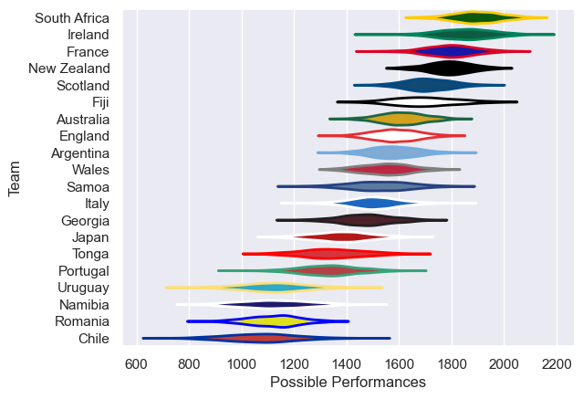
# Pool Results

## Pool A

### Current Standings

| Club        |   Played |   Wins |   Point Differential |   Losing Bonus Points |   Try Bonus Points |
|:------------|---------:|-------:|---------------------:|----------------------:|-------------------:|
| France      |        3 |      3 |                  125 |                     0 |                  1 |
| New Zealand |        3 |      2 |                  133 |                     0 |                  2 |
| Italy       |        3 |      2 |                  -14 |                     0 |                  2 |
| Uruguay     |        3 |      1 |                  -26 |                     0 |                  1 |
| Namibia     |        4 |      0 |                 -218 |                     0 |                  0 |

### Projected Total Table

| Club        |   Played |   Wins |   Point Differential |   Losing Bonus Points |   Try Bonus Points |   Competition Points |
|:------------|---------:|-------:|---------------------:|----------------------:|-------------------:|---------------------:|
| France      |        4 |  3.948 |              136.407 |                 0.05  |              1.938 |               17.78  |
| New Zealand |        4 |  3     |              161.968 |                 0     |              2.999 |               14.999 |
| Italy       |        4 |  2.052 |              -25.407 |                 0.205 |              2.043 |               10.456 |
| Uruguay     |        4 |  1     |              -54.968 |                 0.001 |              1.006 |                5.007 |
| Namibia     |        4 |  0     |             -218     |                 0     |              0     |                0     |

## Pool B

### Current Standings

| Club         |   Played |   Wins |   Point Differential |   Losing Bonus Points |   Try Bonus Points |
|:-------------|---------:|-------:|---------------------:|----------------------:|-------------------:|
| Ireland      |        3 |      3 |                  122 |                     0 |                nan |
| Scotland     |        3 |      2 |                   97 |                     0 |                  2 |
| South Africa |        3 |      2 |                   86 |                     1 |                nan |
| Tonga        |        2 |      0 |                  -71 |                     0 |                  0 |
| Romania      |        3 |      0 |                 -234 |                     0 |                  0 |

### Projected Total Table

| Club         |   Played |   Wins |   Point Differential |   Losing Bonus Points |   Try Bonus Points |   Competition Points |
|:-------------|---------:|-------:|---------------------:|----------------------:|-------------------:|---------------------:|
| Ireland      |        4 |  3.795 |              127.004 |                 0.174 |              0.743 |               18.097 |
| Scotland     |        4 |  2.205 |               91.996 |                 0.432 |              2.182 |               11.434 |
| South Africa |        3 |  2     |               86     |                 1     |              0     |               10     |
| Tonga        |        3 |  0.81  |              -64.261 |                 0.146 |              0.795 |                4.181 |
| Romania      |        4 |  0.19  |             -240.739 |                 0.333 |              0.172 |                1.265 |

## Pool C

### Current Standings

| Club      |   Played |   Wins |   Point Differential |   Losing Bonus Points |   Try Bonus Points |
|:----------|---------:|-------:|---------------------:|----------------------:|-------------------:|
| Wales     |        3 |      3 |                   60 |                     0 |                  2 |
| Fiji      |        3 |      2 |                    6 |                     1 |                nan |
| Australia |        3 |      1 |                  -21 |                     1 |                nan |
| Georgia   |        4 |      1 |                  -25 |                     1 |                nan |
| Portugal  |        3 |      1 |                  -20 |                     0 |                nan |

### Projected Total Table

| Club      |   Played |   Wins |   Point Differential |   Losing Bonus Points |   Try Bonus Points |   Competition Points |
|:----------|---------:|-------:|---------------------:|----------------------:|-------------------:|---------------------:|
| Wales     |        4 |  3.818 |               66.004 |                 0.149 |              2.775 |               18.196 |
| Fiji      |        4 |  2.936 |               18.253 |                 1.061 |              0.929 |               14.734 |
| Georgia   |        5 |  1.182 |              -31.004 |                 1.375 |              0.165 |                6.268 |
| Australia |        3 |  1     |              -21     |                 1     |              0     |                6     |
| Portugal  |        4 |  1.064 |              -32.253 |                 0.173 |              0.053 |                4.482 |

## Pool D

### Current Standings

| Club      |   Played |   Wins |   Point Differential |   Losing Bonus Points |   Try Bonus Points |
|:----------|---------:|-------:|---------------------:|----------------------:|-------------------:|
| England   |        3 |      3 |                  110 |                     0 |                  2 |
| Argentina |        3 |      2 |                   46 |                     0 |                  1 |
| Japan     |        3 |      2 |                   14 |                     0 |                  1 |
| Samoa     |        3 |      1 |                   18 |                     1 |                  1 |
| Chile     |        4 |      0 |                 -188 |                     0 |                  0 |

### Projected Total Table

| Club      |   Played |   Wins |   Point Differential |   Losing Bonus Points |   Try Bonus Points |   Competition Points |
|:----------|---------:|-------:|---------------------:|----------------------:|-------------------:|---------------------:|
| England   |        4 |  3.704 |              113.963 |                 0.235 |              2.684 |               17.735 |
| Argentina |        4 |  2.965 |               58.673 |                 0.032 |              1.951 |               13.843 |
| Japan     |        4 |  2.035 |                1.327 |                 0.171 |              1.033 |                9.344 |
| Samoa     |        4 |  1.296 |               14.037 |                 1.379 |              1.262 |                7.825 |
| Chile     |        4 |  0     |             -188     |                 0     |              0     |                0     |

# Projected Playoff Results

|              | Reach Quarterfinals   | Reach Semifinals   | Reach Bronze Final   | Win Bronze   | Reach Final   | Win Final   |
|:-------------|:----------------------|:-------------------|:---------------------|:-------------|:--------------|:------------|
| Ireland      | 100.0 %               | 68.6 %             | 1.8 %                | 1.8 %        | 66.8 %        | 41.8 %      |
| France       | 95.9 %                | 77.4 %             | 3.6 %                | 3.5 %        | 73.8 %        | 39.3 %      |
| New Zealand  | 100.0 %               | 35.8 %             | 1.8 %                | 1.7 %        | 34.0 %        | 12.4 %      |
| South Africa | 13.3 %                | 8.3 %              | 0.4 %                | 0.4 %        | 7.9 %         | 5.7 %       |
| Scotland     | 86.7 %                | 9.9 %              | 2.2 %                | 1.4 %        | 7.7 %         | 0.6 %       |
| Fiji         | 100.0 %               | 59.2 %             | 54.7 %               | 29.9 %       | 4.5 %         | 0.1 %       |
| England      | 100.0 %               | 40.7 %             | 38.6 %               | 17.5 %       | 2.1 %         | 0.1 %       |
| Wales        | 100.0 %               | 65.2 %             | 62.6 %               | 30.8 %       | 2.6 %         | 0.0 %       |
| Argentina    | 96.5 %                | 34.7 %             | 34.1 %               | 13.0 %       | 0.6 %         | 0.0 %       |
| Japan        | 3.5 %                 | 0.2 %              | 0.2 %                | 0.0 %        | 0.0 %         | 0.0 %       |
| Italy        | 4.1 %                 | 0.0 %              | 0.0 %                | 0.0 %        | 0.0 %         | 0.0 %       |

# Pool Match Predictions

## Pool A

### New Zealand V Uruguay on 2023/10/05

Average Margin: New Zealand by 29.0

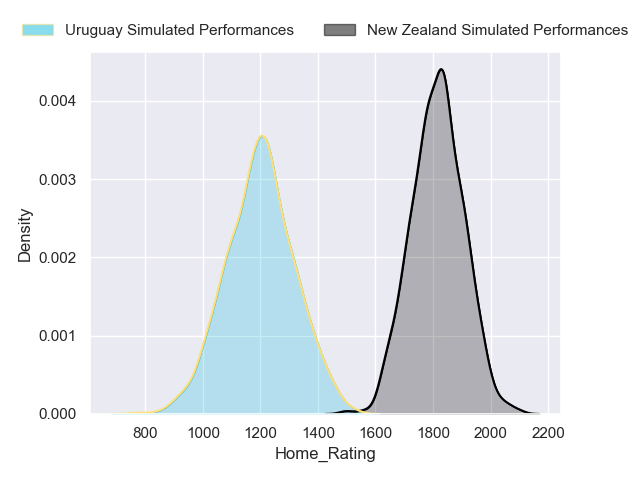

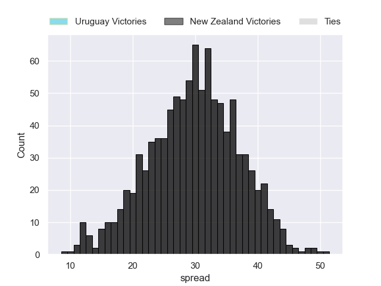

### France V Italy on 2023/10/06

Average Margin: France by 11.4

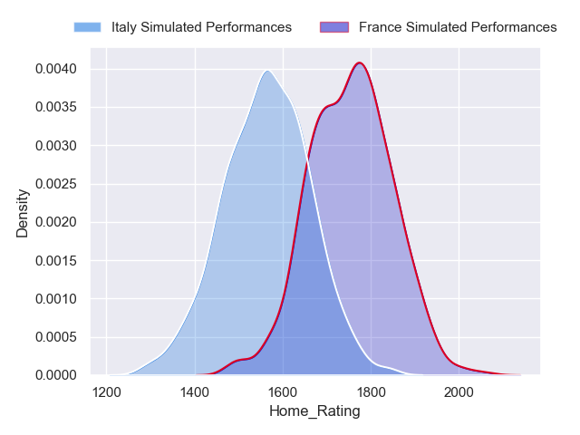
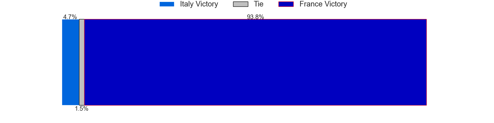
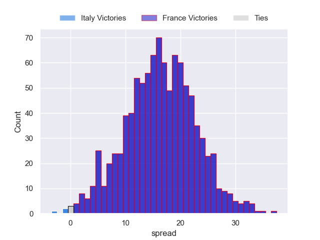

## Pool B

### Ireland V Scotland on 2023/10/07

Average Margin: Ireland by 5.0

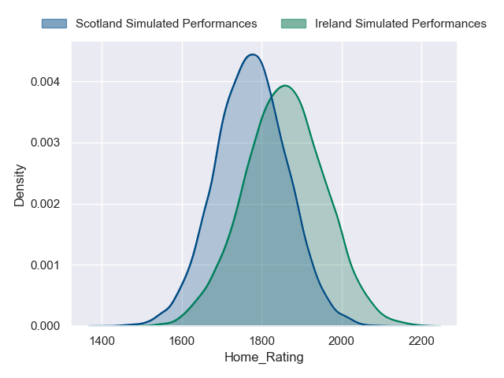
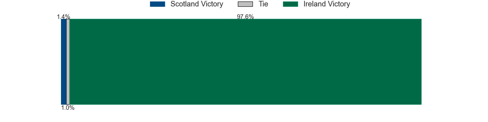
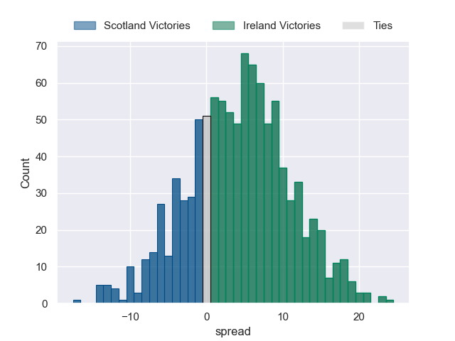

### Tonga V Romania on 2023/10/08

Average Margin: Tonga by 6.7

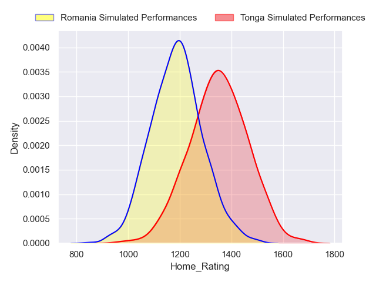
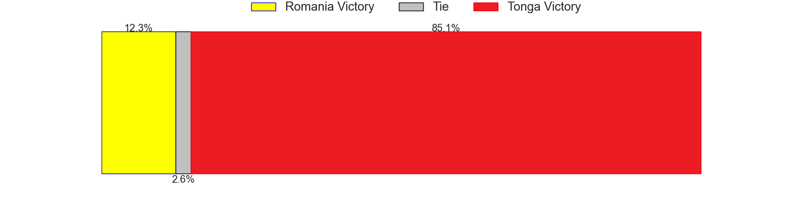
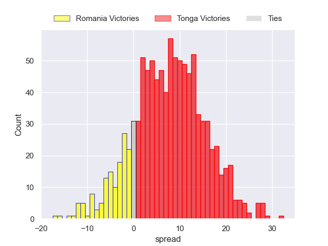

## Pool C

### Wales V Georgia on 2023/10/07

Average Margin: Wales by 6.0

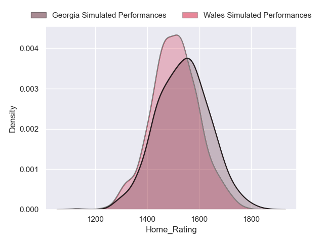
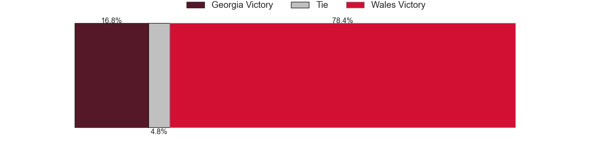
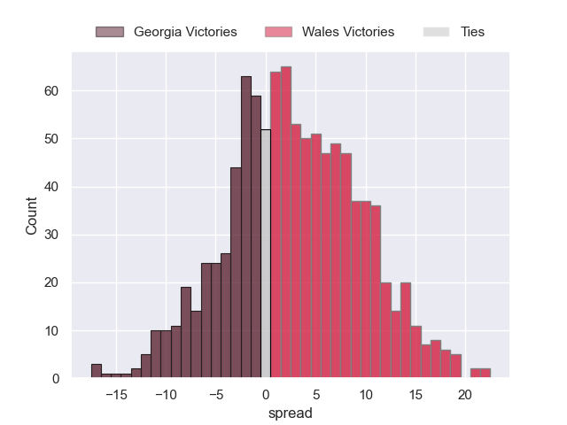

### Fiji V Portugal on 2023/10/08

Average Margin: Fiji by 12.3

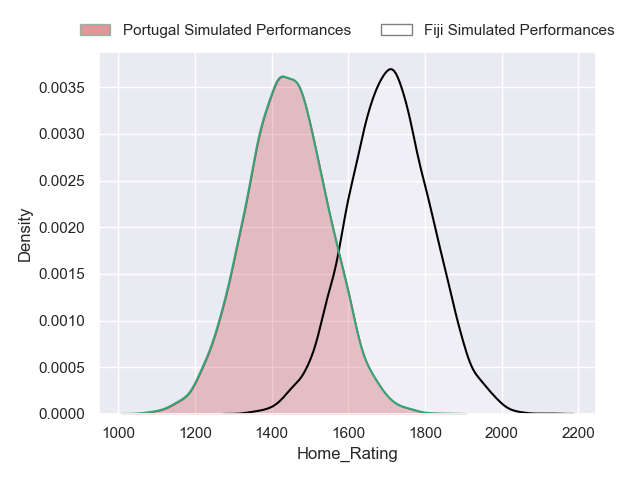
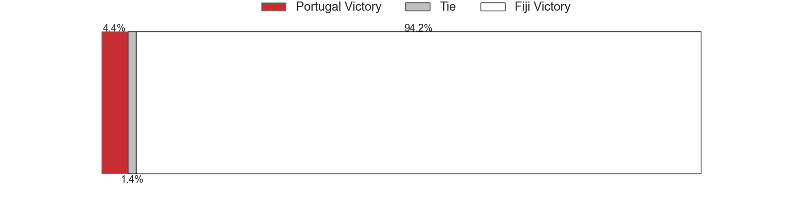
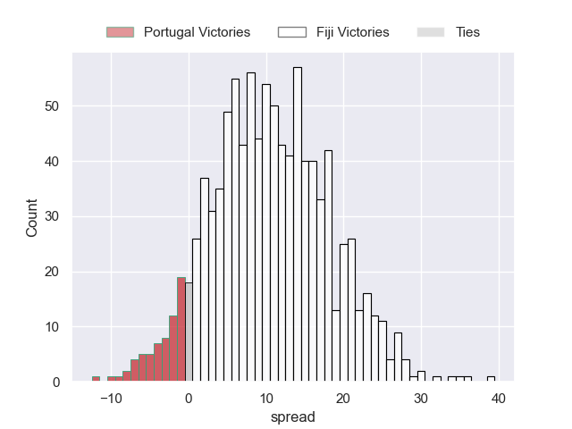

## Pool D

### England V Samoa on 2023/10/07

Average Margin: England by 4.0

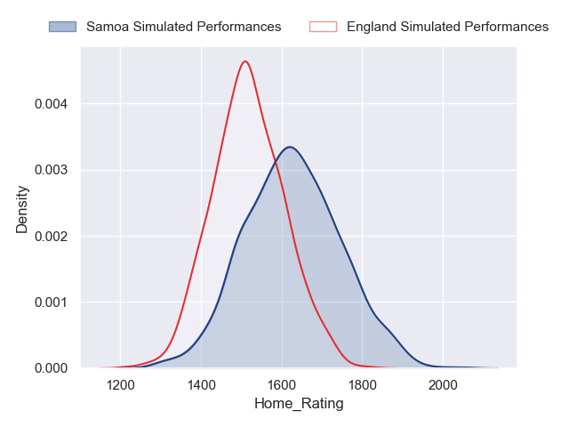
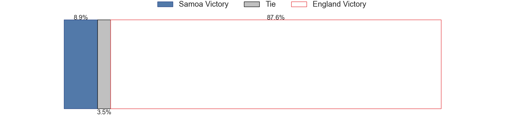
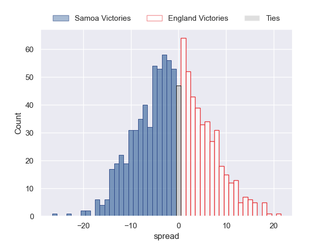

### Japan V Argentina on 2023/10/08

Average Margin: Argentina by 12.7

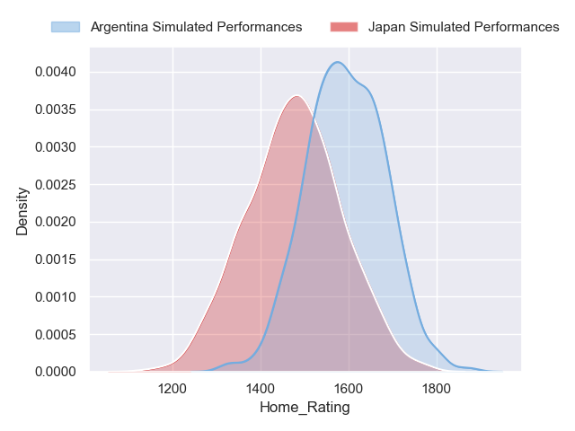
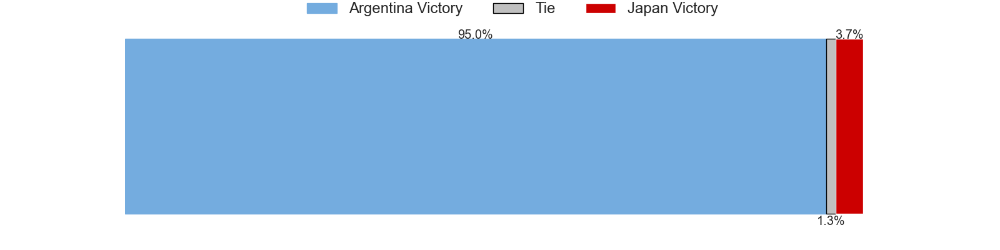
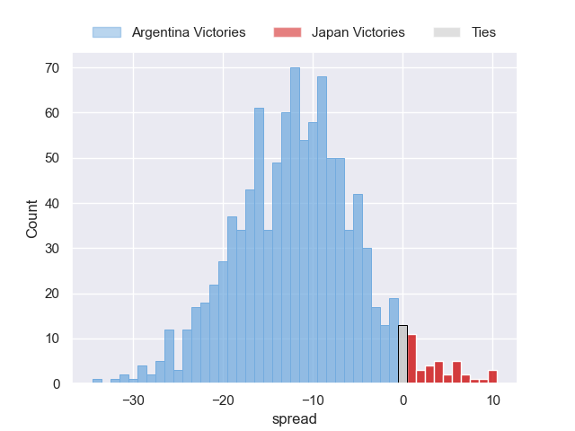

# Completed Match Review

| Match                                 |   Result |   Lineup Prediction |   Minutes Prediction |   Club Prediction |
|:--------------------------------------|---------:|--------------------:|---------------------:|------------------:|
| France V New Zealand on 2023/09/08    |       14 |                 2   |                  1.5 |               2.4 |
| Italy V Namibia on 2023/09/09         |       44 |                14   |                 13.8 |              18.5 |
| Ireland V Romania on 2023/09/09       |       74 |                39.4 |                 40.3 |              36.8 |
| Australia V Georgia on 2023/09/09     |       20 |                -7.2 |                 -8.2 |               6.1 |
| England V Argentina on 2023/09/09     |       17 |                 2.8 |                  3.6 |              -2.7 |
| Japan V Chile on 2023/09/10           |       30 |                12.3 |                 14.6 |              14.3 |
| South Africa V Scotland on 2023/09/10 |       15 |                16.3 |                 17.2 |               9.6 |
| Wales V Fiji on 2023/09/10            |        6 |                -2.9 |                 -3.5 |              -6.7 |
| France V Uruguay on 2023/09/14        |       15 |                16.7 |                 16.5 |              37.6 |
| New Zealand V Namibia on 2023/09/15   |       68 |                25.4 |                 26.1 |              34.7 |
| Wales V Portugal on 2023/09/16        |       20 |                 0.2 |                 -0.1 |              11.3 |
| Ireland V Tonga on 2023/09/16         |       43 |                25.6 |                 25.6 |              25.8 |
| Samoa V Chile on 2023/09/16           |       33 |                16   |                 13.4 |              22.4 |
| South Africa V Romania on 2023/09/17  |       76 |                34.5 |                 35.2 |              39.3 |
| Australia V Fiji on 2023/09/17        |       -7 |               -11.1 |                -12.2 |             nan   |
| England V Japan on 2023/09/17         |       22 |                 1.7 |                  0.3 |               9.7 |
| Italy V Uruguay on 2023/09/20         |       21 |                 9   |                  9.9 |              19.1 |
| France V Namibia on 2023/09/21        |       96 |                33   |                 31.5 |              37   |
| Argentina V Samoa on 2023/09/22       |        9 |                -8.6 |                 -8   |               4.3 |
| Georgia V Portugal on 2023/09/23      |        0 |                 5.9 |                  6.2 |               7.8 |
| England V Chile on 2023/09/23         |       71 |                14.5 |                 14.2 |              24   |
| South Africa V Ireland on 2023/09/23  |       -5 |                -0.7 |                 -1.6 |             nan   |
| Scotland V Tonga on 2023/09/24        |       28 |                10.8 |                 10   |              18.7 |
| Wales V Australia on 2023/09/24       |       34 |                 8.5 |                  7.5 |              -2.7 |
| Uruguay V Namibia on 2023/09/27       |       10 |                 3.1 |                  3.2 |              -0.5 |
| Japan V Samoa on 2023/09/28           |        6 |                -1.9 |                 -1.1 |              -8.1 |
| New Zealand V Italy on 2023/09/29     |       79 |                15.4 |                 14.9 |              16.1 |
| Argentina V Chile on 2023/09/30       |       54 |                10.1 |                 10.9 |              26.7 |
| Fiji V Georgia on 2023/09/30          |        5 |                 9.8 |                  9   |              10.1 |
| Scotland V Romania on 2023/09/30      |       84 |                21.1 |                 22.2 |              29.7 |

# Model Accuracies

| Model | Percent Correct Predictions | Spread Error |
| ------ | ------ | ------ |
| Club Level | 74.2% | 20.7 |
| Player Level: Lineup | 78.1% | 24.8 |
| Player Level: Minutes | 80.0% | 24.8 |

