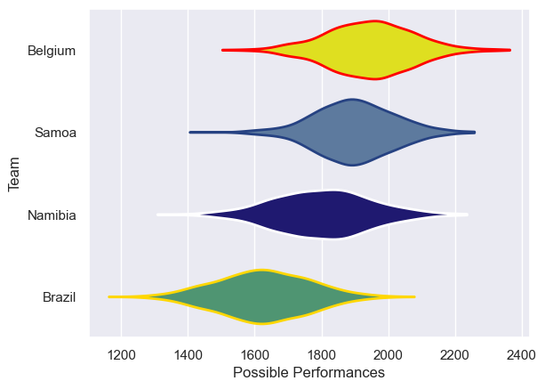

---  
title: "Rugby World Cup 2027 Final Qualification Tournament 2025"  
date: 2025-11-21 6:00:00 -0500  
categories: model review projection  
layout: article  
aside:  
    toc: true  
---
# Team Rankings

# Standings

## Current Standings

| Club    |   Played |   Wins |   Point Differential |   Losing Bonus Points | Try Bonus Points   |   Competition Points |
|:--------|---------:|-------:|---------------------:|----------------------:|:-------------------|---------------------:|
| Samoa   |        3 |      2 |                   56 |                     0 |                    |                   10 |
| Belgium |        3 |      2 |                   10 |                     0 |                    |                   10 |
| Namibia |        3 |      1 |                  -16 |                     1 |                    |                    5 |
| Brazil  |        3 |      0 |                  -50 |                     1 |                    |                    1 |

# Completed Match Review

| Model | Percent Correct Predictions | Spread Error |
| ------ | ------ | ------ |
| Club Level | 83.3% | 9.7 |
| Player Level: Lineup | nan% | nan |
| Player Level: Minutes | nan% | nan |

