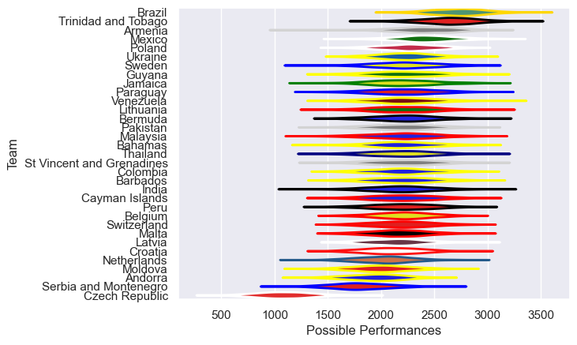

---  
title: "Rugby World Cup Qualifier 2008 Status"  
date: 2025-07-28 6:00:00 -0500  
categories: model review projection  
layout: article  
aside:  
    toc: true  
---
# Current Team Rankings

# Standings

## Current Standings

| Club                      |   Played |   Wins |   Point Differential |   Losing Bonus Points | Try Bonus Points   |   Competition Points |
|:--------------------------|---------:|-------:|---------------------:|----------------------:|:-------------------|---------------------:|
| Brazil                    |        6 |      6 |                  179 |                     0 |                    |                   24 |
| Paraguay                  |        4 |      3 |                  156 |                     0 |                    |                   12 |
| Trinidad and Tobago       |        5 |      3 |                   64 |                     0 |                    |                   12 |
| Mexico                    |        4 |      2 |                   40 |                     2 |                    |                   10 |
| Armenia                   |        2 |      2 |                   61 |                     0 |                    |                    8 |
| Lithuania                 |        2 |      2 |                   49 |                     0 |                    |                    8 |
| Thailand                  |        2 |      2 |                   31 |                     0 |                    |                    8 |
| Netherlands               |        2 |      2 |                   25 |                     0 |                    |                    8 |
| Bermuda                   |        3 |      2 |                   15 |                     0 |                    |                    8 |
| Guyana                    |        3 |      2 |                    3 |                     0 |                    |                    8 |
| Bahamas                   |        3 |      2 |                   -3 |                     0 |                    |                    8 |
| Venezuela                 |        4 |      2 |                  -34 |                     0 |                    |                    8 |
| Sweden                    |        2 |      1 |                   13 |                     1 |                    |                    5 |
| Moldova                   |        2 |      1 |                   10 |                     1 |                    |                    5 |
| Poland                    |        2 |      1 |                    5 |                     1 |                    |                    5 |
| Malta                     |        2 |      1 |                    1 |                     1 |                    |                    5 |
| Ukraine                   |        2 |      1 |                    0 |                     1 |                    |                    5 |
| Croatia                   |        2 |      1 |                   -4 |                     1 |                    |                    5 |
| Czech Republic            |        2 |      1 |                   -4 |                     1 |                    |                    5 |
| Cayman Islands            |        3 |      1 |                  -33 |                     1 |                    |                    5 |
| India                     |        2 |      1 |                   84 |                     0 |                    |                    4 |
| Malaysia                  |        2 |      1 |                    2 |                     0 |                    |                    4 |
| Belgium                   |        2 |      1 |                  -11 |                     0 |                    |                    4 |
| Serbia and Montenegro     |        2 |      1 |                  -16 |                     0 |                    |                    4 |
| Barbados                  |        3 |      1 |                  -66 |                     0 |                    |                    4 |
| Colombia                  |        4 |      1 |                  -93 |                     0 |                    |                    4 |
| Jamaica                   |        3 |      0 |                  -15 |                     3 |                    |                    3 |
| Peru                      |        4 |      0 |                 -173 |                     1 |                    |                    1 |
| Latvia                    |        2 |      0 |                  -35 |                     0 |                    |                    0 |
| St Vincent and Grenadines |        1 |      0 |                  -40 |                     0 |                    |                    0 |
| Andorra                   |        2 |      0 |                  -41 |                     0 |                    |                    0 |
| Switzerland               |        2 |      0 |                  -53 |                     0 |                    |                    0 |
| Pakistan                  |        2 |      0 |                 -117 |                     0 |                    |                    0 |

# Completed Match Review

| Model | Percent Correct Predictions | Spread Error |
| ------ | ------ | ------ |
| Club Level | 47.7% | 24.9 |
| Player Level: Lineup | nan% | nan |
| Player Level: Minutes | nan% | nan |

