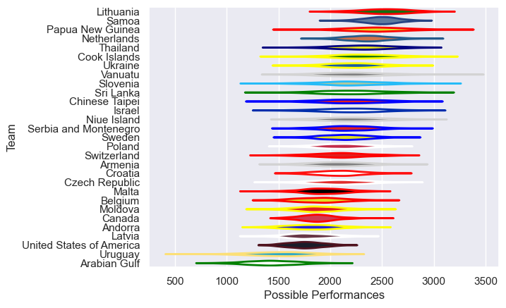

---  
title: "Rugby World Cup Qualifier 2009 Status"  
date: 2025-07-28 6:00:00 -0500  
categories: model review projection  
layout: article  
aside:  
    toc: true  
---
# Current Team Rankings

# Standings

## Current Standings

| Club                     |   Played |   Wins |   Point Differential |   Losing Bonus Points | Try Bonus Points   |   Competition Points |
|:-------------------------|---------:|-------:|---------------------:|----------------------:|:-------------------|---------------------:|
| Lithuania                |        4 |      4 |                   65 |                     0 |                    |                   16 |
| Ukraine                  |        4 |      4 |                   51 |                     0 |                    |                   16 |
| United States of America |        4 |      3 |                    9 |                     0 |                    |                   12 |
| Netherlands              |        3 |      2 |                   27 |                     1 |                    |                    9 |
| Poland                   |        4 |      2 |                   -8 |                     1 |                    |                    9 |
| Samoa                    |        2 |      2 |                  169 |                     0 |                    |                    8 |
| Arabian Gulf             |        2 |      2 |                   39 |                     0 |                    |                    8 |
| Croatia                  |        2 |      2 |                   18 |                     0 |                    |                    8 |
| Papua New Guinea         |        4 |      2 |                  -87 |                     0 |                    |                    8 |
| Belgium                  |        4 |      1 |                   -2 |                     1 |                    |                    7 |
| Czech Republic           |        4 |      1 |                  -11 |                     0 |                    |                    6 |
| Canada                   |        2 |      1 |                   17 |                     1 |                    |                    5 |
| Switzerland              |        2 |      1 |                   17 |                     1 |                    |                    5 |
| Moldova                  |        4 |      1 |                  -30 |                     1 |                    |                    5 |
| Thailand                 |        2 |      1 |                   15 |                     0 |                    |                    4 |
| Cook Islands             |        2 |      1 |                   14 |                     0 |                    |                    4 |
| Andorra                  |        2 |      1 |                    3 |                     0 |                    |                    4 |
| Malta                    |        2 |      1 |                   -5 |                     0 |                    |                    4 |
| Chinese Taipei           |        2 |      1 |                   -8 |                     0 |                    |                    4 |
| Israel                   |        2 |      1 |                   -9 |                     0 |                    |                    4 |
| Serbia and Montenegro    |        2 |      1 |                  -35 |                     0 |                    |                    4 |
| Slovenia                 |        1 |      0 |                   -7 |                     1 |                    |                    1 |
| Uruguay                  |        2 |      0 |                  -26 |                     1 |                    |                    1 |
| Armenia                  |        2 |      0 |                  -31 |                     1 |                    |                    1 |
| Latvia                   |        2 |      0 |                  -21 |                     0 |                    |                    0 |
| Niue Island              |        1 |      0 |                  -22 |                     0 |                    |                    0 |
| Sweden                   |        2 |      0 |                  -22 |                     0 |                    |                    0 |
| Sri Lanka                |        2 |      0 |                  -46 |                     0 |                    |                    0 |
| Vanuatu                  |        1 |      0 |                  -74 |                     0 |                    |                    0 |

# Completed Match Review

| Model | Percent Correct Predictions | Spread Error |
| ------ | ------ | ------ |
| Club Level | 63.9% | 23.1 |
| Player Level: Lineup | nan% | nan |
| Player Level: Minutes | nan% | nan |

