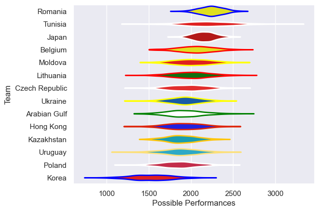

---  
title: "Rugby World Cup Qualifier 2010 Status"  
date: 2025-07-28 6:00:00 -0500  
categories: model review projection  
layout: article  
aside:  
    toc: true  
---
# Current Team Rankings

# Standings

## Current Standings

| Club           |   Played |   Wins |   Point Differential |   Losing Bonus Points | Try Bonus Points   |   Competition Points |
|:---------------|---------:|-------:|---------------------:|----------------------:|:-------------------|---------------------:|
| Romania        |        5 |      4 |                  154 |                     0 |                    |                   18 |
| Japan          |        4 |      4 |                  296 |                     0 |                    |                   16 |
| Hong Kong      |        4 |      2 |                  -68 |                     1 |                    |                    9 |
| Kazakhstan     |        5 |      2 |                 -113 |                     1 |                    |                    9 |
| Belgium        |        2 |      2 |                   24 |                     0 |                    |                    8 |
| Arabian Gulf   |        4 |      2 |                  -61 |                     0 |                    |                    8 |
| Uruguay        |        3 |      1 |                   10 |                     0 |                    |                    6 |
| Moldova        |        2 |      1 |                    9 |                     0 |                    |                    6 |
| Czech Republic |        2 |      1 |                    8 |                     1 |                    |                    5 |
| Ukraine        |        5 |      1 |                  -93 |                     0 |                    |                    4 |
| Poland         |        2 |      0 |                  -21 |                     0 |                    |                    2 |
| Korea          |        4 |      0 |                  -91 |                     2 |                    |                    2 |
| Lithuania      |        1 |      0 |                  -11 |                     0 |                    |                    0 |
| Tunisia        |        1 |      0 |                  -43 |                     0 |                    |                    0 |

# Completed Match Review

| Model | Percent Correct Predictions | Spread Error |
| ------ | ------ | ------ |
| Club Level | 68.2% | 24.2 |
| Player Level: Lineup | nan% | nan |
| Player Level: Minutes | nan% | nan |

