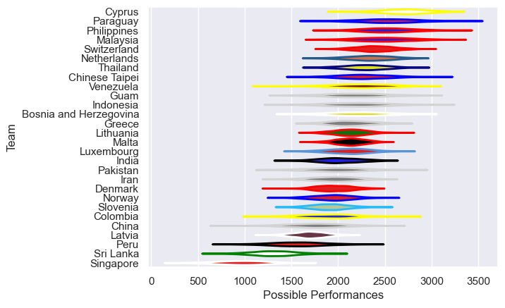

---  
title: "Rugby World Cup Qualifier 2012"  
date: 2025-07-29 6:00:00 -0500  
categories: model review projection  
layout: article  
aside:  
    toc: true  
---
# Current Team Rankings

# Standings

## Current Standings

| Club                   |   Played |   Wins |   Point Differential |   Losing Bonus Points | Try Bonus Points   |   Competition Points |
|:-----------------------|---------:|-------:|---------------------:|----------------------:|:-------------------|---------------------:|
| Philippines            |        3 |      3 |                   49 |                     0 |                    |                   12 |
| Thailand               |        3 |      3 |                   46 |                     0 |                    |                   12 |
| Paraguay               |        2 |      2 |                  102 |                     0 |                    |                    8 |
| Sri Lanka              |        3 |      2 |                   43 |                     0 |                    |                    8 |
| Netherlands            |        2 |      2 |                   25 |                     0 |                    |                    8 |
| Malaysia               |        2 |      1 |                   86 |                     1 |                    |                    5 |
| Guam                   |        2 |      1 |                   19 |                     1 |                    |                    5 |
| Cyprus                 |        1 |      1 |                   41 |                     0 |                    |                    4 |
| Iran                   |        2 |      1 |                   29 |                     0 |                    |                    4 |
| Malta                  |        1 |      1 |                   17 |                     0 |                    |                    4 |
| Latvia                 |        1 |      1 |                   12 |                     0 |                    |                    4 |
| Luxembourg             |        1 |      1 |                    7 |                     0 |                    |                    4 |
| Greece                 |        1 |      1 |                    5 |                     0 |                    |                    4 |
| Colombia               |        2 |      1 |                    3 |                     0 |                    |                    4 |
| Indonesia              |        2 |      1 |                  -15 |                     0 |                    |                    4 |
| India                  |        2 |      1 |                  -21 |                     0 |                    |                    4 |
| Chinese Taipei         |        3 |      1 |                  -32 |                     0 |                    |                    4 |
| Venezuela              |        2 |      1 |                  -54 |                     0 |                    |                    4 |
| Bosnia and Herzegovina |        1 |      0 |                   -5 |                     1 |                    |                    1 |
| Pakistan               |        1 |      0 |                   -6 |                     1 |                    |                    1 |
| Norway                 |        1 |      0 |                   -7 |                     1 |                    |                    1 |
| Denmark                |        1 |      0 |                  -12 |                     0 |                    |                    0 |
| Switzerland            |        1 |      0 |                  -17 |                     0 |                    |                    0 |
| Lithuania              |        2 |      0 |                  -25 |                     0 |                    |                    0 |
| Slovenia               |        1 |      0 |                  -41 |                     0 |                    |                    0 |
| Peru                   |        2 |      0 |                  -51 |                     0 |                    |                    0 |
| Singapore              |        3 |      0 |                  -60 |                     0 |                    |                    0 |
| China                  |        2 |      0 |                 -138 |                     0 |                    |                    0 |

# Completed Match Review

| Model | Percent Correct Predictions | Spread Error |
| ------ | ------ | ------ |
| Club Level | 80.0% | 24.9 |
| Player Level: Lineup | nan% | nan |
| Player Level: Minutes | nan% | nan |

