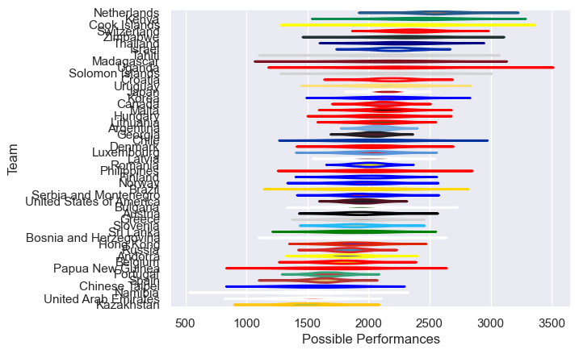

---  
title: "Rugby World Cup Qualifier 2013 Status"  
date: 2025-07-28 6:00:00 -0500  
categories: model review projection  
layout: article  
aside:  
    toc: true  
---
# Current Team Rankings

# Standings

## Current Standings

| Club                     |   Played |   Wins |   Point Differential |   Losing Bonus Points | Try Bonus Points   |   Competition Points |
|:-------------------------|---------:|-------:|---------------------:|----------------------:|:-------------------|---------------------:|
| Georgia                  |        5 |      4 |                   74 |                     0 |                    |                   18 |
| Romania                  |        5 |      4 |                   49 |                     0 |                    |                   18 |
| Japan                    |        4 |      4 |                  308 |                     0 |                    |                   16 |
| Argentina                |        3 |      3 |                  169 |                     0 |                    |                   12 |
| Sri Lanka                |        3 |      3 |                  100 |                     0 |                    |                   12 |
| Netherlands              |        3 |      3 |                   87 |                     0 |                    |                   12 |
| Korea                    |        4 |      3 |                   70 |                     0 |                    |                   12 |
| Cook Islands             |        3 |      3 |                   66 |                     0 |                    |                   12 |
| Israel                   |        4 |      3 |                   15 |                     0 |                    |                   12 |
| Russia                   |        5 |      3 |                   -6 |                     0 |                    |                   12 |
| Papua New Guinea         |        3 |      2 |                    8 |                     1 |                    |                    9 |
| Uruguay                  |        3 |      2 |                   54 |                     0 |                    |                    8 |
| Namibia                  |        2 |      2 |                   29 |                     0 |                    |                    8 |
| Hong Kong                |        4 |      2 |                   26 |                     0 |                    |                    8 |
| Switzerland              |        2 |      2 |                   25 |                     0 |                    |                    8 |
| Bosnia and Herzegovina   |        2 |      2 |                   24 |                     0 |                    |                    8 |
| Canada                   |        2 |      2 |                   20 |                     0 |                    |                    8 |
| Kenya                    |        4 |      2 |                   18 |                     0 |                    |                    8 |
| Zimbabwe                 |        4 |      2 |                   14 |                     0 |                    |                    8 |
| Luxembourg               |        4 |      2 |                    1 |                     0 |                    |                    8 |
| Portugal                 |        5 |      1 |                  -21 |                     1 |                    |                    7 |
| Latvia                   |        2 |      1 |                    9 |                     1 |                    |                    5 |
| Greece                   |        3 |      1 |                   -8 |                     1 |                    |                    5 |
| Slovenia                 |        3 |      1 |                  -16 |                     1 |                    |                    5 |
| Solomon Islands          |        3 |      1 |                  -33 |                     1 |                    |                    5 |
| Spain                    |        5 |      0 |                  -57 |                     1 |                    |                    5 |
| Bulgaria                 |        1 |      1 |                    6 |                     0 |                    |                    4 |
| Hungary                  |        1 |      1 |                    1 |                     0 |                    |                    4 |
| Madagascar               |        2 |      1 |                   -4 |                     0 |                    |                    4 |
| Denmark                  |        2 |      1 |                   -5 |                     0 |                    |                    4 |
| Finland                  |        2 |      1 |                  -12 |                     0 |                    |                    4 |
| Lithuania                |        2 |      1 |                  -15 |                     0 |                    |                    4 |
| Kazakhstan               |        3 |      1 |                  -22 |                     0 |                    |                    4 |
| Chinese Taipei           |        3 |      1 |                  -34 |                     0 |                    |                    4 |
| Belgium                  |        5 |      0 |                  -39 |                     2 |                    |                    4 |
| Thailand                 |        3 |      1 |                  -44 |                     0 |                    |                    4 |
| Chile                    |        3 |      1 |                  -73 |                     0 |                    |                    4 |
| Philippines              |        4 |      1 |                 -187 |                     0 |                    |                    4 |
| Austria                  |        2 |      0 |                   -3 |                     2 |                    |                    2 |
| Croatia                  |        2 |      0 |                   -6 |                     2 |                    |                    2 |
| Tahiti                   |        3 |      0 |                  -41 |                     2 |                    |                    2 |
| Norway                   |        1 |      0 |                   -7 |                     1 |                    |                    1 |
| United States of America |        2 |      0 |                  -20 |                     1 |                    |                    1 |
| Andorra                  |        1 |      0 |                  -11 |                     0 |                    |                    0 |
| Serbia and Montenegro    |        1 |      0 |                  -38 |                     0 |                    |                    0 |
| Malta                    |        2 |      0 |                  -47 |                     0 |                    |                    0 |
| Uganda                   |        2 |      0 |                  -57 |                     0 |                    |                    0 |
| Brazil                   |        3 |      0 |                 -150 |                     0 |                    |                    0 |
| United Arab Emirates     |        4 |      0 |                 -217 |                     0 |                    |                    0 |

# Completed Match Review

| Model | Percent Correct Predictions | Spread Error |
| ------ | ------ | ------ |
| Club Level | 64.7% | 24.0 |
| Player Level: Lineup | nan% | nan |
| Player Level: Minutes | nan% | nan |

