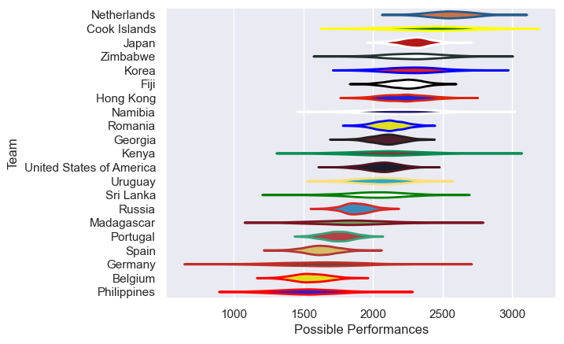

---  
title: "Rugby World Cup Qualifier 2014 Status"  
date: 2025-07-28 6:00:00 -0500  
categories: model review projection  
layout: article  
aside:  
    toc: true  
---
# Current Team Rankings

# Standings

## Current Standings

| Club                     |   Played |   Wins |   Point Differential |   Losing Bonus Points | Try Bonus Points   |   Competition Points |
|:-------------------------|---------:|-------:|---------------------:|----------------------:|:-------------------|---------------------:|
| Russia                   |        9 |      6 |                  -13 |                     0 |                    |                   24 |
| Georgia                  |        5 |      5 |                  106 |                     0 |                    |                   20 |
| Japan                    |        4 |      4 |                  309 |                     0 |                    |                   16 |
| Romania                  |        5 |      4 |                   87 |                     0 |                    |                   16 |
| Hong Kong                |        5 |      3 |                  106 |                     0 |                    |                   12 |
| Uruguay                  |        5 |      2 |                   14 |                     1 |                    |                   11 |
| Spain                    |        5 |      2 |                  -27 |                     2 |                    |                   10 |
| Namibia                  |        3 |      2 |                   76 |                     1 |                    |                    9 |
| Zimbabwe                 |        4 |      2 |                   41 |                     1 |                    |                    9 |
| Kenya                    |        3 |      2 |                   23 |                     0 |                    |                    8 |
| Korea                    |        4 |      2 |                   -4 |                     0 |                    |                    8 |
| United States of America |        2 |      1 |                   19 |                     0 |                    |                    6 |
| Portugal                 |        5 |      1 |                  -56 |                     1 |                    |                    5 |
| Fiji                     |        1 |      1 |                  102 |                     0 |                    |                    4 |
| Germany                  |        2 |      1 |                   -1 |                     0 |                    |                    4 |
| Philippines              |        4 |      1 |                 -226 |                     0 |                    |                    4 |
| Belgium                  |        5 |      0 |                  -86 |                     1 |                    |                    1 |
| Sri Lanka                |        4 |      0 |                 -210 |                     1 |                    |                    1 |
| Netherlands              |        1 |      0 |                  -10 |                     0 |                    |                    0 |
| Cook Islands             |        1 |      0 |                 -102 |                     0 |                    |                    0 |
| Madagascar               |        3 |      0 |                 -148 |                     0 |                    |                    0 |

# Completed Match Review

| Model | Percent Correct Predictions | Spread Error |
| ------ | ------ | ------ |
| Club Level | 58.1% | 33.7 |
| Player Level: Lineup | nan% | nan |
| Player Level: Minutes | nan% | nan |

