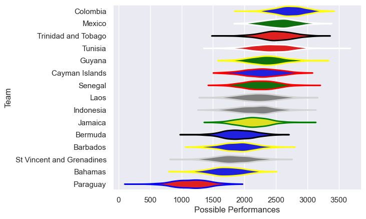

---  
title: "Rugby World Cup Qualifier 2016"  
date: 2025-07-29 6:00:00 -0500  
categories: model review projection  
layout: article  
aside:  
    toc: true  
---
# Current Team Rankings

# Standings

## Current Standings

| Club                      |   Played |   Wins |   Point Differential |   Losing Bonus Points | Try Bonus Points   |   Competition Points |
|:--------------------------|---------:|-------:|---------------------:|----------------------:|:-------------------|---------------------:|
| Mexico                    |        4 |      3 |                  100 |                     0 |                    |                   12 |
| Guyana                    |        3 |      3 |                   53 |                     0 |                    |                   12 |
| Trinidad and Tobago       |        3 |      2 |                   50 |                     1 |                    |                    9 |
| Cayman Islands            |        3 |      2 |                   31 |                     0 |                    |                    8 |
| Laos                      |        1 |      1 |                   36 |                     0 |                    |                    4 |
| Paraguay                  |        1 |      1 |                   12 |                     0 |                    |                    4 |
| Jamaica                   |        3 |      1 |                   10 |                     0 |                    |                    4 |
| Colombia                  |        2 |      1 |                    6 |                     0 |                    |                    4 |
| Senegal                   |        1 |      1 |                    1 |                     0 |                    |                    4 |
| Bermuda                   |        3 |      1 |                  -84 |                     0 |                    |                    4 |
| Tunisia                   |        1 |      0 |                   -1 |                     1 |                    |                    1 |
| Indonesia                 |        1 |      0 |                  -36 |                     0 |                    |                    0 |
| St Vincent and Grenadines |        1 |      0 |                  -48 |                     0 |                    |                    0 |
| Bahamas                   |        3 |      0 |                  -65 |                     0 |                    |                    0 |
| Barbados                  |        2 |      0 |                  -65 |                     0 |                    |                    0 |

## Projected Remaining Table

| Club     |   To Play |   Projected Wins |   Projected Differential |   Projected Losing Bonus Points | Projected Try Bonus Points   |   Projected Competition Points |
|:---------|----------:|-----------------:|-------------------------:|--------------------------------:|:-----------------------------|-------------------------------:|
| Jamaica  |         1 |            0.623 |                    9.877 |                           0.137 |                              |                          2.695 |
| Barbados |         1 |            0.344 |                   -9.877 |                           0.153 |                              |                          1.595 |

## Projected Total Table

| Club                      |   Played |   Wins |   Point Differential |   Losing Bonus Points | Try Bonus Points   |   Competition Points |
|:--------------------------|---------:|-------:|---------------------:|----------------------:|:-------------------|---------------------:|
| Mexico                    |        4 |  3     |              100     |                 0     |                    |               12     |
| Guyana                    |        3 |  3     |               53     |                 0     |                    |               12     |
| Trinidad and Tobago       |        3 |  2     |               50     |                 1     |                    |                9     |
| Cayman Islands            |        3 |  2     |               31     |                 0     |                    |                8     |
| Jamaica                   |        4 |  1.623 |               19.877 |                 0.137 |                    |                6.695 |
| Laos                      |        1 |  1     |               36     |                 0     |                    |                4     |
| Paraguay                  |        1 |  1     |               12     |                 0     |                    |                4     |
| Colombia                  |        2 |  1     |                6     |                 0     |                    |                4     |
| Senegal                   |        1 |  1     |                1     |                 0     |                    |                4     |
| Bermuda                   |        3 |  1     |              -84     |                 0     |                    |                4     |
| Barbados                  |        3 |  0.344 |              -74.877 |                 0.153 |                    |                1.595 |
| Tunisia                   |        1 |  0     |               -1     |                 1     |                    |                1     |
| Indonesia                 |        1 |  0     |              -36     |                 0     |                    |                0     |
| St Vincent and Grenadines |        1 |  0     |              -48     |                 0     |                    |                0     |
| Bahamas                   |        3 |  0     |              -65     |                 0     |                    |                0     |

# Completed Match Review

| Model | Percent Correct Predictions | Spread Error |
| ------ | ------ | ------ |
| Club Level | 58.8% | 27.5 |
| Player Level: Lineup | nan% | nan |
| Player Level: Minutes | nan% | nan |

# Future Predictions

## Week 5

### Jamaica V Barbados on 2016/06/18

Average Margin: Jamaica by 9.9

