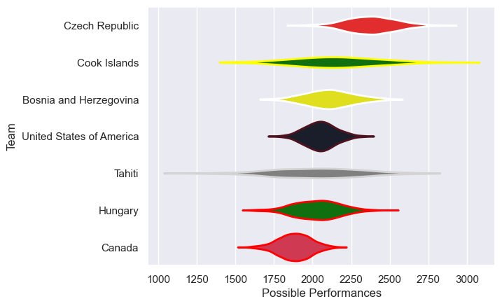

---  
title: "Rugby World Cup Qualifier 2017 Status"  
date: 2025-07-28 6:00:00 -0500  
categories: model review projection  
layout: article  
aside:  
    toc: true  
---
# Current Team Rankings

# Standings

## Current Standings

| Club                     |   Played |   Wins |   Point Differential |   Losing Bonus Points |   Try Bonus Points |   Competition Points |
|:-------------------------|---------:|-------:|---------------------:|----------------------:|-------------------:|---------------------:|
| United States of America |        2 |      1 |                   36 |                     0 |                  2 |                    8 |
| Czech Republic           |        1 |      1 |                   28 |                     0 |                    |                    4 |
| Tahiti                   |        1 |      1 |                    4 |                     0 |                    |                    4 |
| Hungary                  |        2 |      1 |                  -26 |                     0 |                    |                    4 |
| Canada                   |        2 |      0 |                  -36 |                     0 |                    |                    2 |
| Bosnia and Herzegovina   |        1 |      0 |                   -2 |                     1 |                    |                    1 |
| Cook Islands             |        1 |      0 |                   -4 |                     1 |                    |                    1 |

# Completed Match Review

| Model | Percent Correct Predictions | Spread Error |
| ------ | ------ | ------ |
| Club Level | 60.0% | 10.9 |
| Player Level: Lineup | nan% | nan |
| Player Level: Minutes | nan% | nan |

