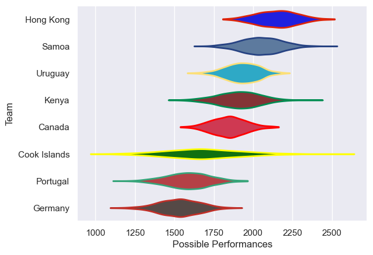

---  
title: "Rugby World Cup Qualifier 2018 Status"  
date: 2025-07-28 6:00:00 -0500  
categories: model review projection  
layout: article  
aside:  
    toc: true  
---
# Current Team Rankings

# Standings

## Current Standings

| Club         |   Played |   Wins |   Point Differential |   Losing Bonus Points | Try Bonus Points   |   Competition Points |
|:-------------|---------:|-------:|---------------------:|----------------------:|:-------------------|---------------------:|
| Canada       |        4 |      3 |                   81 |                     1 |                    |                   13 |
| Hong Kong    |        5 |      3 |                   65 |                     0 |                    |                   12 |
| Germany      |        6 |      3 |                  -27 |                     0 |                    |                   12 |
| Samoa        |        2 |      2 |                   65 |                     0 |                    |                    8 |
| Uruguay      |        1 |      1 |                    1 |                     0 |                    |                    4 |
| Portugal     |        1 |      0 |                   -3 |                     1 |                    |                    1 |
| Cook Islands |        2 |      0 |                  -74 |                     0 |                    |                    0 |
| Kenya        |        3 |      0 |                 -108 |                     0 |                    |                    0 |

# Completed Match Review

| Model | Percent Correct Predictions | Spread Error |
| ------ | ------ | ------ |
| Club Level | 58.3% | 25.1 |
| Player Level: Lineup | nan% | nan |
| Player Level: Minutes | nan% | nan |

