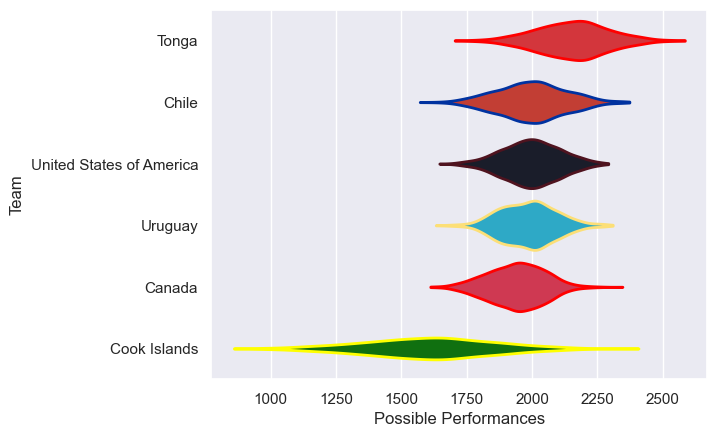

---  
title: "Rugby World Cup Qualifier 2021"  
date: 2025-07-29 6:00:00 -0500  
categories: model review projection  
layout: article  
aside:  
    toc: true  
---
# Current Team Rankings

# Standings

## Current Standings

| Club                     |   Played |   Wins |   Point Differential |   Losing Bonus Points |   Try Bonus Points |   Competition Points |
|:-------------------------|---------:|-------:|---------------------:|----------------------:|-------------------:|---------------------:|
| United States of America |        4 |      2 |                   -7 |                     0 |                  1 |                    9 |
| Canada                   |        4 |      2 |                  -17 |                     0 |                    |                    8 |
| Uruguay                  |        2 |      1 |                   16 |                     1 |                  1 |                    6 |
| Chile                    |        2 |      1 |                    8 |                     1 |                    |                    5 |
| Tonga                    |        1 |      1 |                   44 |                     0 |                    |                    4 |
| Cook Islands             |        1 |      0 |                  -44 |                     0 |                    |                    0 |

# Completed Match Review

| Model | Percent Correct Predictions | Spread Error |
| ------ | ------ | ------ |
| Club Level | 100.0% | 8.2 |
| Player Level: Lineup | nan% | nan |
| Player Level: Minutes | nan% | nan |

