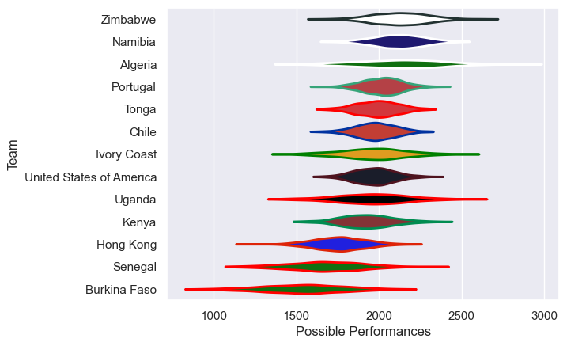

---  
title: "Rugby World Cup Qualifier 2022 Status"  
date: 2025-07-28 6:00:00 -0500  
categories: model review projection  
layout: article  
aside:  
    toc: true  
---
# Current Team Rankings

# Standings

## Current Standings

| Club                     |   Played |   Wins |   Point Differential |   Losing Bonus Points | Try Bonus Points   |   Competition Points |
|:-------------------------|---------:|-------:|---------------------:|----------------------:|:-------------------|---------------------:|
| United States of America |        5 |      3 |                   95 |                     1 |                    |                   15 |
| Namibia                  |        3 |      3 |                  117 |                     0 |                    |                   12 |
| Portugal                 |        3 |      2 |                  113 |                     0 |                    |                   10 |
| Algeria                  |        3 |      2 |                   28 |                     1 |                    |                    9 |
| Kenya                    |        6 |      2 |                 -141 |                     1 |                    |                    9 |
| Uganda                   |        3 |      2 |                  -33 |                     0 |                    |                    8 |
| Chile                    |        2 |      1 |                    1 |                     1 |                    |                    5 |
| Ivory Coast              |        3 |      1 |                   -7 |                     1 |                    |                    5 |
| Senegal                  |        3 |      1 |                  -10 |                     1 |                    |                    5 |
| Tonga                    |        1 |      1 |                   22 |                     0 |                    |                    4 |
| Zimbabwe                 |        3 |      1 |                    4 |                     0 |                    |                    4 |
| Hong Kong                |        4 |      1 |                  -88 |                     0 |                    |                    4 |
| Burkina Faso             |        3 |      0 |                 -101 |                     0 |                    |                    0 |

# Completed Match Review

| Model | Percent Correct Predictions | Spread Error |
| ------ | ------ | ------ |
| Club Level | 52.4% | 20.5 |
| Player Level: Lineup | nan% | nan |
| Player Level: Minutes | nan% | nan |

