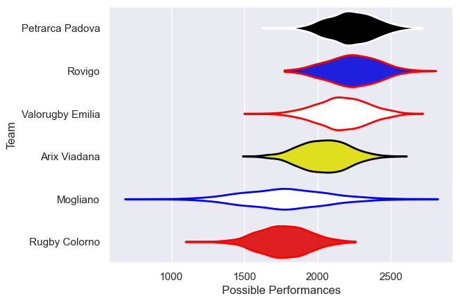

---  
title: "Serie A Elite 23/24"  
date: 2025-07-29 6:00:00 -0500  
categories: model review projection  
layout: article  
aside:  
    toc: true  
---
# Current Team Rankings

# Standings

## Current Standings

| Club             |   Played |   Wins |   Point Differential |   Losing Bonus Points |   Try Bonus Points |   Competition Points |
|:-----------------|---------:|-------:|---------------------:|----------------------:|-------------------:|---------------------:|
| Petrarca Padova  |        3 |      3 |                   30 |                     0 |                  1 |                   13 |
| Arix Viadana     |        3 |      2 |                    7 |                     0 |                  1 |                    9 |
| Rovigo           |        2 |      1 |                   15 |                     1 |                    |                    5 |
| Valorugby Emilia |        2 |      1 |                    3 |                     1 |                    |                    5 |
| Rugby Colorno    |        2 |      0 |                  -28 |                     1 |                    |                    1 |
| Mogliano         |        2 |      0 |                  -27 |                     0 |                    |                    0 |

# Completed Match Review

| Model | Percent Correct Predictions | Spread Error |
| ------ | ------ | ------ |
| Club Level | 71.4% | 11.5 |
| Player Level: Lineup | nan% | nan |
| Player Level: Minutes | nan% | nan |

