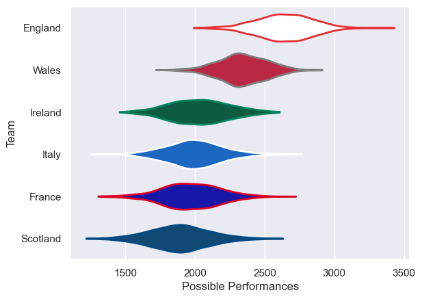

---  
title: "Six Nations 2001"  
date: 2025-07-29 6:00:00 -0500  
categories: model review projection  
layout: article  
aside:  
    toc: true  
---
# Current Team Rankings

# Standings

## Current Standings

| Club     |   Played |   Wins |   Point Differential |   Losing Bonus Points | Try Bonus Points   |   Competition Points |
|:---------|---------:|-------:|---------------------:|----------------------:|:-------------------|---------------------:|
| England  |        5 |      4 |                  149 |                     1 |                    |                   17 |
| Ireland  |        5 |      4 |                   40 |                     0 |                    |                   16 |
| Scotland |        5 |      2 |                  -24 |                     0 |                    |                   10 |
| Wales    |        5 |      2 |                  -41 |                     0 |                    |                   10 |
| France   |        5 |      2 |                  -23 |                     1 |                    |                    9 |
| Italy    |        5 |      0 |                 -101 |                     1 |                    |                    1 |

# Completed Match Review

| Model | Percent Correct Predictions | Spread Error |
| ------ | ------ | ------ |
| Club Level | 53.3% | 18.6 |
| Player Level: Lineup | nan% | nan |
| Player Level: Minutes | nan% | nan |

