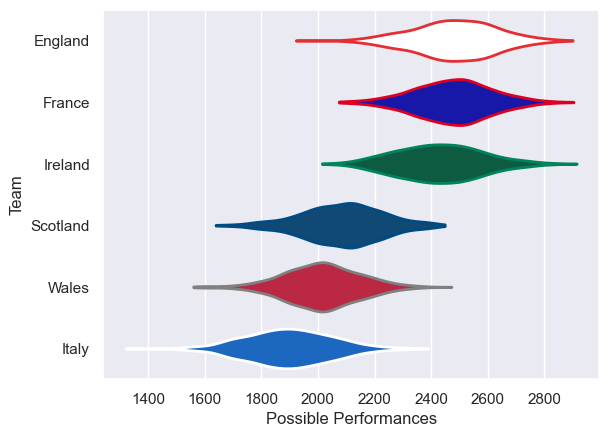

---  
title: "Six Nations 2003 Status"  
date: 2025-07-28 6:00:00 -0500  
categories: model review projection  
layout: article  
aside:  
    toc: true  
---
# Current Team Rankings

# Standings

## Current Standings

| Club     |   Played |   Wins |   Point Differential |   Losing Bonus Points | Try Bonus Points   |   Competition Points |
|:---------|---------:|-------:|---------------------:|----------------------:|:-------------------|---------------------:|
| England  |        5 |      5 |                  127 |                     0 |                    |                   20 |
| Ireland  |        5 |      4 |                   22 |                     0 |                    |                   16 |
| France   |        5 |      3 |                   78 |                     1 |                    |                   13 |
| Scotland |        5 |      2 |                  -80 |                     0 |                    |                    8 |
| Italy    |        5 |      1 |                  -85 |                     0 |                    |                    4 |
| Wales    |        5 |      0 |                  -62 |                     1 |                    |                    1 |

# Completed Match Review

| Model | Percent Correct Predictions | Spread Error |
| ------ | ------ | ------ |
| Club Level | 86.7% | 9.5 |
| Player Level: Lineup | nan% | nan |
| Player Level: Minutes | nan% | nan |

