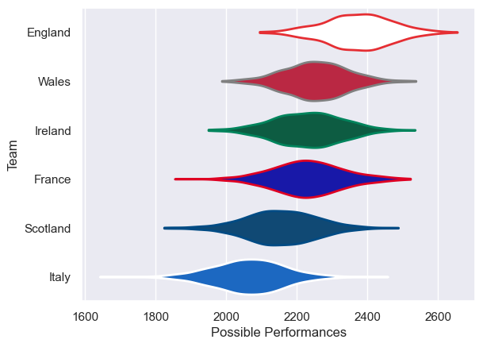

---  
title: "Six Nations 2013"  
date: 2025-07-29 6:00:00 -0500  
categories: model review projection  
layout: article  
aside:  
    toc: true  
---
# Current Team Rankings

# Standings

## Current Standings

| Club     |   Played |   Wins |   Point Differential |   Losing Bonus Points |   Try Bonus Points |   Competition Points |
|:---------|---------:|-------:|---------------------:|----------------------:|-------------------:|---------------------:|
| England  |        5 |      4 |                   16 |                     0 |                  1 |                   17 |
| Wales    |        5 |      4 |                   56 |                     0 |                    |                   16 |
| Scotland |        5 |      2 |                   -9 |                     1 |                  1 |                   10 |
| Ireland  |        5 |      1 |                   -9 |                     3 |                    |                    9 |
| Italy    |        5 |      2 |                  -36 |                     1 |                    |                    9 |
| France   |        5 |      1 |                  -18 |                     1 |                    |                    7 |

# Completed Match Review

| Model | Percent Correct Predictions | Spread Error |
| ------ | ------ | ------ |
| Club Level | 46.7% | 10.9 |
| Player Level: Lineup | nan% | nan |
| Player Level: Minutes | nan% | nan |

