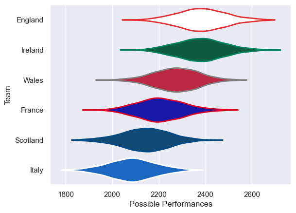

---  
title: "Six Nations 2015"  
date: 2025-07-29 6:00:00 -0500  
categories: model review projection  
layout: article  
aside:  
    toc: true  
---
# Current Team Rankings

# Standings

## Current Standings

| Club     |   Played |   Wins |   Point Differential |   Losing Bonus Points |   Try Bonus Points |   Competition Points |
|:---------|---------:|-------:|---------------------:|----------------------:|-------------------:|---------------------:|
| Ireland  |        5 |      4 |                   63 |                     1 |                  1 |                   18 |
| England  |        5 |      4 |                   57 |                     0 |                  2 |                   18 |
| Wales    |        5 |      4 |                   53 |                     1 |                  1 |                   18 |
| France   |        5 |      2 |                    2 |                     2 |                  1 |                   11 |
| Italy    |        5 |      1 |                 -120 |                     0 |                    |                    4 |
| Scotland |        5 |      0 |                  -55 |                     3 |                    |                    3 |

# Completed Match Review

| Model | Percent Correct Predictions | Spread Error |
| ------ | ------ | ------ |
| Club Level | 80.0% | 11.8 |
| Player Level: Lineup | nan% | nan |
| Player Level: Minutes | nan% | nan |

