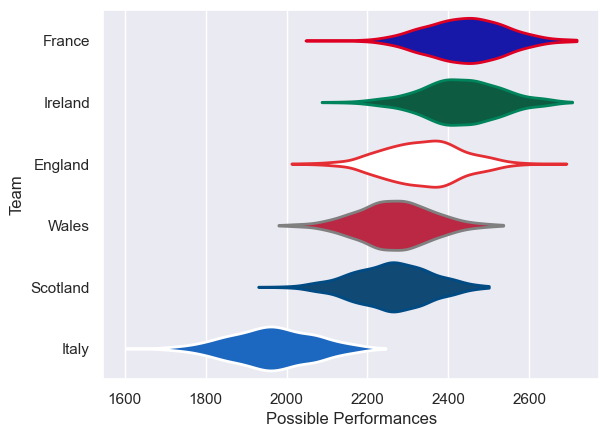

---  
title: "Six Nations 2022 Status"  
date: 2025-07-28 6:00:00 -0500  
categories: model review projection  
layout: article  
aside:  
    toc: true  
---
# Current Team Rankings

# Standings

## Current Standings

| Club     |   Played |   Wins |   Point Differential |   Losing Bonus Points |   Try Bonus Points |   Competition Points |
|:---------|---------:|-------:|---------------------:|----------------------:|-------------------:|---------------------:|
| France   |        5 |      5 |                   68 |                     0 |                  2 |                   22 |
| Ireland  |        5 |      4 |                  105 |                     1 |                  4 |                   21 |
| England  |        5 |      2 |                    5 |                     1 |                  1 |                   10 |
| Scotland |        5 |      2 |                  -29 |                     1 |                  1 |                   10 |
| Wales    |        5 |      1 |                  -28 |                     3 |                    |                    7 |
| Italy    |        5 |      1 |                 -121 |                     0 |                    |                    4 |

# Completed Match Review

| Model | Percent Correct Predictions | Spread Error |
| ------ | ------ | ------ |
| Club Level | 86.7% | 8.6 |
| Player Level: Lineup | nan% | nan |
| Player Level: Minutes | nan% | nan |

