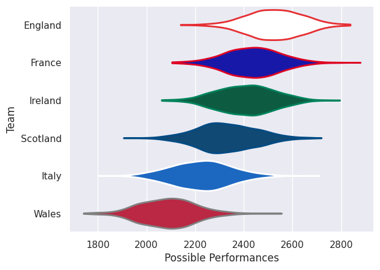

---  
title: "Six Nations 2026"  
date: 2025-08-29 6:00:00 -0500  
categories: model review projection  
layout: article  
aside:  
    toc: true  
---
# Team Rankings

# Standings

## Projected Remaining Table

| Club     |   To Play |   Projected Wins |   Projected Differential |   Projected Losing Bonus Points | Projected Try Bonus Points   |   Projected Competition Points |
|:---------|----------:|-----------------:|-------------------------:|--------------------------------:|:-----------------------------|-------------------------------:|
| France   |         5 |            2.951 |                   17.795 |                           0.99  |                              |                         13.186 |
| Ireland  |         5 |            2.781 |                   15.052 |                           0.992 |                              |                         12.5   |
| England  |         5 |            2.755 |                   12.234 |                           1.041 |                              |                         12.469 |
| Scotland |         5 |            2.313 |                   -3.303 |                           1.12  |                              |                         10.838 |
| Wales    |         5 |            1.8   |                  -20.788 |                           1.053 |                              |                          8.671 |
| Italy    |         5 |            1.776 |                  -20.99  |                           1.11  |                              |                          8.642 |

## Projected Total Table

| Club     |   Played |   Wins |   Point Differential |   Losing Bonus Points | Try Bonus Points   |   Competition Points |
|:---------|---------:|-------:|---------------------:|----------------------:|:-------------------|---------------------:|
| France   |        5 |  2.951 |               17.795 |                 0.99  |                    |               13.186 |
| Ireland  |        5 |  2.781 |               15.052 |                 0.992 |                    |               12.5   |
| England  |        5 |  2.755 |               12.234 |                 1.041 |                    |               12.469 |
| Scotland |        5 |  2.313 |               -3.303 |                 1.12  |                    |               10.838 |
| Wales    |        5 |  1.8   |              -20.788 |                 1.053 |                    |                8.671 |
| Italy    |        5 |  1.776 |              -20.99  |                 1.11  |                    |                8.642 |

# Future Predictions

## Week 1

### France V Ireland on 2026/02/05

Average Margin: France by 2.7

### England V Wales on 2026/02/07

Average Margin: England by 9.2

### Italy V Scotland on 2026/02/07

Average Margin: Scotland by 1.2

## Week 2

### Scotland V England on 2026/02/14

Average Margin: England by 0.6

### Ireland V Italy on 2026/02/14

Average Margin: Ireland by 7.3

### Wales V France on 2026/02/15

Average Margin: France by 4.0

## Week 3

### Wales V Scotland on 2026/02/21

Average Margin: Scotland by 1.4

### England V Ireland on 2026/02/21

Average Margin: England by 2.3

### France V Italy on 2026/02/22

Average Margin: France by 8.7

## Week 4

### Ireland V Wales on 2026/03/06

Average Margin: Ireland by 7.3

### Italy V England on 2026/03/07

Average Margin: England by 2.6

### Scotland V France on 2026/03/07

Average Margin: Scotland by 0.2

## Week 5

### Ireland V Scotland on 2026/03/14

Average Margin: Ireland by 5.5

### Wales V Italy on 2026/03/14

Average Margin: Wales by 1.2

### France V England on 2026/03/14

Average Margin: France by 2.5

