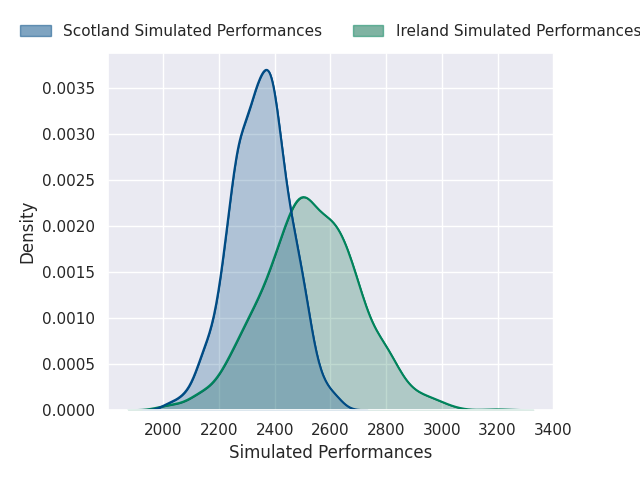
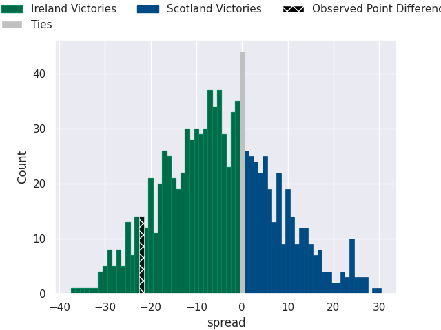
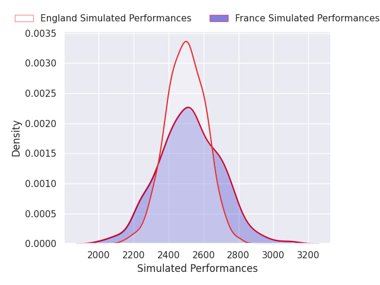
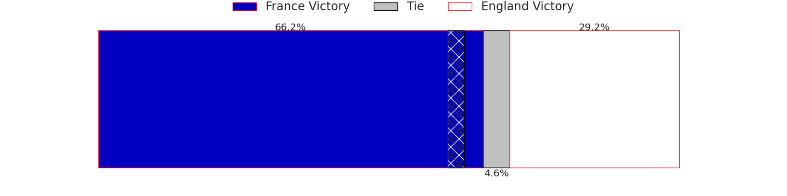
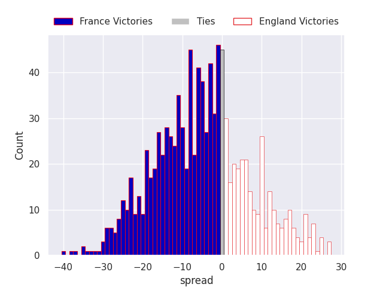

# Team Rankings

# Standings

## Current Standings

| Club     |   Played |   Wins |   Point Differential |   Losing Bonus Points |   Try Bonus Points |   Competition Points |
|:---------|---------:|-------:|---------------------:|----------------------:|-------------------:|---------------------:|
| France   |        4 |      3 |                   79 |                     0 |                  4 |                   16 |
| Scotland |        4 |      3 |                   21 |                     1 |                  3 |                   16 |
| Ireland  |        4 |      3 |                   16 |                     0 |                  2 |                   14 |
| Italy    |        4 |      2 |                  -24 |                     1 |                    |                    9 |
| England  |        4 |      1 |                    4 |                     1 |                  2 |                    7 |
| Wales    |        4 |      0 |                  -96 |                     1 |                    |                    1 |

## Projected Remaining Table

| Club     |   To Play |   Projected Wins |   Projected Differential |   Projected Losing Bonus Points | Projected Try Bonus Points   |   Projected Competition Points |
|:---------|----------:|-----------------:|-------------------------:|--------------------------------:|:-----------------------------|-------------------------------:|
| France   |         1 |            0.683 |                    5.334 |                           0.153 |                              |                          2.957 |
| Ireland  |         1 |            0.621 |                    3.681 |                           0.19  |                              |                          2.762 |
| Italy    |         1 |            0.581 |                    2.615 |                           0.2   |                              |                          2.622 |
| Wales    |         1 |            0.37  |                   -2.615 |                           0.26  |                              |                          1.838 |
| Scotland |         1 |            0.335 |                   -3.681 |                           0.256 |                              |                          1.684 |
| England  |         1 |            0.281 |                   -5.334 |                           0.266 |                              |                          1.462 |

## Projected Total Table

| Club     |   Played |   Wins |   Point Differential |   Losing Bonus Points |   Try Bonus Points |   Competition Points |
|:---------|---------:|-------:|---------------------:|----------------------:|-------------------:|---------------------:|
| France   |        5 |  3.683 |               84.334 |                 0.153 |                  4 |               18.957 |
| Scotland |        5 |  3.335 |               17.319 |                 1.256 |                  3 |               17.684 |
| Ireland  |        5 |  3.621 |               19.681 |                 0.19  |                  2 |               16.762 |
| Italy    |        5 |  2.581 |              -21.385 |                 1.2   |                    |               11.622 |
| England  |        5 |  1.281 |               -1.334 |                 1.266 |                  2 |                8.462 |
| Wales    |        5 |  0.37  |              -98.615 |                 1.26  |                    |                2.838 |

# Completed Match Review

| Model | Percent Correct Predictions | Spread Error |
| ------ | ------ | ------ |
| Club Level | 60.0% | 13.6 |
| Player Level: Lineup | nan% | nan |
| Player Level: Minutes | nan% | nan |

# Future Predictions

## Week 5

### Ireland V Scotland on 2026/03/14

Average Margin: Ireland by 3.7

### France V England on 2026/03/14

Average Margin: France by 5.3

### Wales V Italy on 2026/03/14

Average Margin: Italy by 2.6

