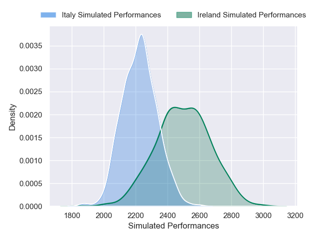
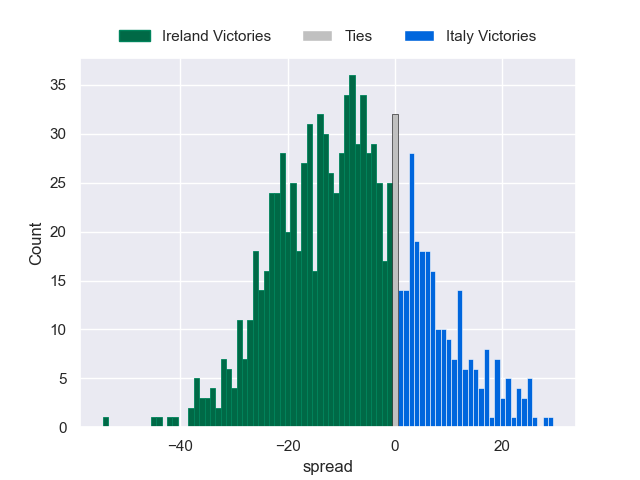
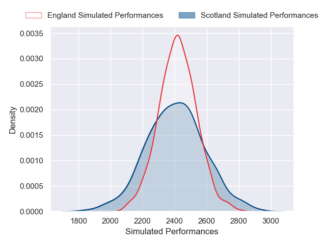
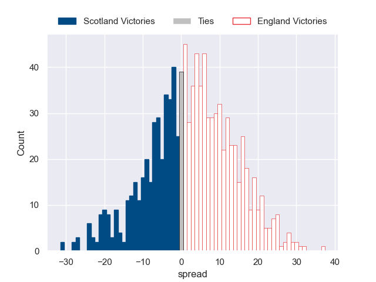
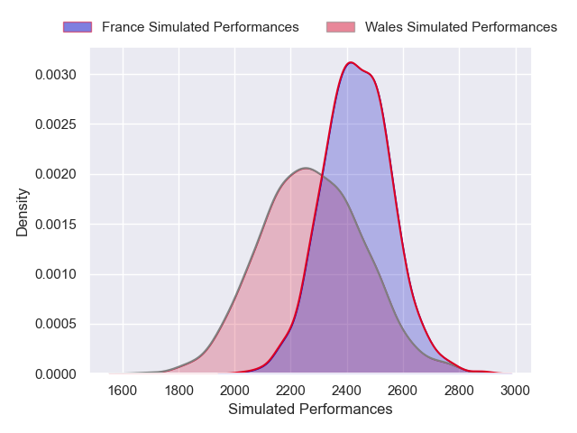
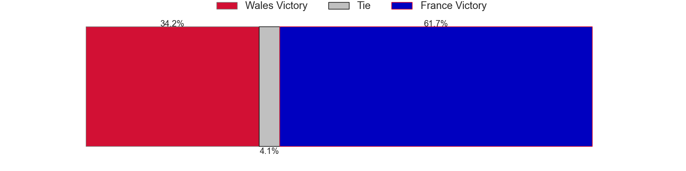
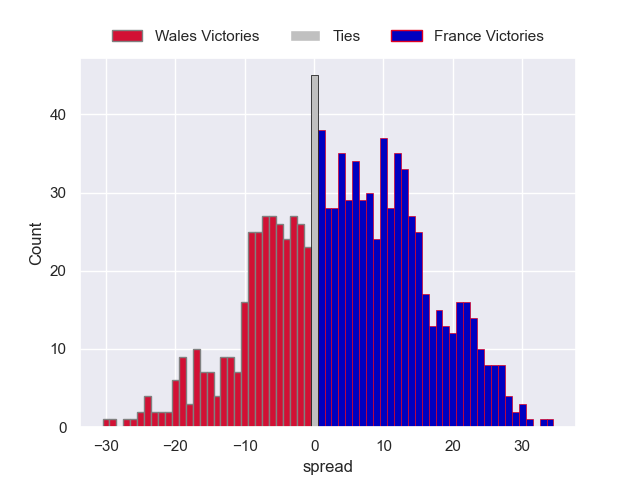

# Team Rankings

# Standings

## Current Standings

| Club     |   Played |   Wins |   Point Differential |   Losing Bonus Points |   Try Bonus Points |   Competition Points |
|:---------|---------:|-------:|---------------------:|----------------------:|-------------------:|---------------------:|
| England  |        1 |      1 |                   41 |                     0 |                  1 |                    5 |
| France   |        1 |      1 |                   22 |                     0 |                  1 |                    5 |
| Italy    |        1 |      1 |                    3 |                     0 |                    |                    4 |
| Scotland |        1 |      0 |                   -3 |                     1 |                    |                    1 |
| Ireland  |        1 |      0 |                  -22 |                     0 |                    |                    0 |
| Wales    |        1 |      0 |                  -41 |                     0 |                    |                    0 |

## Projected Remaining Table

| Club     |   To Play |   Projected Wins |   Projected Differential |   Projected Losing Bonus Points | Projected Try Bonus Points   |   Projected Competition Points |
|:---------|----------:|-----------------:|-------------------------:|--------------------------------:|:-----------------------------|-------------------------------:|
| France   |         4 |            2.416 |                   17.668 |                           0.756 |                              |                         10.734 |
| England  |         4 |            2.407 |                   14.98  |                           0.742 |                              |                         10.72  |
| Ireland  |         4 |            2.292 |                   12.728 |                           0.648 |                              |                         10.104 |
| Scotland |         4 |            1.775 |                   -4.383 |                           0.877 |                              |                          8.311 |
| Italy    |         4 |            1.439 |                  -15.664 |                           0.881 |                              |                          6.975 |
| Wales    |         4 |            1.189 |                  -25.329 |                           0.883 |                              |                          5.943 |

## Projected Total Table

| Club     |   Played |   Wins |   Point Differential |   Losing Bonus Points |   Try Bonus Points |   Competition Points |
|:---------|---------:|-------:|---------------------:|----------------------:|-------------------:|---------------------:|
| France   |        5 |  3.416 |               39.668 |                 0.756 |                  1 |               15.734 |
| England  |        5 |  3.407 |               55.98  |                 0.742 |                  1 |               15.72  |
| Italy    |        5 |  2.439 |              -12.664 |                 0.881 |                    |               10.975 |
| Ireland  |        5 |  2.292 |               -9.272 |                 0.648 |                    |               10.104 |
| Scotland |        5 |  1.775 |               -7.383 |                 1.877 |                    |                9.311 |
| Wales    |        5 |  1.189 |              -66.329 |                 0.883 |                    |                5.943 |

# Completed Match Review

| Model | Percent Correct Predictions | Spread Error |
| ------ | ------ | ------ |
| Club Level | 66.7% | 7.8 |
| Player Level: Lineup | nan% | nan |
| Player Level: Minutes | nan% | nan |

# Future Predictions

## Week 2

### Ireland V Italy on 2026/02/14

Average Margin: Ireland by 6.2

### Scotland V England on 2026/02/14

Average Margin: England by 4.2

### Wales V France on 2026/02/15

Average Margin: France by 8.4

## Week 3

### England V Ireland on 2026/02/21

Average Margin: England by 7.2

### Wales V Scotland on 2026/02/21

Average Margin: Scotland by 4.5

### France V Italy on 2026/02/22

Average Margin: France by 8.6

## Week 4

### Ireland V Wales on 2026/03/06

Average Margin: Ireland by 9.7

### Scotland V France on 2026/03/07

Average Margin: France by 0.6

### Italy V England on 2026/03/07

Average Margin: England by 3.6

## Week 5

### Wales V Italy on 2026/03/14

Average Margin: Italy by 2.7

### France V England on 2026/03/14

Average Margin: England by 0.0

### Ireland V Scotland on 2026/03/14

Average Margin: Ireland by 4.1

