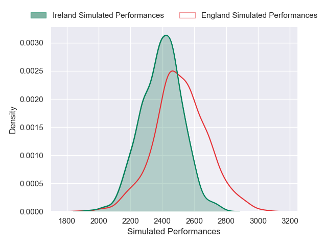
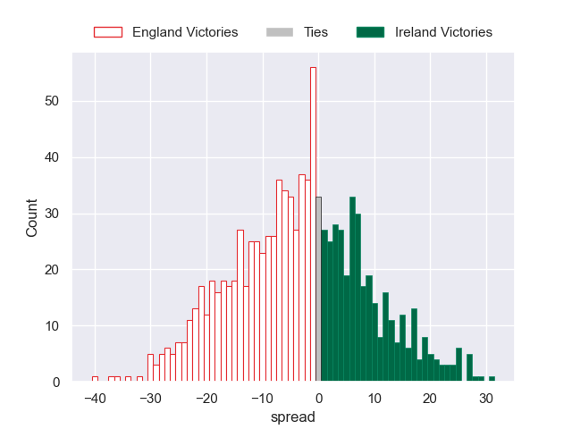
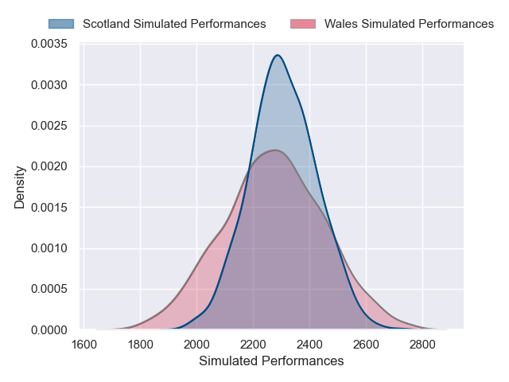
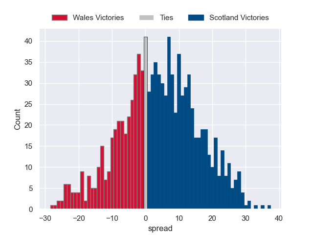
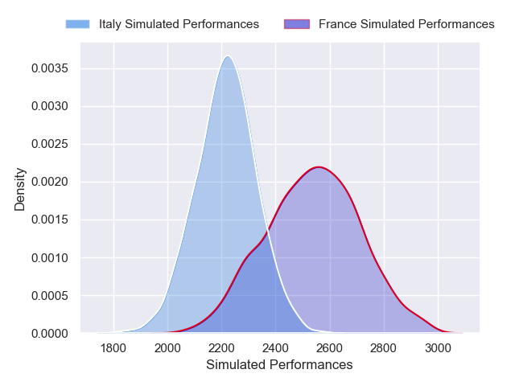
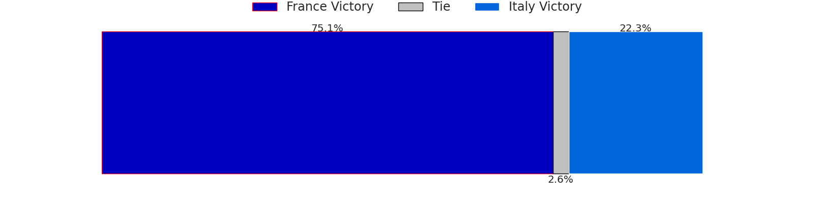
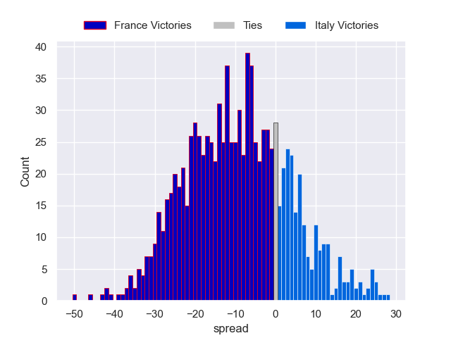

# Team Rankings

# Standings

## Current Standings

| Club     |   Played |   Wins |   Point Differential |   Losing Bonus Points |   Try Bonus Points |   Competition Points |
|:---------|---------:|-------:|---------------------:|----------------------:|-------------------:|---------------------:|
| France   |        2 |      2 |                   64 |                     0 |                  2 |                   10 |
| Scotland |        2 |      1 |                    8 |                     1 |                  1 |                    6 |
| England  |        2 |      1 |                   30 |                     0 |                  1 |                    5 |
| Italy    |        2 |      1 |                   -4 |                     1 |                    |                    5 |
| Ireland  |        2 |      1 |                  -15 |                     0 |                    |                    4 |
| Wales    |        2 |      0 |                  -83 |                     0 |                    |                    0 |

## Projected Remaining Table

| Club     |   To Play |   Projected Wins |   Projected Differential |   Projected Losing Bonus Points | Projected Try Bonus Points   |   Projected Competition Points |
|:---------|----------:|-----------------:|-------------------------:|--------------------------------:|:-----------------------------|-------------------------------:|
| France   |         3 |            1.825 |                   12.132 |                           0.548 |                              |                          8.112 |
| Ireland  |         3 |            1.656 |                    8.469 |                           0.517 |                              |                          7.367 |
| England  |         3 |            1.584 |                    5.237 |                           0.636 |                              |                          7.228 |
| Scotland |         3 |            1.457 |                    1.875 |                           0.671 |                              |                          6.783 |
| Italy    |         3 |            1.182 |                   -8.406 |                           0.657 |                              |                          5.667 |
| Wales    |         3 |            0.906 |                  -19.307 |                           0.629 |                              |                          4.501 |

## Projected Total Table

| Club     |   Played |   Wins |   Point Differential |   Losing Bonus Points |   Try Bonus Points |   Competition Points |
|:---------|---------:|-------:|---------------------:|----------------------:|-------------------:|---------------------:|
| France   |        5 |  3.825 |               76.132 |                 0.548 |                  2 |               18.112 |
| Scotland |        5 |  2.457 |                9.875 |                 1.671 |                  1 |               12.783 |
| England  |        5 |  2.584 |               35.237 |                 0.636 |                  1 |               12.228 |
| Ireland  |        5 |  2.656 |               -6.531 |                 0.517 |                    |               11.367 |
| Italy    |        5 |  2.182 |              -12.406 |                 1.657 |                    |               10.667 |
| Wales    |        5 |  0.906 |             -102.307 |                 0.629 |                    |                4.501 |

# Completed Match Review

| Model | Percent Correct Predictions | Spread Error |
| ------ | ------ | ------ |
| Club Level | 66.7% | 11.2 |
| Player Level: Lineup | nan% | nan |
| Player Level: Minutes | nan% | nan |

# Future Predictions

## Week 3

### England V Ireland on 2026/02/21

Average Margin: England by 5.7

### Wales V Scotland on 2026/02/21

Average Margin: Scotland by 5.5

### France V Italy on 2026/02/22

Average Margin: France by 8.9

## Week 4

### Ireland V Wales on 2026/03/06

Average Margin: Ireland by 10.7

### Scotland V France on 2026/03/07

Average Margin: France by 0.2

### Italy V England on 2026/03/07

Average Margin: England by 2.6

## Week 5

### Ireland V Scotland on 2026/03/14

Average Margin: Ireland by 3.4

### France V England on 2026/03/14

Average Margin: France by 3.1

### Wales V Italy on 2026/03/14

Average Margin: Italy by 3.1

