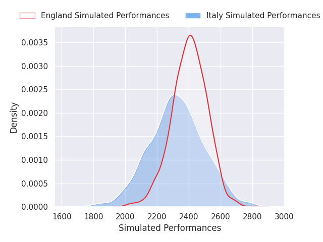
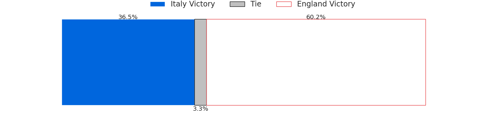
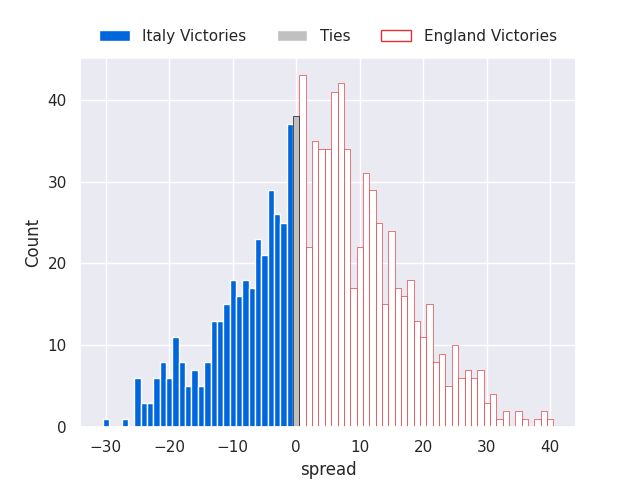

# Team Rankings

# Standings

## Current Standings

| Club     |   Played |   Wins |   Point Differential |   Losing Bonus Points |   Try Bonus Points |   Competition Points |
|:---------|---------:|-------:|---------------------:|----------------------:|-------------------:|---------------------:|
| France   |        3 |      3 |                   89 |                     0 |                  3 |                   15 |
| Scotland |        3 |      2 |                   11 |                     1 |                  2 |                   11 |
| Ireland  |        3 |      2 |                    6 |                     0 |                  1 |                    9 |
| England  |        3 |      1 |                    9 |                     0 |                  2 |                    6 |
| Italy    |        3 |      1 |                  -29 |                     1 |                    |                    5 |
| Wales    |        3 |      0 |                  -86 |                     1 |                    |                    1 |

## Projected Remaining Table

| Club     |   To Play |   Projected Wins |   Projected Differential |   Projected Losing Bonus Points | Projected Try Bonus Points   |   Projected Competition Points |
|:---------|----------:|-----------------:|-------------------------:|--------------------------------:|:-----------------------------|-------------------------------:|
| Ireland  |         2 |            1.417 |                   17.601 |                           0.256 |                              |                          6.08  |
| France   |         2 |            1.207 |                    6.754 |                           0.353 |                              |                          5.377 |
| Italy    |         2 |            0.995 |                    1.089 |                           0.464 |                              |                          4.618 |
| England  |         2 |            0.837 |                   -3.135 |                           0.467 |                              |                          3.995 |
| Scotland |         2 |            0.713 |                   -6.825 |                           0.478 |                              |                          3.522 |
| Wales    |         2 |            0.568 |                  -15.484 |                           0.414 |                              |                          2.84  |

## Projected Total Table

| Club     |   Played |   Wins |   Point Differential |   Losing Bonus Points |   Try Bonus Points |   Competition Points |
|:---------|---------:|-------:|---------------------:|----------------------:|-------------------:|---------------------:|
| France   |        5 |  4.207 |               95.754 |                 0.353 |                  3 |               20.377 |
| Ireland  |        5 |  3.417 |               23.601 |                 0.256 |                  1 |               15.08  |
| Scotland |        5 |  2.713 |                4.175 |                 1.478 |                  2 |               14.522 |
| England  |        5 |  1.837 |                5.865 |                 0.467 |                  2 |                9.995 |
| Italy    |        5 |  1.995 |              -27.911 |                 1.464 |                    |                9.618 |
| Wales    |        5 |  0.568 |             -101.484 |                 1.414 |                    |                3.84  |

# Completed Match Review

| Model | Percent Correct Predictions | Spread Error |
| ------ | ------ | ------ |
| Club Level | 53.3% | 13.8 |
| Player Level: Lineup | nan% | nan |
| Player Level: Minutes | nan% | nan |

# Future Predictions

## Week 4

### Ireland V Wales on 2026/03/06

Average Margin: Ireland by 12.6

### Scotland V France on 2026/03/07

Average Margin: France by 1.8

### Italy V England on 2026/03/07

Average Margin: England by 1.8

## Week 5

### France V England on 2026/03/14

Average Margin: France by 5.0

### Ireland V Scotland on 2026/03/14

Average Margin: Ireland by 5.0

### Wales V Italy on 2026/03/14

Average Margin: Italy by 2.9

