# Team Rankings

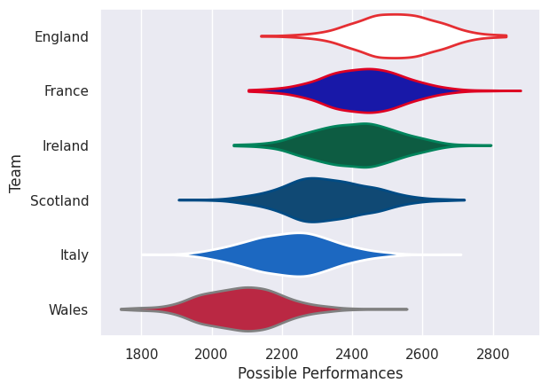
# Standings

## Current Standings

| Club     |   Played |   Wins |   Point Differential |   Losing Bonus Points |   Try Bonus Points |   Competition Points |
|:---------|---------:|-------:|---------------------:|----------------------:|-------------------:|---------------------:|
| France   |        3 |      3 |                   89 |                     0 |                  3 |                   15 |
| Scotland |        3 |      2 |                   11 |                     1 |                  2 |                   11 |
| Ireland  |        3 |      2 |                    6 |                     0 |                  1 |                    9 |
| England  |        3 |      1 |                    9 |                     0 |                  1 |                    5 |
| Italy    |        3 |      1 |                  -29 |                     1 |                    |                    5 |
| Wales    |        3 |      0 |                  -86 |                     1 |                    |                    1 |

## Projected Remaining Table

| Club     |   To Play |   Projected Wins |   Projected Differential |   Projected Losing Bonus Points | Projected Try Bonus Points   |   Projected Competition Points |
|:---------|----------:|-----------------:|-------------------------:|--------------------------------:|:-----------------------------|-------------------------------:|
| Ireland  |         2 |            1.38  |                   16.881 |                           0.272 |                              |                          5.952 |
| France   |         2 |            1.223 |                    7.393 |                           0.377 |                              |                          5.441 |
| Italy    |         2 |            0.955 |                    0.576 |                           0.45  |                              |                          4.456 |
| England  |         2 |            0.861 |                   -3.189 |                           0.429 |                              |                          4.057 |
| Scotland |         2 |            0.71  |                   -7.016 |                           0.49  |                              |                          3.52  |
| Wales    |         2 |            0.612 |                  -14.645 |                           0.396 |                              |                          2.988 |

## Projected Total Table

| Club     |   Played |   Wins |   Point Differential |   Losing Bonus Points |   Try Bonus Points |   Competition Points |
|:---------|---------:|-------:|---------------------:|----------------------:|-------------------:|---------------------:|
| France   |        5 |  4.223 |               96.393 |                 0.377 |                  3 |               20.441 |
| Ireland  |        5 |  3.38  |               22.881 |                 0.272 |                  1 |               14.952 |
| Scotland |        5 |  2.71  |                3.984 |                 1.49  |                  2 |               14.52  |
| Italy    |        5 |  1.955 |              -28.424 |                 1.45  |                    |                9.456 |
| England  |        5 |  1.861 |                5.811 |                 0.429 |                  1 |                9.057 |
| Wales    |        5 |  0.612 |             -100.645 |                 1.396 |                    |                3.988 |

# Completed Match Review

| Model | Percent Correct Predictions | Spread Error |
| ------ | ------ | ------ |
| Club Level | 80.0% | 11.9 |
| Player Level: Lineup | nan% | nan |
| Player Level: Minutes | nan% | nan |

# Future Predictions

## Week 4

### Ireland V Wales on 2026/03/06

Average Margin: Ireland by 12.1

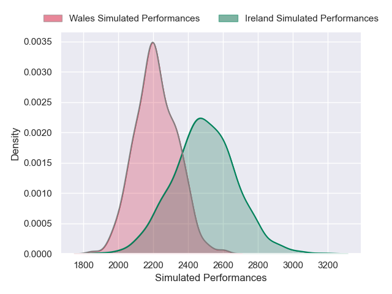
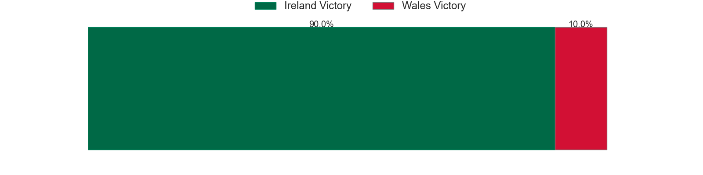
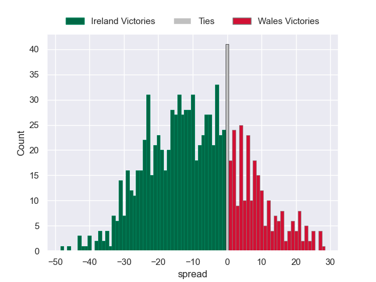

### Italy V England on 2026/03/07

Average Margin: England by 2.0

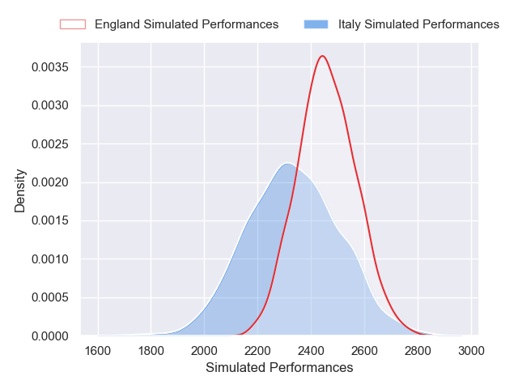
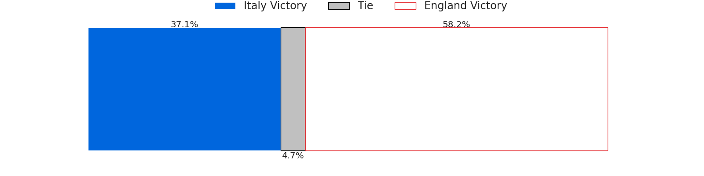

### Scotland V France on 2026/03/07

Average Margin: France by 2.2

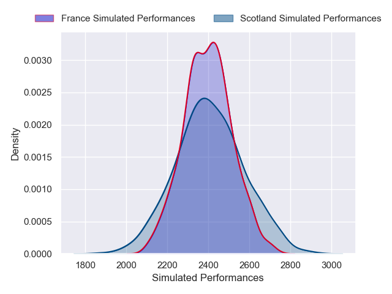

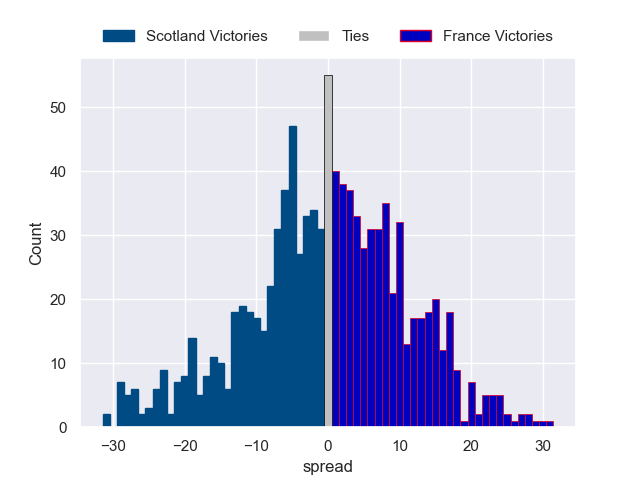

## Week 5

### Ireland V Scotland on 2026/03/14

Average Margin: Ireland by 4.8

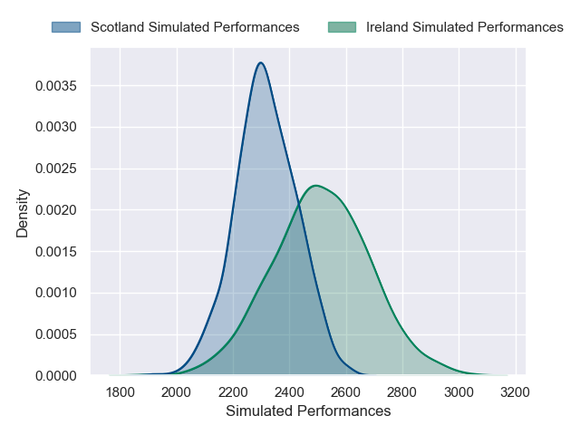

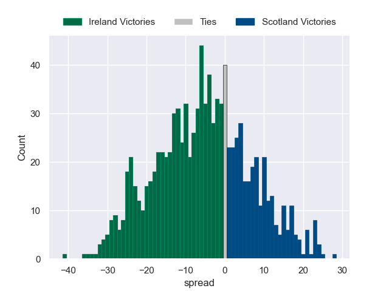

### France V England on 2026/03/14

Average Margin: France by 5.2

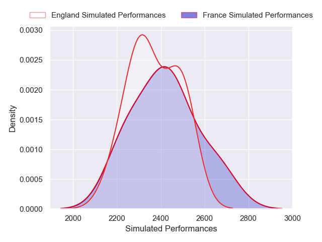

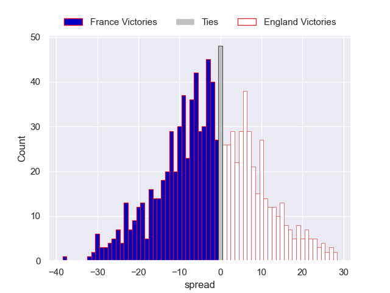

### Wales V Italy on 2026/03/14

Average Margin: Italy by 2.6

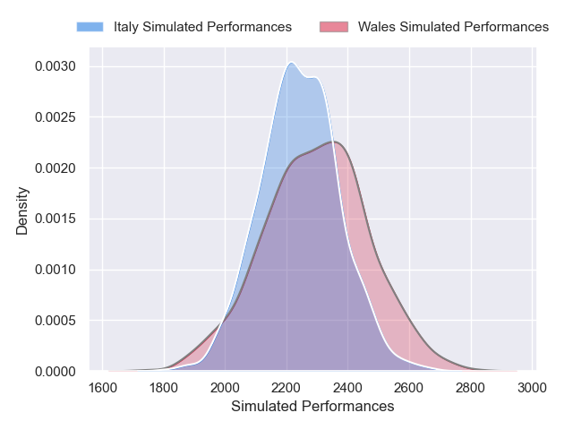

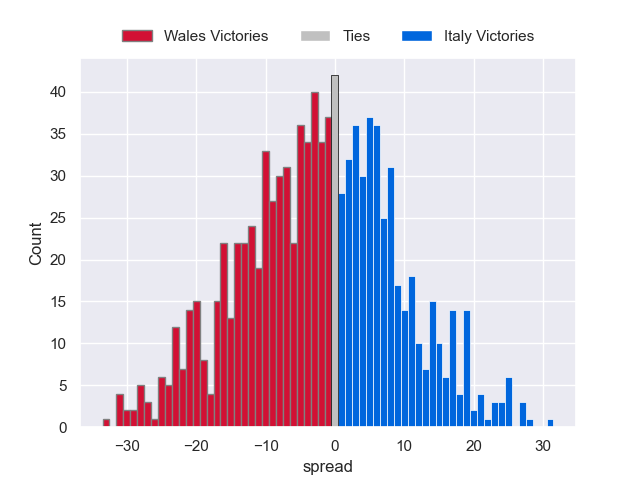

