---  
title: "Six Nations Championship 2023 Status"  
date: 2023-12-05 6:00:00 -0500  
categories: model review projection  
layout: article  
aside:  
    toc: true  
---
# Current Team Rankings

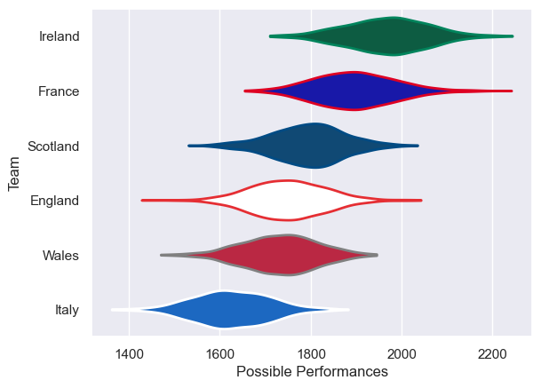
# Standings

## Current Standings

| Club     |   Played |   Wins |   Point Differential |   Losing Bonus Points |   Try Bonus Points |   Competition Points |
|:---------|---------:|-------:|---------------------:|----------------------:|-------------------:|---------------------:|
| Ireland  |        5 |      5 |                   79 |                     0 |                  4 |                   24 |
| France   |        5 |      4 |                   59 |                     0 |                  4 |                   20 |
| Scotland |        5 |      3 |                   20 |                     0 |                  3 |                   15 |
| England  |        5 |      2 |                  -35 |                     1 |                  1 |                   10 |
| Wales    |        5 |      1 |                  -63 |                     0 |                  2 |                    6 |
| Italy    |        5 |      0 |                  -60 |                     1 |                  0 |                    1 |

## Projected Remaining Table

| Club     |   Matches Remaining |   Wins |   Point Differential |   Losing Bonus Points |   Try Bonus Points |   Competition Points |
|:---------|--------------------:|-------:|---------------------:|----------------------:|-------------------:|---------------------:|
| Ireland  |                   4 |    3.5 |             42.1733  |                   0.5 |                3.4 |                 17.7 |
| France   |                   3 |    2.4 |             24.6749  |                   0.5 |                2.3 |                 12.4 |
| Scotland |                   1 |    0.7 |              4.24819 |                   0.3 |                0.7 |                  3.8 |
| England  |                   2 |    0.3 |            -12.3128  |                   0.7 |                0.3 |                  2.3 |
| Wales    |                   2 |    0.1 |            -18.7786  |                   0.7 |                0.1 |                  1.1 |
| Italy    |                   2 |    0   |            -40.005   |                   0   |                0   |                  0   |

## Projected Total Table

| Club     |   Total Matches |   Wins |   Point Differential |   Losing Bonus Points |   Try Bonus Points |   Competition Points |
|:---------|----------------:|-------:|---------------------:|----------------------:|-------------------:|---------------------:|
| Ireland  |               9 |    8.5 |             121.173  |                   0.5 |                7.4 |                 41.7 |
| France   |               8 |    6.4 |              83.6749 |                   0.5 |                6.3 |                 32.4 |
| Scotland |               6 |    3.7 |              24.2482 |                   0.3 |                3.7 |                 18.8 |
| England  |               7 |    2.3 |             -47.3128 |                   1.7 |                1.3 |                 12.3 |
| Wales    |               7 |    1.1 |             -81.7786 |                   0.7 |                2.1 |                  7.1 |
| Italy    |               7 |    0   |            -100.005  |                   1   |                0   |                  1   |

# Completed Match Review

| Model | Percent Correct Predictions | Spread Error |
| ------ | ------ | ------ |
| Club Level | 80.0% | 10.0 |
| Player Level: Lineup | 80.0% | 10.1 |
| Player Level: Minutes | 86.7% | 10.0 |

# Future Predictions

## Week 6

### France V Ireland on 2024/02/02

Average Margin: Ireland by 0.1

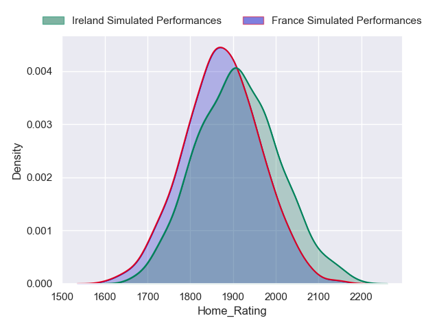

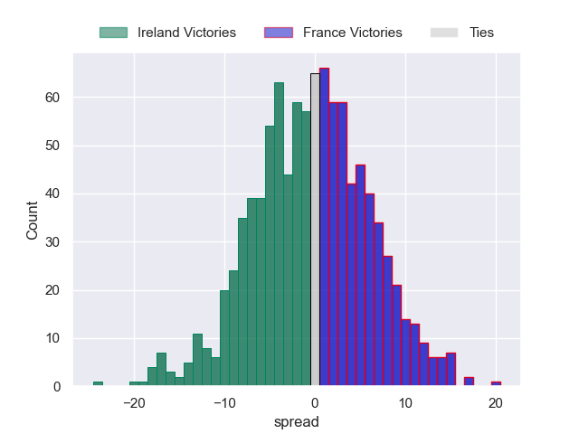

## Week 7

### Ireland V Italy on 2024/02/11

Average Margin: Ireland by 21.0

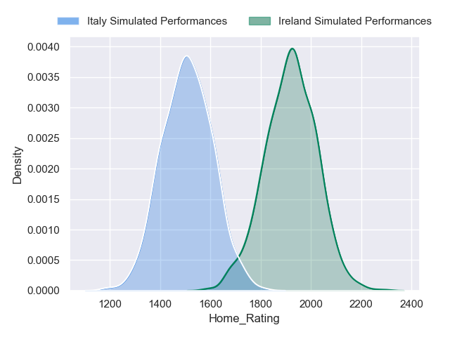
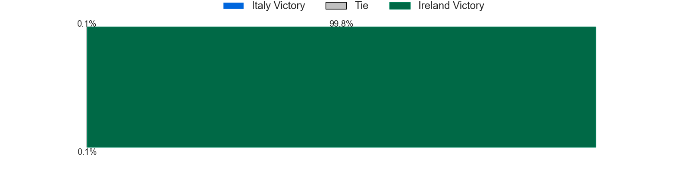
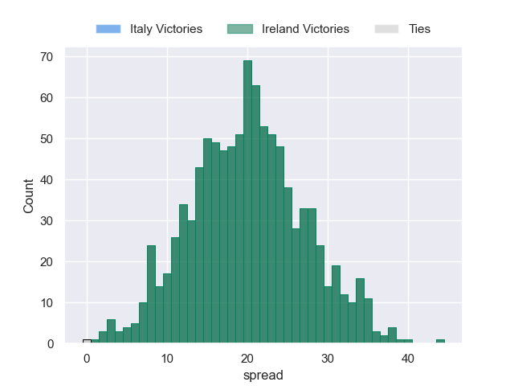

## Week 8

### Scotland V England on 2024/02/24

Average Margin: Scotland by 4.2

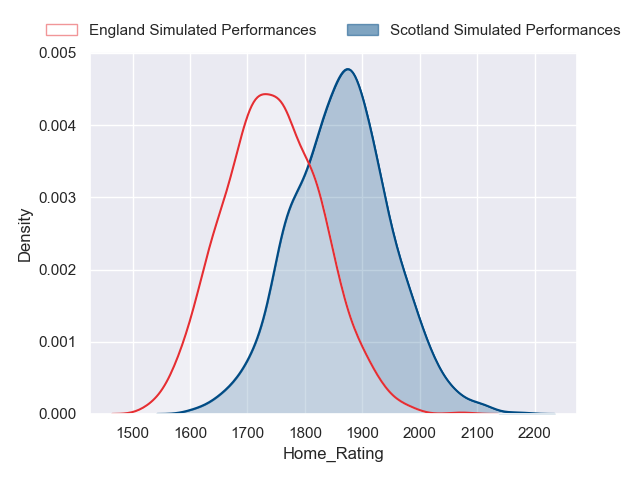
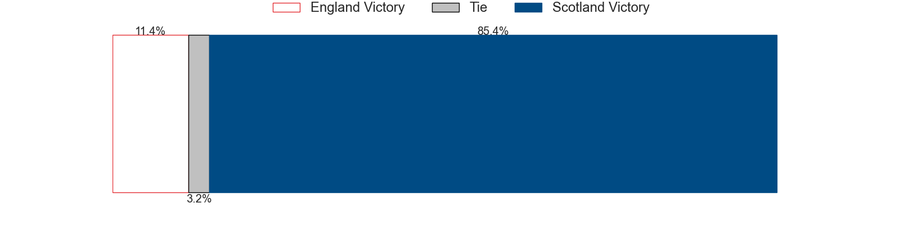
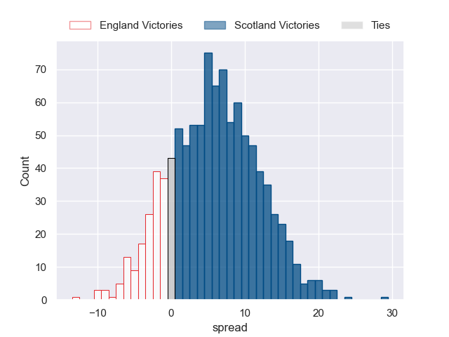

### Ireland V Wales on 2024/02/24

Average Margin: Ireland by 13.1

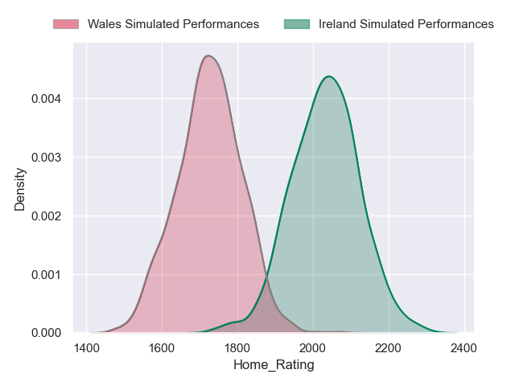
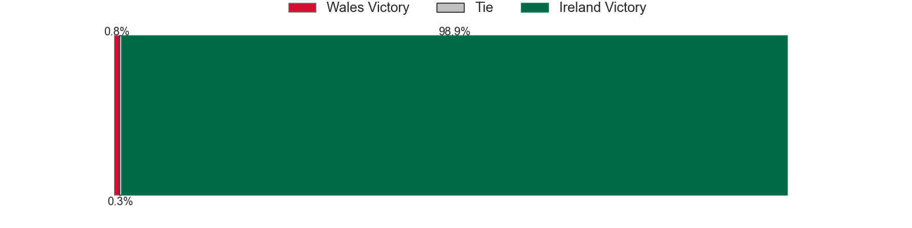
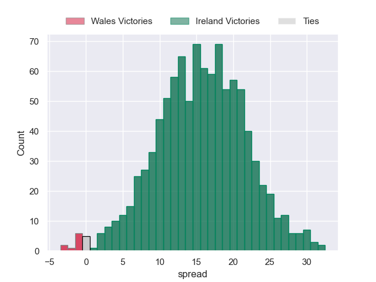

### France V Italy on 2024/02/25

Average Margin: France by 19.0

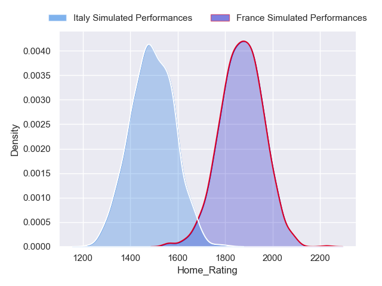
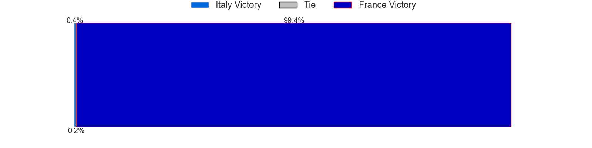
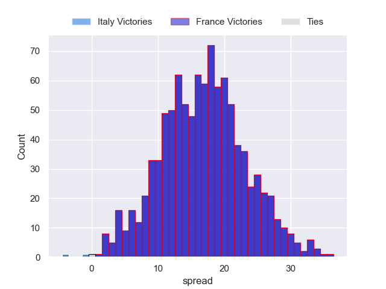

## Week 9

### England V Ireland on 2024/03/09

Average Margin: Ireland by 8.1

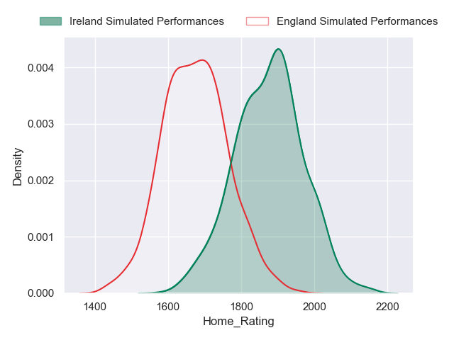
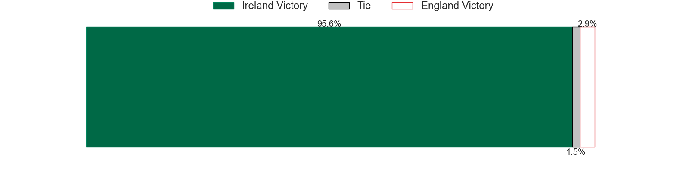
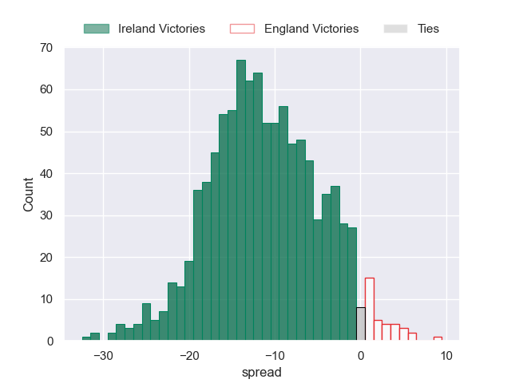

### Wales V France on 2024/03/10

Average Margin: France by 5.7

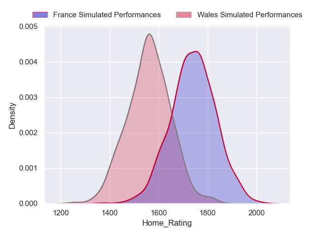
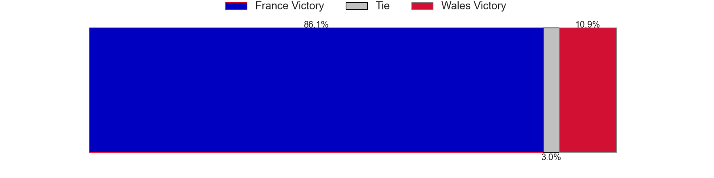
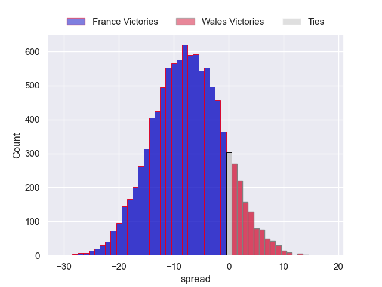

