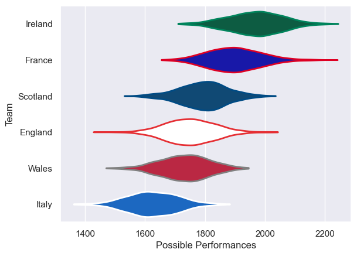

---  
title: "Six Nations Championship 2023 Status"  
date: 2023-12-04 6:00:00 -0500  
categories: model review projection  
layout: article  
aside:  
    toc: true  
---
# Current Team Rankings

# Standings

## Current Standings

| Club     |   Played |   Wins |   Point Differential |   Losing Bonus Points |   Try Bonus Points |   Competition Points |
|:---------|---------:|-------:|---------------------:|----------------------:|-------------------:|---------------------:|
| Ireland  |        5 |      5 |                   79 |                     0 |                  4 |                   24 |
| France   |        5 |      4 |                   59 |                     0 |                  4 |                   20 |
| Scotland |        5 |      3 |                   20 |                     0 |                  3 |                   15 |
| England  |        5 |      2 |                  -35 |                     1 |                  1 |                   10 |
| Wales    |        5 |      1 |                  -63 |                     0 |                  2 |                    6 |
| Italy    |        5 |      0 |                  -60 |                     1 |                  0 |                    1 |

## Projected Remaining Table

| Club     |   Matches Remaining |   Wins |   Point Differential |   Losing Bonus Points |   Try Bonus Points |   Competition Points |
|:---------|--------------------:|-------:|---------------------:|----------------------:|-------------------:|---------------------:|
| Ireland  |                   4 |    3.4 |             42.9536  |                   0.4 |                3.3 |                 17.3 |
| France   |                   3 |    2.3 |             22.1031  |                   0.5 |                2.2 |                 11.9 |
| Scotland |                   1 |    0.8 |              5.39372 |                   0.2 |                0.8 |                  4.2 |
| England  |                   2 |    0.3 |            -12.6805  |                   0.8 |                0.3 |                  2.2 |
| Wales    |                   2 |    0.2 |            -20.3346  |                   0.5 |                0.2 |                  1.5 |
| Italy    |                   2 |    0   |            -37.4354  |                   0.1 |                0   |                  0.1 |

## Projected Total Table

| Club     |   Total Matches |   Wins |   Point Differential |   Losing Bonus Points |   Try Bonus Points |   Competition Points |
|:---------|----------------:|-------:|---------------------:|----------------------:|-------------------:|---------------------:|
| Ireland  |               9 |    8.4 |             121.954  |                   0.4 |                7.3 |                 41.3 |
| France   |               8 |    6.3 |              81.1031 |                   0.5 |                6.2 |                 31.9 |
| Scotland |               6 |    3.8 |              25.3937 |                   0.2 |                3.8 |                 19.2 |
| England  |               7 |    2.3 |             -47.6805 |                   1.8 |                1.3 |                 12.2 |
| Wales    |               7 |    1.2 |             -83.3346 |                   0.5 |                2.2 |                  7.5 |
| Italy    |               7 |    0   |             -97.4354 |                   1.1 |                0   |                  1.1 |

# Completed Match Review

| Model | Percent Correct Predictions | Spread Error |
| ------ | ------ | ------ |
| Club Level | 80.0% | 10.0 |
| Player Level: Lineup | 80.0% | 10.1 |
| Player Level: Minutes | 86.7% | 10.0 |

# Future Predictions

## Week 6

### France V Ireland on 2024/02/02

Average Margin: Ireland by 0.0

## Week 7

### Ireland V Italy on 2024/02/11

Average Margin: Ireland by 20.4

## Week 8

### Scotland V England on 2024/02/24

Average Margin: Scotland by 5.4

### Ireland V Wales on 2024/02/24

Average Margin: Ireland by 15.3

### France V Italy on 2024/02/25

Average Margin: France by 17.1

## Week 9

### England V Ireland on 2024/03/09

Average Margin: Ireland by 7.3

### Wales V France on 2024/03/10

Average Margin: France by 5.1

