---  
title: "Six Nations Championship 2024 Status"  
date: 2025-01-27 6:00:00 -0500  
categories: model review projection  
layout: article  
aside:  
    toc: true  
---
# Current Team Rankings

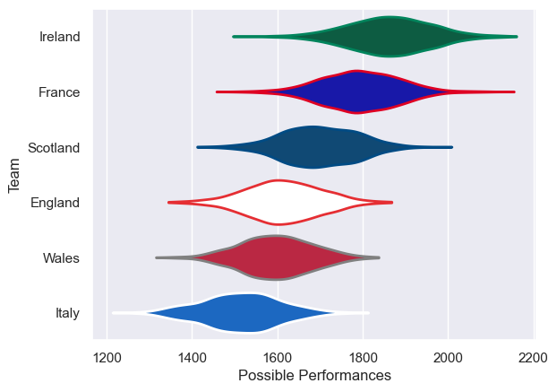
# Standings

## Current Standings

| Club     |   Played |   Wins |   Point Differential |   Losing Bonus Points |   Try Bonus Points |   Competition Points |
|:---------|---------:|-------:|---------------------:|----------------------:|-------------------:|---------------------:|
| Ireland  |        5 |      4 |                   84 |                     1 |                  3 |                   20 |
| France   |        5 |      3 |                    6 |                     0 |                  1 |                   15 |
| England  |        5 |      3 |                   -5 |                     1 |                  1 |                   14 |
| Scotland |        5 |      2 |                    0 |                     3 |                  1 |                   12 |
| Italy    |        5 |      2 |                  -34 |                     1 |                  0 |                   11 |
| Wales    |        5 |      0 |                  -51 |                     3 |                  1 |                    4 |

## Projected Remaining Table

| Club     |   Matches Remaining |   Wins |   Point Differential |   Losing Bonus Points |   Try Bonus Points |   Competition Points |
|:---------|--------------------:|-------:|---------------------:|----------------------:|-------------------:|---------------------:|
| Ireland  |                   5 |    3.7 |             37.5401  |                   0.7 |                2.3 |                 18.1 |
| France   |                   5 |    3.3 |             26.4218  |                   1   |                1.8 |                 15.8 |
| Scotland |                   5 |    3.2 |             26.9773  |                   0.9 |                1.6 |                 15.5 |
| England  |                   5 |    2.6 |              1.77321 |                   1.1 |                1.3 |                 12.7 |
| Italy    |                   5 |    1.4 |            -34.0751  |                   1.1 |                0.7 |                  7.5 |
| Wales    |                   5 |    0.8 |            -58.6374  |                   1.1 |                0.5 |                  4.8 |

## Projected Total Table

| Club     |   Total Matches |   Wins |   Point Differential |   Losing Bonus Points |   Try Bonus Points |   Competition Points |
|:---------|----------------:|-------:|---------------------:|----------------------:|-------------------:|---------------------:|
| Ireland  |              10 |    7.7 |            121.54    |                   1.7 |                5.3 |                 38.1 |
| France   |              10 |    6.3 |             32.4218  |                   1   |                2.8 |                 30.8 |
| Scotland |              10 |    5.2 |             26.9773  |                   3.9 |                2.6 |                 27.5 |
| England  |              10 |    5.6 |             -3.22679 |                   2.1 |                2.3 |                 26.7 |
| Italy    |              10 |    3.4 |            -68.0751  |                   2.1 |                0.7 |                 18.5 |
| Wales    |              10 |    0.8 |           -109.637   |                   4.1 |                1.5 |                  8.8 |

# Completed Match Review

| Model | Percent Correct Predictions | Spread Error |
| ------ | ------ | ------ |
| Club Level | 46.7% | 9.5 |
| Player Level: Lineup | 66.7% | 11.1 |
| Player Level: Minutes | 66.7% | 10.6 |

# Future Predictions

## Week 6

### France V Wales on 2025/01/31

Average Margin: France by 17.8

Average Scoreline: 26-8

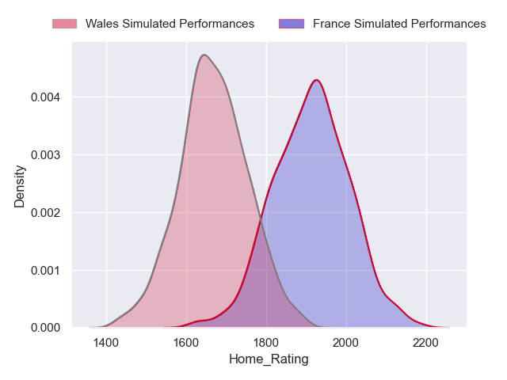

### Ireland V England on 2025/02/01

Average Margin: Ireland by 10.8

Average Scoreline: 21-10

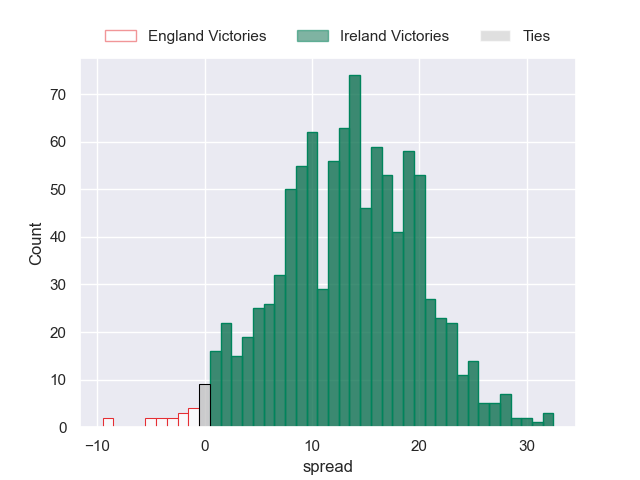

### Scotland V Italy on 2025/02/01

Average Margin: Scotland by 13.7

Average Scoreline: 25-11

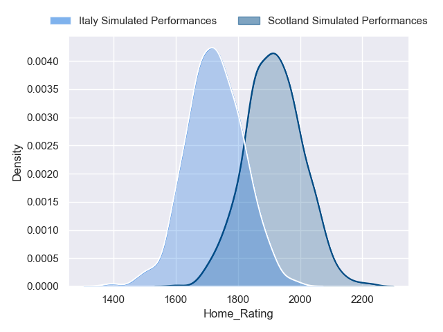

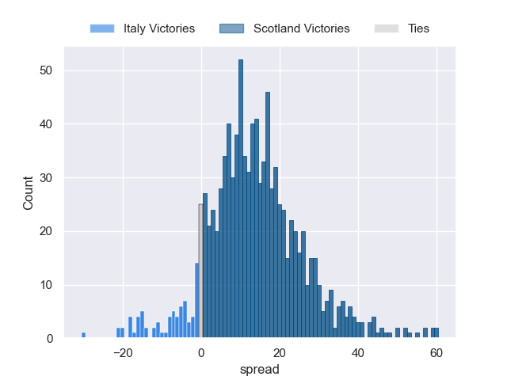

## Week 7

### England V France on 2025/02/08

Average Margin: France by 1.5

Average Scoreline: 18-17

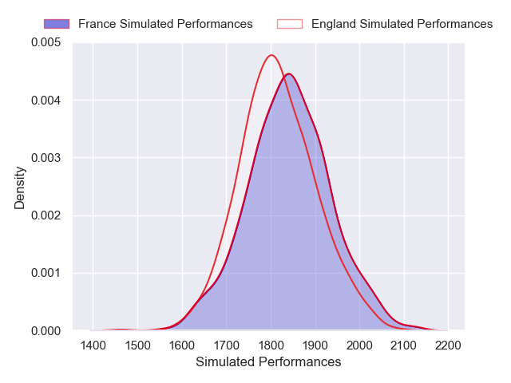

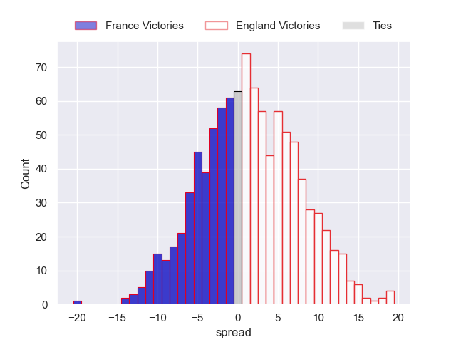

### Italy V Wales on 2025/02/08

Average Margin: Italy by 6.7

Average Scoreline: 20-13

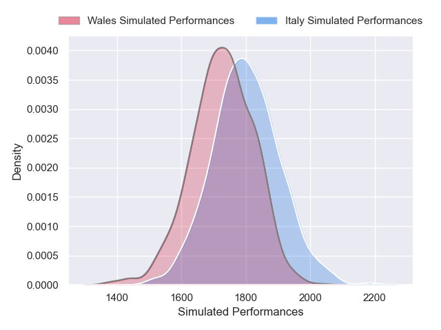

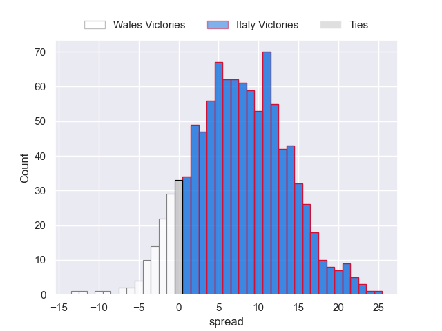

### Scotland V Ireland on 2025/02/09

Average Margin: Scotland by 0.7

Average Scoreline: 15-14

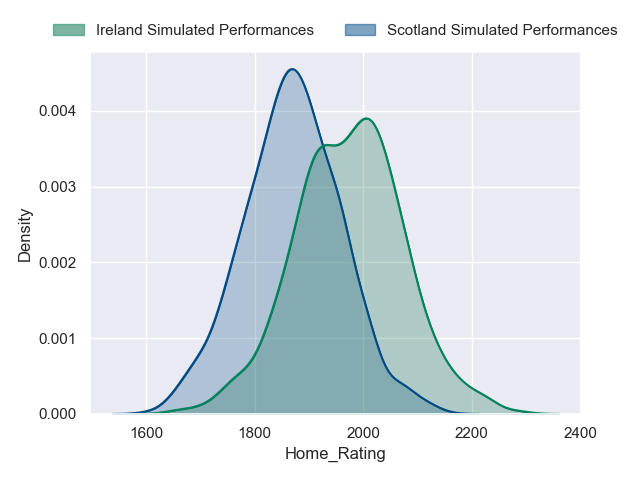

## Week 8

### England V Scotland on 2025/02/22

Average Margin: Scotland by 1.1

Average Scoreline: 15-14

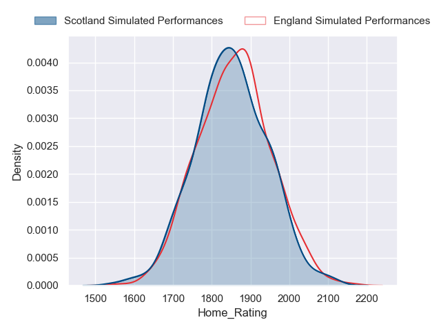

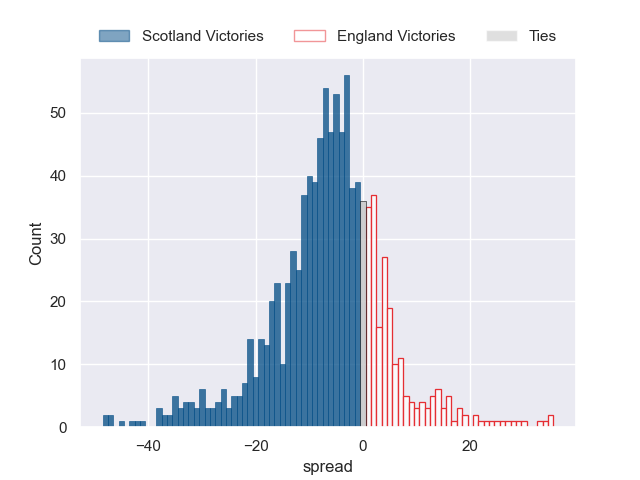

### Wales V Ireland on 2025/02/22

Average Margin: Ireland by 12.5

Average Scoreline: 46-34

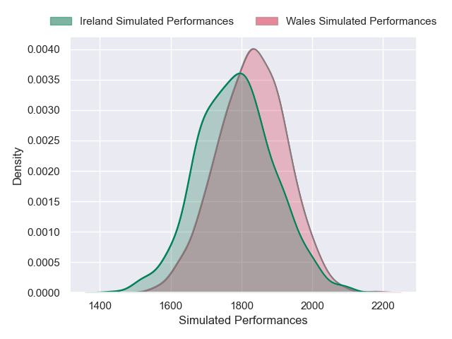
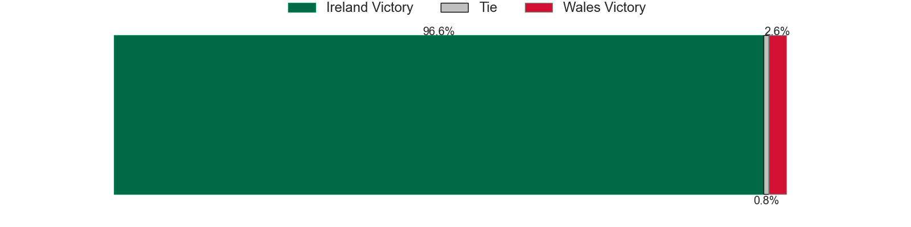
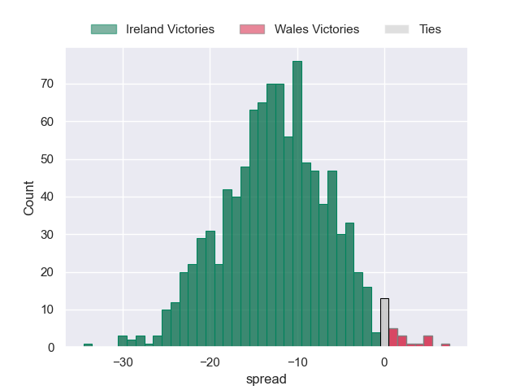

### Italy V France on 2025/02/23

Average Margin: France by 8.4

Average Scoreline: 36-27

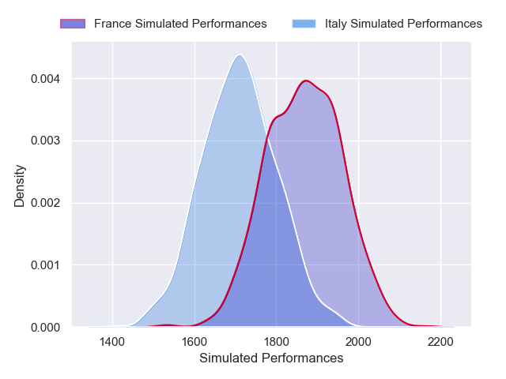

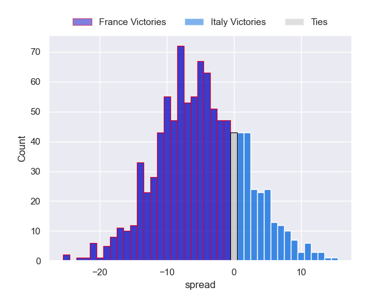

## Week 9

### Scotland V Wales on 2025/03/08

Average Margin: Scotland by 16.0

Average Scoreline: 33-17

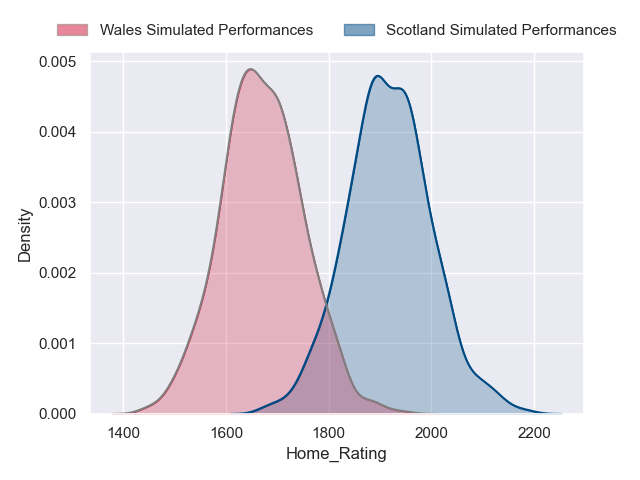

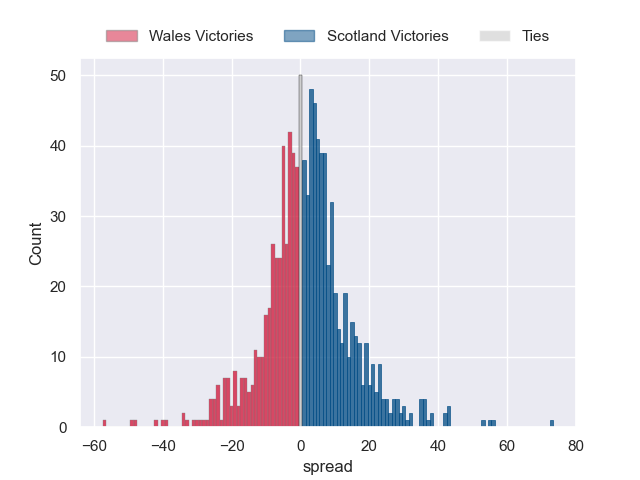

### Ireland V France on 2025/03/08

Average Margin: Ireland by 5.7

Average Scoreline: 16-10

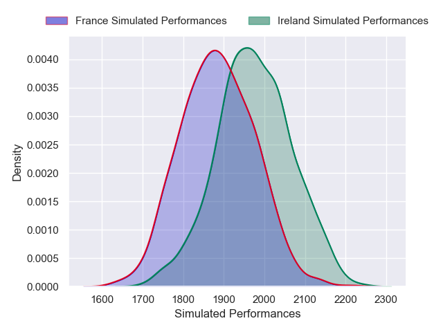

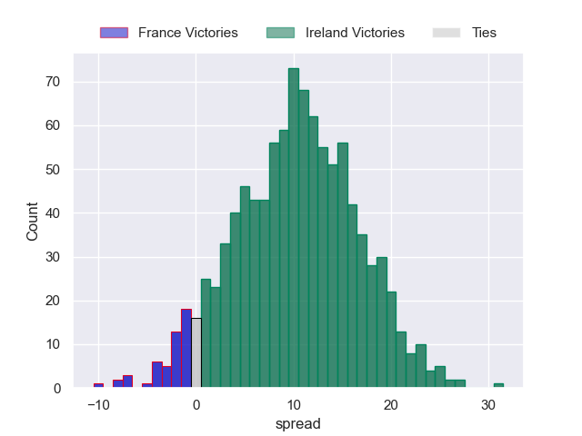

### England V Italy on 2025/03/09

Average Margin: England by 9.4

Average Scoreline: 22-13

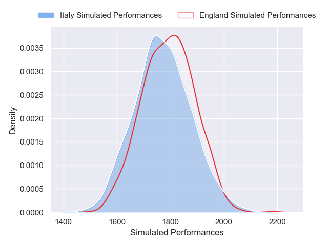
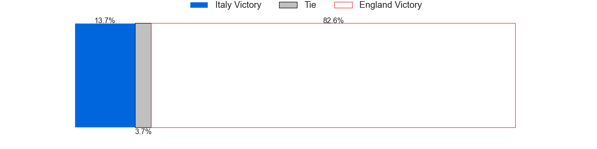
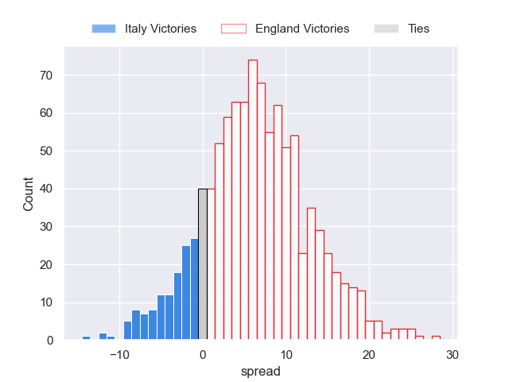

## Week 10

### France V Scotland on 2025/03/15

Average Margin: France by 4.6

Average Scoreline: 17-12

### Wales V England on 2025/03/15

Average Margin: England by 5.7

Average Scoreline: 29-23

### Italy V Ireland on 2025/03/15

Average Margin: Ireland by 9.3

Average Scoreline: 38-29

